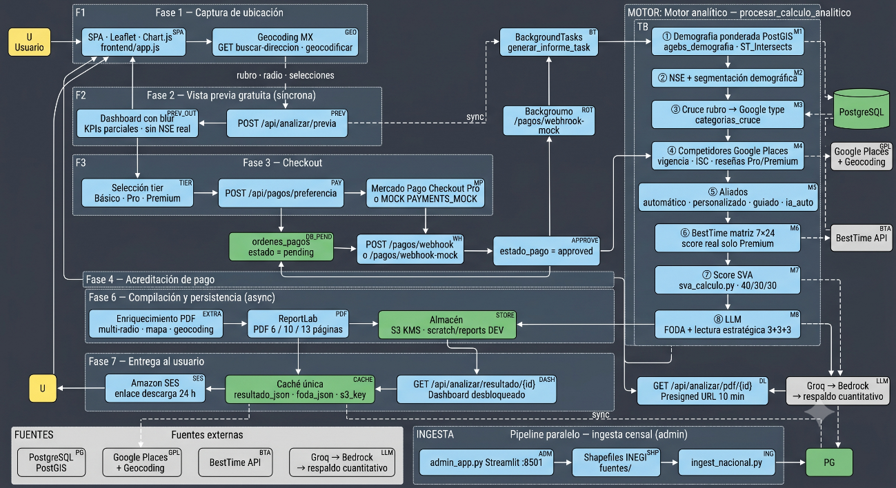

Author(s): Emmanuel Ramírez Romero · Miguel Domínguez  
Status: Beta operativa  
Ultima actualización: 2026-06-19

---

# RFC-Viabilidad — GeoViabilidad Hook

## Objetivo

Facilitar a pymes, inversionistas y emprendedores en México la decisión de **dónde abrir o expandir un negocio**, cruzando en un solo flujo demografía censal, competencia y aliados en tiempo real, afluencia peatonal y análisis de los datos con LLM traducido a lenguaje de negocio. La aplicación busca **democratizar el geomarketing corporativo** mediante **pago único por reporte**, sin suscripciones ni conocimientos técnicos avanzados, complementado por un panel administrativo que mantiene actualizada la base geoespacial a partir de Shapefiles de INEGI.

---

## Goals

- Ofrecer análisis de viabilidad comercial accesibles con tres tipos de reporte:
  - **Básico:** $299 MXN · reporte PDF 6 páginas.
  - **Pro:** $649 MXN · 10 páginas + mapas + heatmap peatonal en dashboard.
  - **Premium:** $799 MXN · 13 páginas + aliados guiados + afluencia real en score de viabilidad.
- Proporcionar un score de viabilidad transparente (40% demografía · 30% competencia · 30% tráfico peatonal), lectura estratégica en web, análisis de fortalezas, oportunidades y consideraciones, además de un reporte descargable en PDF.
- Presentar un análisis de competidores y aliados configurables por nivel de pago.

---

## Non-Goals

- No sustituye consultoría legal ni una recomendación profesional.
- No emite facturas fiscales, solo acredita pagos.
- No ofrece cobertura internacional.

---

## Background

En México, una proporción elevada de nuevas pymes no alcanza los dos años de operación, en gran parte por mala selección de ubicación. La información censal y la oferta comercial en tiempo real existen, pero su cruce requiere herramientas especializadas, bases geoespaciales y presupuestos con los cuales no está familiarizada la mayoría de los emprendedores.

Esta aplicación nace para cerrar esa brecha: una plataforma web donde el usuario marca un punto en el mapa, indica su giro y recibe un análisis claro sobre la viabilidad de esa ubicación. El sistema cruza datos oficiales de población, la competencia cercana, el tráfico de personas en la zona y un resumen en lenguaje sencillo generado con inteligencia artificial.

---

## Overview

La aplicación se organiza en tres piezas: la **página web** donde el usuario ubica su negocio en el mapa, el **núcleo de negocio** que analiza, cobra y genera reportes y un **panel de administración** para cargar y actualizar los datos de población. De punta a punta, el recorrido es capturar la ubicación, ofrecer una vista previa gratuita, cobrar el reporte elegido, ejecutar el análisis en segundo plano y entregar el resultado en el dashboard y en PDF.

---

## Detailed design

### Arquitectura del repositorio

```
viabilidad-hook/                          # GeoViabilidad Hook — monorepo backend + SPA
│
├── app/                                  # Backend FastAPI (API 1.0.0)
│   ├── main.py                           # Entrypoint, middleware, montaje estáticos /health
│   ├── routes_analytics.py               # /api/analizar/* (previa, resultado, PDF, geocoding)
│   ├── payments.py                       # /api/pagos/* (preferencia, webhook, mock)
│   ├── analytics.py                      # Orquestador analítico principal
│   ├── sva_calculo.py                    # Score SVA transparente (40/30/30)
│   ├── nse.py                            # Nivel socioeconómico (PostGIS + censo)
│   ├── vigencia_comercio.py              # Vigencia operativa de comercios
│   ├── aliados_guiados.py                # Motor determinista aliados Premium
│   ├── aliados_deterministico.py         # Resolución aliados sin LLM
│   ├── competencia_busqueda.py           # Búsqueda y filtro de competidores
│   ├── google_places.py                  # Places API + geocoding + vigencia
│   ├── besttime.py                       # Afluencia peatonal (heatmap)
│   ├── bedrock.py                        # Cadena LLM Groq → Bedrock → respaldo
│   ├── lectura_estrategica.py            # Lectura 3+3+3 para dashboard
│   ├── demografia_segmentos.py           # Segmentación demográfica
│   ├── reports.py                        # Generador PDF ReportLab (6/10/13 pág.)
│   ├── chart_images.py                   # Gráficas/heatmap embebidos en PDF
│   ├── tasks.py                          # BackgroundTasks: PDF, S3, SES
│   ├── auth.py                           # JWT mock (DEV) / Cognito (pendiente H4)
│   ├── middleware.py                     # Rate limit LLM + errores amigables
│   ├── config.py                         # Variables de entorno
│   ├── database.py                       # Sesión SQLAlchemy / PostGIS
│   ├── models.py                         # ORM (ordenes_pagos, etc.)
│   ├── schemas.py                        # Validación Pydantic (tiers, aliados)
│   ├── schemas_nse.py                    # Contratos NSE
│   ├── schemas_aliados_guiados.py        # Contratos aliados guiados
│   ├── ingest_nacional.py                # Ingesta censal programática
│   └── assets/                           # Portada PDF (cover_bg, cover_logo)
│
├── frontend/                             # SPA Vanilla JS (v1.0.4)
│   ├── index.html                        # Layout mapa + dashboard + modales
│   ├── app.js                            # Lógica UI, mapa Leaflet, checkout mock
│   └── index.css                         # Glassmorphic dark/light
│
├── admin_app.py                          # Panel Streamlit ingesta INEGI (:8501)
├── ingest_all_states.py                  # CLI ingesta masiva shapefiles
├── ingest_censo_nse.py                   # Ingesta variables NSE
│
├── tests/
│   ├── test_suite.py                     # Integración API, tiers, vigencia, pagos
│   ├── test_besttime.py                  # Parsing BestTime
│   └── security/                         # Stress LLM, prompt injection
│
├── docker-compose.yml                    # Desarrollo: web-api :8000 + admin :8501
├── docker-compose.prod.yml               # Producción ECR + DEV_MODE=False
├── Dockerfile                            # Python 3.11 + GDAL/PostGIS
├── pyproject.toml · requirements.txt     # Dependencias Python
└── run_local.ps1 · run_local.sh          # Arranque local
```

### Pipeline end-to-end

Diagrama en formato SVG (exportado desde el documento fuente):



### Motor analítico

**Entradas:** coordenadas del punto, radio de análisis, giro comercial, nivel de reporte contratado, selecciones de competidores y aliados, intenciones del emprendedor y (en Premium) configuración de aliados guiados.

**Pipeline (índice):**

1. Demografía ponderada.
2. NSE y segmentación demográfica.
3. Cruce de rubro → categoría de búsqueda.
4. Autodetección con IA *(opcional)*.
5. Competencia, vigencia e índice de saturación.
6. Aliados comerciales.
7. Afluencia peatonal.
8. Puntaje SVA (0–100).

> El motor convierte un punto en el mapa y un giro comercial en cifras comparables. Si no hay datos censales en la zona, demografía y NSE se reportan con valores honestos (incluido cero). Si no hay Premium o la medición de tráfico no está disponible, el pilar de tráfico usa un valor base. La lectura estratégica con IA ocurre **después del pago**, no dentro de estos ocho pasos.

#### ① Demografía ponderada

| | |
|--|--|
| **Entrada** | Punto en mapa, radio y base censal por AGEB |
| **Proceso** | Intersección del círculo de análisis con polígonos censales; cada AGEB aporta población proporcional al área que cae dentro del radio |
| **Salida** | Población estimada, viviendas y desglose por sexo |
| **Notas** | Sin cartografía en la zona → cero real, no estimaciones inventadas |

#### ② NSE y segmentación demográfica

| | |
|--|--|
| **Entrada** | Mismo punto y radio; indicadores de escolaridad, internet y autos del censo |
| **Proceso** | Agregación espacial ponderada → etiqueta de nivel socioeconómico → pirámide de edades |
| **Salida** | Perfil NSE (A/B/C+/D+) y segmentación demográfica |
| **Notas** | Si falla la consulta, se usa un perfil de respaldo; la vista previa gratuita puede ocultar el NSE en pantalla |

#### ③ Cruce de rubro

| | |
|--|--|
| **Entrada** | Giro comercial declarado por el usuario |
| **Proceso** | Tabla interna de equivalencias rubro → tipo de negocio en mapas; si no hay match, búsqueda genérica |
| **Salida** | Tipo de establecimiento y categoría para búsquedas |
| **Notas** | Define la búsqueda por defecto cuando el usuario no personaliza competidores |

#### ④ Autodetección con IA *(opcional)*

| | |
|--|--|
| **Entrada** | Usuario activa autodetección en competidores; giro, intenciones y mapeo del paso anterior |
| **Proceso** | La IA sugiere tipos de negocio; el sistema valida contra una lista permitida y aplica respaldo si falla |
| **Salida** | Lista de categorías para la búsqueda de competencia |
| **Notas** | Solo si el usuario lo solicita; ver Pipeline LLM. No es el diagnóstico estratégico del reporte |

#### ⑤ Competencia, vigencia e ISC

| | |
|--|--|
| **Entrada** | Tipos de búsqueda resueltos, coordenadas, radio, marcas o keywords opcionales |
| **Proceso** | Búsqueda en Google Maps → filtro por giro → distancias → verificación de locales abiertos/cerrados → índice de saturación (rivales cercanos pesan más) → selección de los 5 más relevantes |
| **Salida** | Listado de competidores, conteos, distancia al más cercano, índice ISC |
| **Notas** | Reportes pagados Básico en adelante; reseñas detalladas en Pro/Premium (mín. 5 reseñas); locales cerrados permanentemente no cuentan en el índice |

#### ⑥ Aliados comerciales

| | |
|--|--|
| **Entrada** | Modo automático, personalizado, guiado (Premium) o autodetección IA |
| **Proceso** | **Automático:** bancos, escuelas y transporte · **Personalizado:** tipos o palabras clave · **Guiado:** atractores confirmados por el usuario |
| **Salida** | Listado y conteos por tipo de aliado |
| **Notas** | Aliados personalizados y modo guiado: Premium; error de mapas → conteo cero, nunca inventado |

#### ⑦ Afluencia peatonal

| | |
|--|--|
| **Entrada** | Coordenadas del punto |
| **Proceso** | Consulta a plataforma de tráfico peatonal → matriz de afluencia por día y hora |
| **Salida** | Curvas de afluencia y saturación promedio de la zona |
| **Notas** | El tráfico **real** entra al puntaje SVA solo en Premium cuando la medición es exitosa |

#### ⑧ Puntaje SVA (0–100)

| | |
|--|--|
| **Entrada** | Demografía, competencia, afluencia y nivel de reporte |
| **Proceso** | Tres pilares ponderados: demografía (40%), competencia (30%), tráfico peatonal (30%) |
| **Salida** | SVA final y desglose por pilar |
| **Notas** | Fórmula transparente en el PDF; el motor no redacta conclusiones — solo números y listas |

**Salida del motor:** JSON con métricas y listados, persistido en `resultado_json`. El análisis estratégico (`foda_json`) se genera **después**, en el flujo post-pago.

### Pipeline LLM (inteligencia artificial)

La IA interviene en **dos momentos**:

1. **Autodetección de categorías** (opcional): si el usuario marca autodetección en competidores, el sistema clasifica qué tipos de negocio buscar en Google Places. Entrada: giro, intenciones y contexto del rubro. Salida: listas de categorías validadas contra una lista permitida.
2. **Diagnóstico estratégico** (solo post-pago): tras calcular SVA, NSE y competencia, el LLM redacta 3 fortalezas y 3 oportunidades. El servidor completa consideraciones, conclusión y dictamen con reglas propias (sin LLM).

**Entradas principales:** rubro, intenciones del emprendedor (texto libre sanitizado), métricas del análisis (población, SVA, NSE, competidores, afluencia, dirección, tier).

**Flujo de seguridad:** sanitización anti-manipulación de prompts → guardrail de contenido → llamada a Groq (beta) o Bedrock (producción) → validación del JSON → fusión con respaldo cuantitativo si algo falla.

**Salidas:** `foda_json` en base de datos (dashboard + PDF) con fortalezas, oportunidades, consideraciones de apertura y conclusión ejecutiva. Si el LLM no responde, el reporte sigue disponible con textos derivados de datos reales.

**Cadena de proveedores:** Groq → Amazon Bedrock → respaldo cuantitativo (nunca deja al usuario sin diagnóstico).

---

### Pipeline de ingesta censal (panel de administración)

El **panel de administración** (`admin_app.py`, puerto 8501) es la consola interna para cargar datos del INEGI en la base de datos. No la usa el emprendedor final; la opera el equipo PhiQus cuando hay que incorporar un estado nuevo o refrescar el Censo 2020.

**Qué hace:** recibe shapefiles y archivos CSV del censo, los reproyecta, filtra AGEBs urbanas e inserta población, vivienda y variables de nivel socioeconómico en PostGIS. Muestra cuántas AGEBs hay por estado y cuáles ya tienen geometría, censo y NSE.

**Por qué no es automático de punta a punta:** INEGI no ofrece una sincronización continua gratuita; los archivos nacionales pesan más de 3 GB y deben descargarse manualmente a la carpeta `fuentes/` del servidor. La ingesta masiva se dispara con un botón (o con el script `ingest_all_states.py`) para no repetir horas de procesamiento en cada despliegue y para que un operador valide la cobertura antes de habilitar análisis en una zona. El Censo 2020 es un snapshot decenal, no requiere actualización diaria.

**Entradas:** ZIP de cartografía estatal, ZIP de CSV censal, o archivos nacionales precolocados en `fuentes/`.

**Salidas:** tabla `agebs_demografia` con polígonos y demografía, base de todos los cálculos de población, NSE y SVA en la plataforma pública.

---

## Métricas

| Operación | Tiempo medido |
|-----------|---------------|
| Consulta de población en el radio | ~61 ms |
| Nivel socioeconómico en la zona | ~26 ms |
| Relacionar el giro con las categorías | ~2 ms |
| Cargar datos del análisis en pantalla | ~4,3 s |
| Generación del PDF | ~3 s |

### Métricas LLM y seguridad

| Prueba | Descripción | Resultado |
|--------|-------------|-----------|
| Ataques simulados (30 casos) | 30 ataques simulados (cambiar instrucciones, sacar datos internos o forzar respuestas fuera de formato) sin llamar a la API. | 0 bypass |
| Tests de defensa automatizados | 26 verificaciones automáticas (filtrar textos maliciosos, validar formato de respuesta y limitar consultas por IP) en el código de la aplicación. | 26 passed |
| Diagnóstico disponible si falla la IA | Respaldo cuantitativo (población, competencia y SVA reales) si la IA no responde o rechaza el texto del usuario. | 100% |
| Pruebas críticas contra Groq real (19 casos) | 19 ataques de alta severidad contra Groq en entorno real, pendientes de ejecutar antes del lanzamiento comercial. | Pendiente antes de go-live |

La IA solo redacta fortalezas y oportunidades; el resto del dictamen lo construye el servidor con reglas. Entradas sospechosas se filtran antes de llegar al modelo.

---

## Apéndice — Cálculo detallado del puntaje SVA

El **Score de Viabilidad de Apertura (SVA)** es un número entero de **0 a 100** que resume tres factores independientes. Cada factor también se expresa de 0 a 100 y luego se combina con pesos fijos. No hay caja negra: la misma lógica alimenta la pantalla del usuario y el PDF del reporte.

**Estado:** Cerrado.

### Fórmula general

**SVA = redondeo entero de (Demografía × 40% + Competencia × 30% + Tráfico peatonal × 30%)**

| Pilar | Peso | Aporte máximo |
|-------|------|---------------|
| Demografía | 40% | 40 puntos |
| Competencia | 30% | 30 puntos |
| Tráfico peatonal | 30% | 30 puntos |

---

### Pilar 1 — Demografía

**Qué mide:** cuántas personas viven **por kilómetro cuadrado** dentro del radio elegido, no el total absoluto de habitantes.

1. Se calcula el área del círculo: \(A = \pi \times (\text{radio en km})^2\).
2. **Densidad** = población estimada ÷ área.
3. **Score demográfico:**
   - Densidad ≤ **120 hab/km²** → score fijo **15** (zona muy dispersa).
   - Densidad ≥ **2 000 hab/km²** → score fijo **100** (zona muy densa).
   - Entre 120 y 2 000 → interpolación suave en escala logarítmica entre 15 y 100.

**Ejemplo (radio 1 km):** 4 342 habitantes → densidad ~1 382 hab/km² → score demográfico ~**89**.

---

### Pilar 2 — Competencia

**Qué mide:** qué tan **cerca y numerosos** están los rivales, no solo cuántos hay.

1. Se mide la distancia en metros de cada competidor al punto elegido.
2. Locales **cerrados permanentemente** no cuentan.
3. **Índice ISC** (saturación comercial): por cada rival activo se suma \(1 / \text{distancia}^2\), con un mínimo de 10 m en la distancia. Dos rivales a 50 m penalizan mucho más que diez a 800 m.
4. El ISC se convierte a score 0–100 con escala logarítmica:
   - Sin rivales → **100**.
   - Saturación muy baja (`log₁₀(ISC) ≤ −6`) → **100**.
   - Saturación muy alta (`log₁₀(ISC) ≥ −2`) → **10**.
   - Entre ambos → interpolación lineal (de 100 hacia 10).

**Ejemplo:** 12 competidores entre 80 m y 1 200 m → ISC ≈ 0,000106 → score competencia ≈ **54**.

---

### Pilar 3 — Tráfico peatonal

**Qué mide:** afluencia de personas en la zona cuando hay medición disponible.

| Situación | Score de tráfico |
|-----------|------------------|
| Reporte **Premium** y medición de tráfico exitosa | Promedio semanal de saturación de la plataforma BestTime (0–100 %) |
| Cualquier otro caso (Básico, Pro, sin datos, error API) | Valor base fijo **55.0** |

El promedio semanal se obtiene del promedio de los siete días de la matriz horaria 7×24. Ese porcentaje **es directamente** el score del pilar; no se reescala.

---

### Ejemplo completo de SVA

Reporte **Pro**, sin medición real de tráfico:

| Pilar | Score | × Peso | Aporte |
|-------|-------|--------|--------|
| Demografía | 72.2 | 40% | 28.9 |
| Competencia | 54.4 | 30% | 16.3 |
| Tráfico peatonal | 55.0 | 30% | 16.5 |
| **Total** | | | **61.7 → SVA 62** |

Mismo análisis en **Premium** con tráfico medido al **62.5%**:

**SVA = (72.2×0.4) + (54.4×0.3) + (62.5×0.3) = 63.95 → 64**

---

### Qué no modifica el SVA

- El **NSE** (nivel socioeconómico) contextualiza el reporte pero no entra en la fórmula.
- Los **aliados** (bancos, escuelas, transporte) informan el mapa pero no suman puntos al SVA en esta versión.
- Las **reseñas** y el **dictamen con IA** son lectura estratégica posterior; no cambian el número del SVA.

### Transparencia en el PDF

El reporte incluye el desglose de los tres pilares, la regla aplicada en cada uno, los aportes ponderados y la fórmula final literaria (ej. «(72.2 × 0.4) + (54.4 × 0.3) + (55.0 × 0.3) = 61.7 → 62»). El simulador de escenarios del PDF recalcula el SVA si hubiera menos competidores o estuvieran más lejos — siempre con las mismas reglas, sin IA.

---

## Links

- [INEGI — Censo de Población y Vivienda 2020](https://www.inegi.org.mx/programas/ccpv/2020/)
- [INEGI — Geografía y marco geoestadístico](https://www.inegi.org.mx/temas/geografia/)
- [INEGI — Descarga de datos](https://www.inegi.org.mx/app/descarga/)
- [INEGI — Estadística de Empresas](https://www.inegi.org.mx/temas/empresas/)
- [INEGI — SCIAN](https://www.inegi.org.mx/app/scian/)
- [Google Places API](https://developers.google.com/maps/documentation/places/web-service/overview)
- [Google Geocoding API](https://developers.google.com/maps/documentation/geocoding/overview)
- [Mercado Pago Checkout Pro](https://www.mercadopago.com.mx/developers/es/docs/checkout-pro/landing)
- [Groq API](https://console.groq.com/docs)
- [Amazon Bedrock](https://aws.amazon.com/bedrock/)
- [Amazon S3](https://aws.amazon.com/s3/)
- [Amazon Cognito](https://aws.amazon.com/cognito/)
