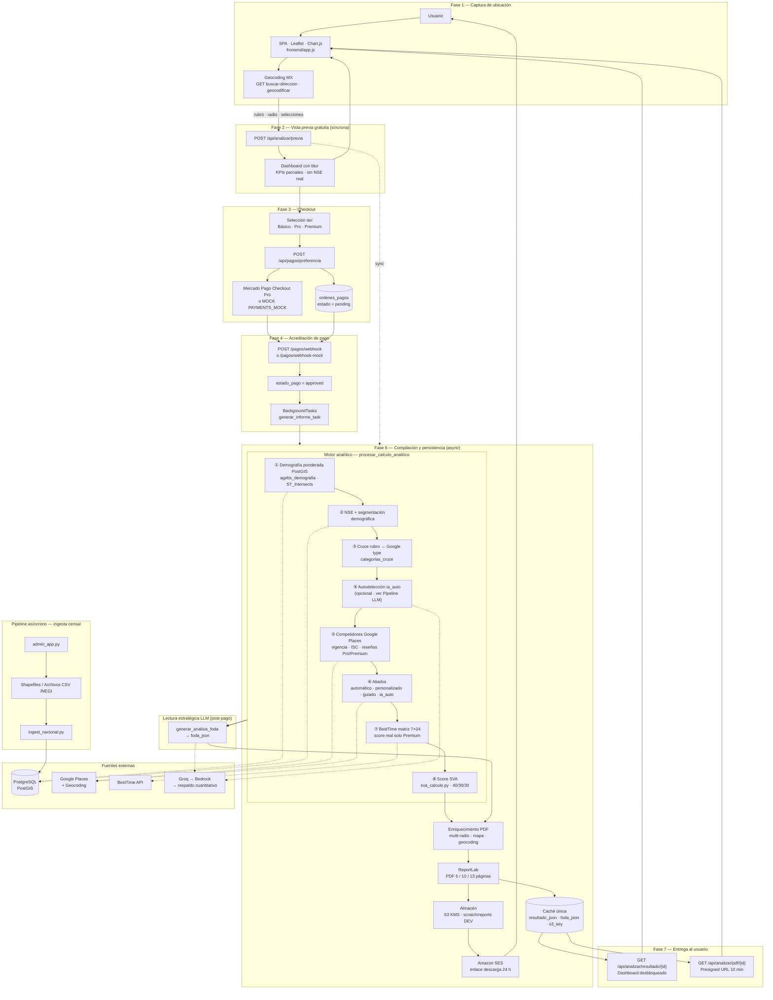
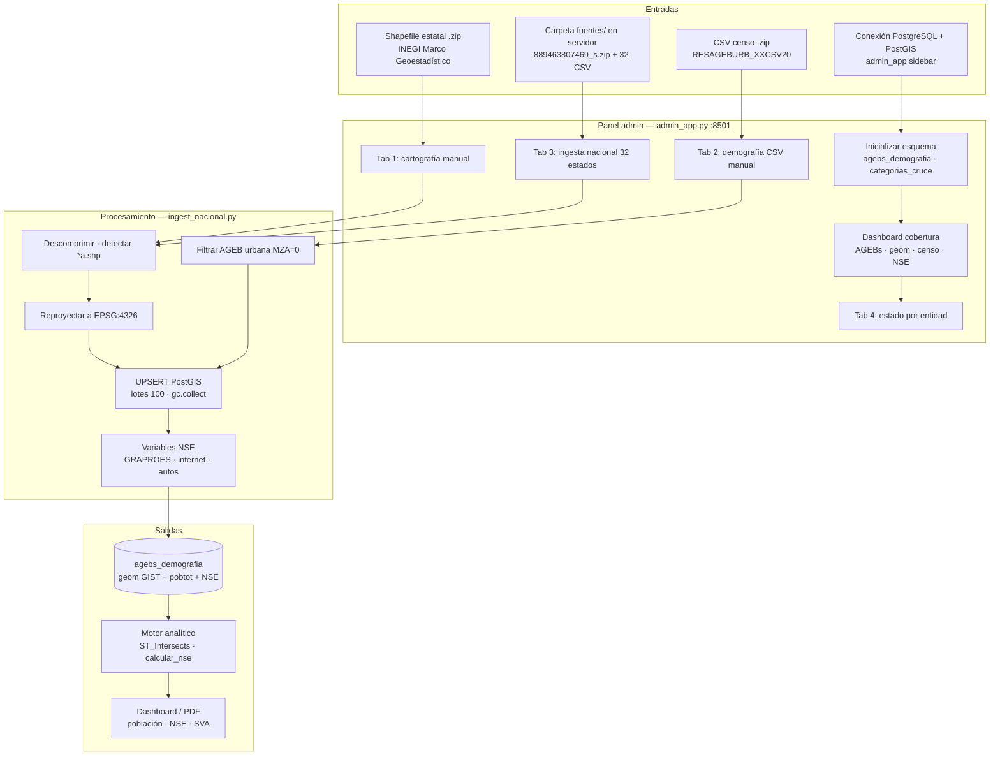
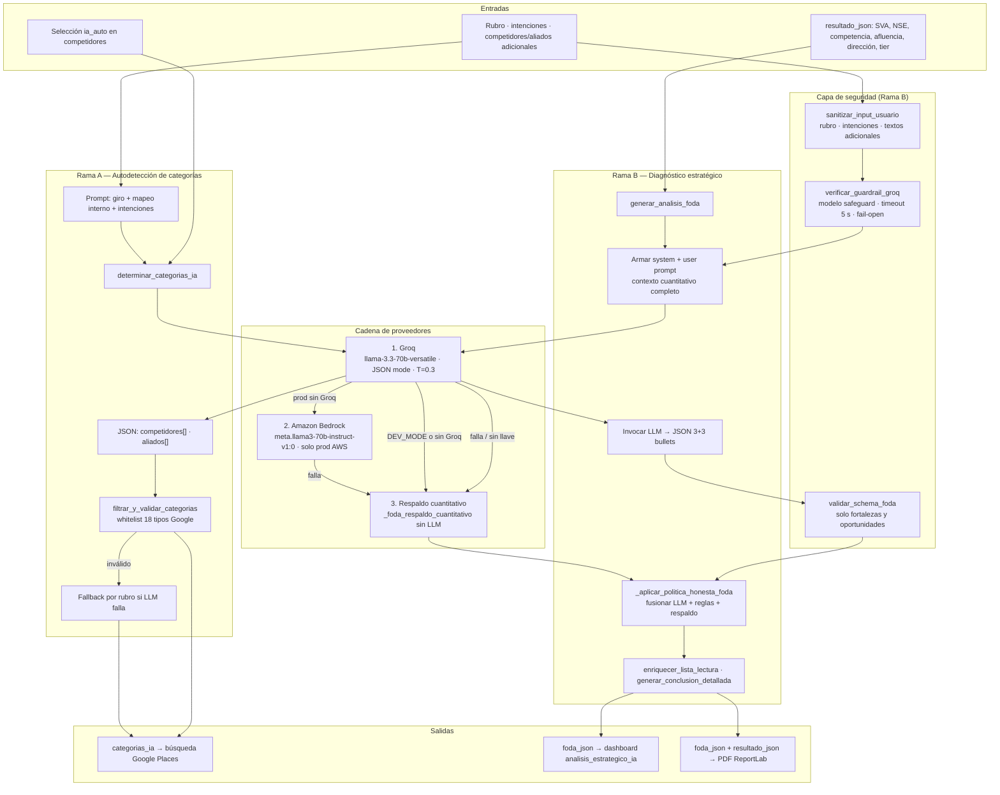

Author(s): Emmanuel Ramírez Romero · PhiQus Data Science
Status: Implementado (beta operativa)
Ultima actualización: 2026-06-18
Versión de referencia: API `1.0.0` · Frontend `app.js v1.0.4` · Rama `spotlight`

---

# RFC-Viabilidad — GeoViabilidad Hook

Plataforma de **geomarketing y viabilidad comercial** para México. Combina demografía INEGI (Censo 2020, PostGIS), competencia y aliados (Google Places), afluencia peatonal (BestTime), nivel socioeconómico (NSE), vigencia operativa de comercios e inferencia LLM para entregar dictámenes interactivos y **reportes PDF de pago único** por nivel (Básico, Pro, Premium).

---

## Objetivo

Facilitar a pymes, inversionistas y emprendedores en México la decisión de **dónde abrir o expandir un negocio**, cruzando en un solo flujo demografía censal (INEGI/PostGIS), competencia y aliados en tiempo real (Google Places), afluencia peatonal (BestTime) y análisis con LLM traducido a lenguaje de negocio. GeoViabilidad Hook busca **democratizar el geomarketing corporativo** — hoy reservado a consultoras con presupuestos elevados — mediante **pago único por reporte** (Básico, Pro o Premium), sin suscripciones ni conocimientos SIG, complementado por un panel administrativo que mantiene actualizada la base geoespacial a partir de Shapefiles INEGI.

**Estado:** Cerrado en beta operativa (junio 2026). Go-live comercial AWS pendiente H4.

---

## Links

Referencias que sustentan el **Background**, el stack técnico y la documentación interna del proyecto. Las rutas relativas parten de la raíz del repositorio.

### Repositorio y producto

| Recurso | Enlace | Uso en este RFC |
|---------|--------|-----------------|
| Repositorio PhiQus | [github.com/PhiQus-DS/pq-edm-viabilidad](https://github.com/PhiQus-DS/pq-edm-viabilidad) | Código fuente; rama de referencia `spotlight` |
| Sitio PhiQus | [phiqus.com](https://phiqus.com/) | Marca y producto (enlace en PDF `reports.py`) |
| README del proyecto | [README.md](../../../README.md) | Inicio rápido, stack y variables de entorno |
| API interactiva (beta) | `http://135.181.30.179:8000/docs` | OpenAPI Swagger en despliegue VPS |

### Documentación interna

| Documento | Enlace | Contenido |
|-----------|--------|-----------|
| Roadmap H0–H6 | [docs/ROADMAP.md](../../../docs/ROADMAP.md) | Hitos, estado beta y go-live H4 |
| Contrato NSE | [docs/SPEC_DRIVEN_CONTRACT_NSE.md](../../../docs/SPEC_DRIVEN_CONTRACT_NSE.md) | Especificación nivel socioeconómico |
| Contrato aliados guiados | [docs/SPEC_DRIVEN_CONTRACT_ALIADOS_GUIADOS.md](../../../docs/SPEC_DRIVEN_CONTRACT_ALIADOS_GUIADOS.md) | Modo guiado Premium |
| Apéndice fórmulas SVA | [Apéndice SVA](#apéndice--cálculo-detallado-del-score-sva-sva) | Cálculo transparente del puntaje 0–100 |
| Extensiones históricas | [rfc.md](../../../rfc.md) | Evolución funcional §1–§22 |
| Arquitectura AWS | [rfc-viabilidad-comercial.md](./rfc-viabilidad-comercial.md) | Diseño cloud objetivo y costos |
| Requisitos | [requirements.md](./requirements.md) | RF funcionales originales |
| Diseño UI/PDF | [design.md](./design.md) | Decisiones visuales y portada |
| Plan de ejecución | [tasks.md](./tasks.md) | Checklist de implementación |
| Blindaje VPS | [scripts/vps-hardening.sh](../../../scripts/vps-hardening.sh) | Firewall y aislamiento beta |

### Contexto de negocio y fuentes de datos (Background)

| Tema | Enlace | Justificación |
|------|--------|---------------|
| Censo de Población y Vivienda 2020 | [INEGI — CPV 2020](https://www.inegi.org.mx/programas/ccpv/2020/) | Base demográfica por AGEB usada en `agebs_demografia` |
| Marco geoestadístico (AGEB, manzanas) | [INEGI — Geografía](https://www.inegi.org.mx/temas/geografia/) | Unidades espaciales para `ST_Intersects` y búfer de influencia |
| Descarga de capas censales | [INEGI — Descarga de datos](https://www.inegi.org.mx/app/descarga/) | Shapefiles ingeridos vía `admin_app.py` / `ingest_nacional.py` |
| Dinámica de empresas en México | [INEGI — Estadística de Empresas](https://www.inegi.org.mx/temas/empresas/) | Contexto de mortalidad y viabilidad de negocios (Background §pymes) |
| SCIAN (giros comerciales) | [INEGI — SCIAN](https://www.inegi.org.mx/app/scian/) | Mapeo rubro ↔ categorías Google en `categorias_cruce` |

### Stack técnico del proyecto

| Componente | Enlace | Rol en GeoViabilidad |
|------------|--------|----------------------|
| FastAPI | [fastapi.tiangolo.com](https://fastapi.tiangolo.com/) | API REST, BackgroundTasks, OpenAPI |
| PostGIS | [postgis.net](https://postgis.net/) | Consultas espaciales (`ST_Intersects`, índice GIST) |
| PostgreSQL | [postgresql.org](https://www.postgresql.org/) | Motor relacional + extensión PostGIS |
| SQLAlchemy | [docs.sqlalchemy.org](https://docs.sqlalchemy.org/) | ORM (`models.py`, `database.py`) |
| Leaflet | [leafletjs.com](https://leafletjs.com/) | Mapa interactivo en `frontend/` |
| Chart.js | [chartjs.org](https://www.chartjs.org/) | Gráfica de competencia en dashboard |
| ReportLab | [docs.reportlab.com](https://docs.reportlab.com/) | Generación PDF (`reports.py`) |
| Streamlit | [docs.streamlit.io](https://docs.streamlit.io/) | Panel admin ingesta INEGI |
| Docker Compose | [docs.docker.com/compose](https://docs.docker.com/compose/) | Despliegue dev/beta (`docker-compose.yml`) |
| Pydantic v2 | [docs.pydantic.dev](https://docs.pydantic.dev/) | Validación tiers y payloads (`schemas.py`) |

### APIs e integraciones externas

| Servicio | Enlace | Uso en la app |
|----------|--------|---------------|
| Google Places API | [Places Web Service](https://developers.google.com/maps/documentation/places/web-service/overview) | Competidores, aliados, Place Details, vigencia |
| Google Geocoding API | [Geocoding API](https://developers.google.com/maps/documentation/geocoding/overview) | Búsqueda por dirección y geocodificación inversa |
| BestTime API | [besttime.app](https://besttime.app/) | Afluencia peatonal y heatmap 7×24 |
| Mercado Pago Checkout Pro | [Checkout Pro — Developers](https://www.mercadopago.com.mx/developers/es/docs/checkout-pro/landing) | Cobro único por reporte (`payments.py`) |
| Groq API | [console.groq.com/docs](https://console.groq.com/docs) | LLM primario en beta (`bedrock.py`) |
| Amazon Bedrock | [aws.amazon.com/bedrock](https://aws.amazon.com/bedrock/) | LLM en producción AWS |
| Amazon S3 | [aws.amazon.com/s3](https://aws.amazon.com/s3/) | Almacén PDF firmados (prod) |
| Amazon SES | [aws.amazon.com/ses](https://aws.amazon.com/ses/) | Envío de enlace PDF por correo (prod) |
| Amazon Cognito | [aws.amazon.com/cognito](https://aws.amazon.com/cognito/) | Auth JWT objetivo H4 (`auth.py`) |
| AWS SSM Parameter Store | [Parameter Store](https://docs.aws.amazon.com/systems-manager/latest/userguide/systems-manager-parameter-store.html) | Secretos en producción |

### Puntos de entrada en código (referencia rápida)

| Módulo | Ruta | Responsabilidad |
|--------|------|-----------------|
| API principal | `app/main.py` | Entrypoint, middleware, `/health` |
| Analítica | `app/routes_analytics.py` · `app/analytics.py` | Previa, resultado, motor SVA |
| Pagos | `app/payments.py` | Preferencia, webhook, mock |
| PDF | `app/reports.py` | Reporte 6/10/13 páginas |
| Frontend | `frontend/app.js` | SPA, mapa, checkout |
| Tests | `tests/test_suite.py` | Regresión integración |

---

## Goals

1. **Democratizar el geomarketing corporativo** — Ofrecer análisis de viabilidad comercial accesibles mediante **pago único por ubicación** (sin suscripciones ni cargos recurrentes), con tres tipos de reporte:
   - **Básico:** $299 MXN · reporte PDF 6 páginas
   - **Pro:** $649 MXN · 10 páginas + mapas + heatmap peatonal en dashboard
   - **Premium:** $799 MXN · 13 páginas + aliados guiados + afluencia real en score SVA

2. **Eliminar barreras técnicas SIG** — Consultas espaciales PostGIS (`ST_Intersects`) sobre AGEBs INEGI con índice GIST; pipeline de ingesta de Shapefiles en panel admin sin requerir conocimientos GIS.

3. **Entregar insight accionable** — Score SVA transparente (40% demografía · 30% competencia · 30% tráfico peatonal), lectura estratégica 3+3+3 en web, FODA y proyecciones financieras en PDF.

4. **Personalización por tier** — Competidores y aliados configurables con límites por plan; autodetección IA (`ia_auto`); modo guiado de aliados exclusivo Premium.

5. **Confiabilidad operativa** — Caché `resultado_json` / `foda_json` como fuente única entre dashboard y PDF; vigencia operativa de comercios; coherencia tabla/gráfica de competencia.

6. **Beta desplegable a bajo costo** — Contenedor Docker único en VPS Hetzner con PostGIS compartido; arquitectura objetivo AWS documentada para go-live (H4).

**Estado:** Cerrado en beta. Go-live comercial AWS pendiente.

---

## Non-Goals

1. **No sustituye consultoría legal ni uso de suelo** — No valida licencias, zonificación ni permisos municipales.
2. **No reemplaza inspección física** — No evalúa fachada, accesos ni condiciones del local in situ.
3. **No emite facturas fiscales (SAT/CFDI)** — Solo acredita pago y desbloquea análisis.
4. **No ofrece cobertura internacional** — Calibrado exclusivamente para México (`country:MX` en geocodificación).
5. **No expone API pública B2B** — Fuera de alcance en v1.0 beta.

**Estado:** Cerrado.

---

## Background

En México, muchas pymes nuevas no llegan a cumplir dos años, y una de las causas más frecuentes es elegir mal el lugar para abrir o expandir el negocio (véase [INEGI — Estadística de Empresas](https://www.inegi.org.mx/temas/empresas/)). Hoy ya existen datos útiles para decidir mejor: cuánta gente vive en cada zona ([Censo 2020](https://www.inegi.org.mx/programas/ccpv/2020/)), cómo está dividido el territorio a nivel de colonia y manzana ([Marco geoestadístico](https://www.inegi.org.mx/temas/geografia/)) y qué comercios hay alrededor de un punto en el mapa ([Google Places](https://developers.google.com/maps/documentation/places/web-service/overview)). El problema es que combinar esa información suele requerir estudios costosos, software especializado y equipos que la mayoría de los emprendedores no tiene.

**GeoViabilidad Hook** nace para cerrar esa brecha: una plataforma web donde el usuario marca un punto en el mapa, indica su giro y recibe un análisis claro sobre la viabilidad de esa ubicación. El sistema cruza datos oficiales de población, la competencia cercana, el tráfico de personas en la zona y un resumen en lenguaje sencillo generado con inteligencia artificial. El acceso es por **pago único por reporte** — sin mensualidades — a través de [Mercado Pago](https://www.mercadopago.com.mx/developers/es/docs/checkout-pro/landing).

**Estado actual (junio 2026):** la plataforma ya opera en versión beta en un servidor de pruebas. Los pagos y el acceso de usuarios se simulan en este entorno; cuando hay credenciales configuradas, el análisis utiliza datos reales de mapas, afluencia y censos.

---

## Overview

La aplicación se organiza en tres piezas dentro del mismo repositorio: la **pantalla web** donde el usuario ubica su negocio en el mapa (`frontend/`), el **núcleo de negocio** que analiza, cobra y genera reportes (`app/`) y un **panel de administración** para cargar y actualizar los datos de población (`admin_app.py`). De punta a punta, el recorrido es capturar la ubicación, ofrecer una vista previa gratuita, cobrar el reporte elegido, ejecutar el análisis en segundo plano —demografía, competencia, tráfico e interpretación con IA— y entregar el resultado en el dashboard y en PDF. El árbol de carpetas siguiente muestra dónde vive cada módulo; el [pipeline end-to-end](#pipeline-end-to-end-diagrama-de-bloques) en Detailed Design desglosa ese mismo flujo fase por fase.

### Arquitectura del repositorio

```
viabilidad-hook/                          # GeoViabilidad Hook — monorepo backend + SPA
│
├── app/                                  # Backend FastAPI (API 1.0.0)
│   ├── main.py                           # Entrypoint, middleware, montaje estáticos /health
│   ├── routes_analytics.py               # /api/analizar/* (previa, resultado, PDF, geocoding)
│   ├── payments.py                       # /api/pagos/* (preferencia, webhook, mock)
│   ├── analytics.py                      # Orquestador analítico principal
│   ├── sva_calculo.py                    # Score SVA transparente (40/30/30)
│   ├── nse.py                            # Nivel socioeconómico (PostGIS + censo)
│   ├── vigencia_comercio.py              # Vigencia operativa de comercios
│   ├── aliados_guiados.py                # Motor determinista aliados Premium
│   ├── aliados_deterministico.py         # Resolución aliados sin LLM
│   ├── competencia_busqueda.py           # Búsqueda y filtro de competidores
│   ├── google_places.py                  # Places API + geocoding + vigencia
│   ├── besttime.py                       # Afluencia peatonal (heatmap)
│   ├── bedrock.py                        # Cadena LLM Groq → Bedrock → respaldo
│   ├── lectura_estrategica.py            # Lectura 3+3+3 para dashboard
│   ├── demografia_segmentos.py           # Segmentación demográfica
│   ├── reports.py                        # Generador PDF ReportLab (6/10/13 pág.)
│   ├── chart_images.py                   # Gráficas/heatmap embebidos en PDF
│   ├── tasks.py                          # BackgroundTasks: PDF, S3, SES
│   ├── auth.py                           # JWT mock (DEV) / Cognito (pendiente H4)
│   ├── middleware.py                     # Rate limit LLM + errores amigables
│   ├── config.py                         # Variables de entorno
│   ├── database.py                       # Sesión SQLAlchemy / PostGIS
│   ├── models.py                         # ORM (ordenes_pagos, etc.)
│   ├── schemas.py                        # Validación Pydantic (tiers, aliados)
│   ├── schemas_nse.py                    # Contratos NSE
│   ├── schemas_aliados_guiados.py        # Contratos aliados guiados
│   ├── ingest_nacional.py                # Ingesta censal programática
│   └── assets/                           # Portada PDF (cover_bg, cover_logo)
│
├── frontend/                             # SPA Vanilla JS (v1.0.4)
│   ├── index.html                        # Layout mapa + dashboard + modales
│   ├── app.js                            # Lógica UI, mapa Leaflet, checkout mock
│   └── index.css                         # Glassmorphic dark/light
│
├── admin_app.py                          # Panel Streamlit ingesta INEGI (:8501)
├── ingest_all_states.py                  # CLI ingesta masiva shapefiles
├── ingest_censo_nse.py                   # Ingesta variables NSE
│
├── tests/
│   ├── test_suite.py                     # Integración API, tiers, vigencia, pagos
│   ├── test_besttime.py                  # Parsing BestTime
│   └── security/                         # Stress LLM, prompt injection
│
├── docker-compose.yml                    # Desarrollo: web-api :8000 + admin :8501
├── docker-compose.prod.yml               # Producción ECR + DEV_MODE=False
├── Dockerfile                            # Python 3.11 + GDAL/PostGIS
├── pyproject.toml · requirements.txt     # Dependencias Python
└── run_local.ps1 · run_local.sh          # Arranque local
```

**Dependencias externas al repo** (no versionadas): `fuentes/` (shapefiles INEGI), `.env`, base `geo-analisis-db` (PostGIS en red Docker).

### Runtime en despliegue

```
[Navegador] → SPA (frontend/) → FastAPI (app/) :8000
                                    │
                    ┌───────────────┼───────────────┐
                    ▼               ▼               ▼
            geo-analisis-db   Google/BestTime   Groq/Bedrock
            (PostGIS)         APIs              LLM
                    │
            [admin_app.py :8501 localhost] ← ingesta INEGI
```

### Componentes principales

| Capa | Tecnología | Rol |
|------|------------|-----|
| Frontend | HTML/CSS/JS, Leaflet 1.9.4, Chart.js | Mapa, dashboard, checkout, PDF |
| API | FastAPI 1.0.0, BackgroundTasks | Analítica, pagos, PDF, estáticos |
| Datos | PostgreSQL 16 + PostGIS 3.4 | Demografía, órdenes, caché resultados |
| Admin | Streamlit (`admin_app.py`) | Ingesta censal estatal |
| IA | Groq → Bedrock → respaldo cuantitativo | FODA, lectura estratégica, autodetección |
| Reportes | ReportLab | PDF 6/10/13 páginas por tier |
| Pagos | Mercado Pago Checkout Pro | Mock en beta |

### Flujo de usuario (cerrado)

1. Usuario ubica punto en mapa o busca dirección.
2. Configura giro, radio (500–5000 m), competidores/aliados opcionales.
3. Obtiene **vista previa gratuita** (`POST /api/analizar/previa`) con KPIs parcialmente bloqueados.
4. Selecciona tier y paga (mock o Mercado Pago real).
5. Webhook aprueba orden → `generar_informe_task` en background.
6. Dashboard desbloqueado (`GET /api/analizar/resultado/{orden_id}`) + descarga PDF.

---

## Detailed Design

### Pipeline end-to-end (diagrama de bloques)

Flujo completo desde la captura de ubicación hasta la entrega del dashboard y el PDF. Las **fases 2 y 5–7** comparten el mismo motor (`procesar_calculo_analitico`); la previa lo ejecuta de forma **síncrona**, el flujo pagado lo dispara vía **BackgroundTasks** tras acreditar el pago.



Ver detalle en [Pipeline de ingesta censal](#pipeline-de-ingesta-censal-panel-de-administración).

**Leyenda de rutas**

| Ruta | Momento | Comportamiento |
|------|---------|----------------|
| Vista previa | Antes del pago | Motor completo en tier gratuito; UI con blur y sin NSE real |
| Webhook → BackgroundTask | Tras pago aprobado | Aprueba orden de inmediato; PDF y caché se generan en segundo plano |
| `GET /resultado/{id}` | Post-pago | Lee `resultado_json` / `foda_json`; si no hay caché, recalcula en línea |
| `GET /pdf/{id}` | Post-pago | Requiere `s3_key_reporte`; responde 422 mientras el PDF compila |

**Estado:** Cerrado en beta.

---

### Pipeline de ingesta censal (panel de administración)

GeoViabilidad **no descarga sola** los datos del INEGI. Un operador con rol administrativo usa el **panel Streamlit** (`admin_app.py`, puerto `8501`) para cargar cartografía y censos en PostGIS. Esa base alimenta demografía, NSE y el score SVA; sin AGEBs cargadas, el análisis en mapa devuelve vacío o estimaciones limitadas.

**Función del panel:** mantener actualizada la tabla `agebs_demografia`, inicializar esquemas auxiliares (`categorias_cruce`, `ordenes_pagos`, `ingesta_tareas`, `cache_analisis_api`) y **monitorear cobertura** por entidad federativa (geometría, censo 2020, variables NSE).

**Por qué no hay carga 100 % automatizada (sin intervención humana)**

| Factor | Decisión |
|--------|----------|
| **Fuente INEGI** | Los shapefiles y CSV del Censo 2020 se obtienen por descarga manual desde [INEGI — Descarga de datos](https://www.inegi.org.mx/app/descarga/); no existe un webhook ni API gratuita de sincronización continua para ~3 GB nacionales. |
| **Archivos fuera del repo** | La carpeta `fuentes/` (~3,1 GB cartografía + 32 ZIP de censo estatal) no se versiona en Git por tamaño y licencia; debe colocarse en el servidor antes de una ingesta masiva. |
| **Control operativo** | La ingesta es **idempotente** pero pesada (horas, RAM). Un botón con confirmación evita ejecutarla en cada deploy o reinicio de contenedor. |
| **Validación humana** | El operador verifica cobertura (pestaña «Estado de coberturas») antes de abrir análisis a usuarios en un estado nuevo. |
| **Seguridad** | El panel no es público: en beta escucha solo en `127.0.0.1:8501` (acceso vía túnel SSH). No expone subida de archivos a Internet. |
| **Frecuencia del censo** | El Censo 2020 es snapshot decenal; no requiere job diario. Actualización futura = nueva descarga INEGI + ingesta guiada, no cron autónomo en v1.0 beta. |

La pestaña «Ingesta Nacional Automática» **automatiza el procesamiento** de los 32 estados (une cartografía + CSV + NSE en lotes), pero **no automatiza la adquisición** de archivos ni la decisión de cuándo correrla.



#### Entradas

| Modo | Qué sube el operador | Formato esperado | Uso típico |
|------|----------------------|------------------|------------|
| **Cartografía manual** | ZIP estatal con shapefile de AGEBs urbanas | `.shp` + `.dbf` + `.shx` + `.prj` (ej. `*a.shp`) | Incorporar un estado nuevo o corregir geometrías |
| **Demografía manual** | ZIP con CSV del censo estatal | `RESAGEBURB_XXCSV20.zip` | Población, vivienda, sexo por AGEB |
| **Ingesta nacional** | Nada por red — archivos ya en `fuentes/` | `889463807469_s.zip` + `resageburb_XXcsv20.zip` ×32 | Carga inicial México completo |
| **CLI alternativa** | — | `python ingest_all_states.py` | Misma lógica sin UI; ops en servidor |

#### Flujo detallado

1. **Conexión:** el operador configura host/puerto/credenciales PostGIS en el sidebar; al conectar, el panel crea extensiones y tablas si no existen.
2. **Cartografía (Tab 1):** descomprime ZIP → localiza shapefile AGEB → reproyecta a WGS84 → `INSERT … ON CONFLICT` en `agebs_demografia.geom` (demografía en `-1` hasta cruzar CSV).
3. **Censo (Tab 2):** lee CSV en chunks → filtra filas AGEB consolidadas (`MZA = 0`) → upsert `pobtot`, `pobmas`, `pobfem`, `vivtot` y columnas NSE vía `censo_ageb_from_row`.
4. **Nacional (Tab 3):** iteración secuencial estados `01`–`32` con `ingest_state()`; libera memoria entre estados; registra progreso en consola Streamlit.
5. **Monitoreo (Tab 4 + métricas):** contadores globales y desglose por entidad (`total`, `con_geom`, `con_censo`) para decidir qué falta cargar.
6. **Consumo downstream:** el motor analítico intersecta el círculo del usuario con `agebs_demografia` (`obtener_demografia_ponderada`, `calcular_nse`); sin filas en la entidad, el análisis no tiene base censal.

#### Salidas

| Artefacto | Contenido | Consumido por |
|-----------|-----------|---------------|
| `agebs_demografia.geom` | Polígonos AGEB en EPSG:4326, índice GIST | Consultas espaciales del motor analítico |
| Campos demográficos | Población, vivienda, densidad ponderada | KPIs, SVA pilar demográfico, PDF |
| Campos NSE | GRAPROES, internet %, autos %, segmentos | `calcular_nse`, lectura estratégica, PDF |
| `categorias_cruce` (semilla) | Mapeo SCIAN ↔ Google Places | Cruce de rubro comercial |
| Dashboard de cobertura | AGEBs / estado | Operaciones — no expuesto al usuario final |

**Alternativa sin UI:** `ingest_all_states.py` invoca `run_ingest_nacional()` con la misma carpeta `fuentes/`; recomendado para la primera carga en servidor.

**Estado:** Cerrado en beta. Ingesta vía API FastAPI asíncrona (diseño histórico en `rfc-viabilidad-comercial.md`) **no implementada** — el panel Streamlit es el canal vigente.

---

### Pipeline LLM (inteligencia artificial)

GeoViabilidad usa IA en **dos momentos distintos** del flujo: (A) clasificar categorías de competidores cuando el usuario activa autodetección (`ia_auto`), dentro del motor analítico; (B) redactar la **lectura estratégica** del punto (fortalezas y oportunidades) una vez calculadas las métricas, solo en flujo **post-pago** (`generar_informe_task` o `GET /resultado/{id}`). La vista previa gratuita puede usar (A) pero **no** genera lectura estratégica con LLM.



#### Entradas

| Rama | Origen | Campos clave | Cuándo |
|------|--------|--------------|--------|
| **A — Autodetección** | Formulario usuario + motor analítico | `rubro`, `intenciones`, `google_type`, `categoria`, `competidores_adicionales` | Solo si `competidores_seleccionados` contiene `"ia_auto"` |
| **B — Diagnóstico** | Salida de `procesar_calculo_analitico` + orden | `poblacion_ponderada`, `densidad_hab_km2`, `competidores_conteo`, `sva`, `nse`, `afluencia_peatonal`, `direccion`, `radio_metros`, `tier_adquirido`, selecciones de competidores/aliados | Tras pago aprobado: tarea `generar_informe_task` o primer `GET /resultado/{id}` sin caché |
| **B — Texto libre usuario** | Orden / formulario | `intenciones` (máx. 500 caracteres), `rubro` (máx. 100), competidores/aliados adicionales | Siempre en Rama B; sanitizados antes del prompt |

#### Flujo detallado

**Rama A — `determinar_categorias_ia` (`app/bedrock.py`, invocada desde `app/analytics.py`)**

1. Recibe el giro comercial y contexto opcional (intenciones, mapeo interno `google_type`/`categoria`, marcas mencionadas).
2. Construye prompt con **lista cerrada** de 18 categorías Google permitidas (`cafe`, `restaurant`, `gym`, `bank`, etc.).
3. Invoca Groq (`temperature=0.1`, `response_format=json_object`, timeout 10 s).
4. Valida respuesta con `filtrar_y_validar_categorias`: descarta categorías fuera de whitelist; si una lista queda vacía, usa fallback predefinido por rubro.
5. En producción sin Groq: intenta Bedrock; si falla, fallback determinista por subcadena en el rubro.
6. Las categorías resultantes alimentan `resolver_tipos_competidores_busqueda` y la búsqueda en Google Places.

**Rama B — `generar_analisis_foda` (`app/bedrock.py`, invocada desde `app/tasks.py` y `app/routes_analytics.py`)**

1. **Sanitización:** `sanitizar_input_usuario` trunca longitud y rechaza patrones de prompt injection, jailbreak y exfiltración (tokens Llama, `ignore instructions`, referencias a API keys, etc.). Rubro o intenciones rechazados → valores por defecto seguros.
2. **Guardrail pre-LLM:** `verificar_guardrail_groq` (modelo `openai/gpt-oss-safeguard-20b`, timeout 5 s). Si clasifica `unsafe` → salta al respaldo cuantitativo. Si timeout/error → **fail-open** (permite continuar).
3. **Sin llave Groq válida:** retorna directamente `_foda_respaldo_cuantitativo` (sin llamada LLM).
4. **Prompt al LLM principal:** system prompt exige JSON estricto con exactamente 3 fortalezas y 3 oportunidades (máx. 200 caracteres c/u), tono descriptivo, sin montos inventados, sin citar competencia como fortaleza si `competencia > 0`. User prompt incluye SVA, NSE, densidad, conteo de competidores, categorías analizadas e intenciones.
5. **Invocación:** Groq primero (`GROQ_MODEL`, T=0.3, timeout 20 s, JSON mode). Si falla y `DEV_MODE` o sin AWS → respaldo. Si producción → Bedrock Llama 3 (`max_gen_len=1500`).
6. **Post-proceso híbrido (`_aplicar_politica_honesta_foda`):**
   - El LLM **solo** aporta `fortalezas` y `oportunidades` (validadas por schema).
   - El servidor genera sin LLM: `consideraciones_apertura` (3 reglas sobre SVA, competencia, demografía/afluencia), `conclusion` (`generar_conclusion_detallada` en `lectura_estrategica.py`), `dictamen_final`, `segmentacion_nicho`, `top_quejas_competidores` (desde ratings reales de Places).
   - `enriquecer_lista_lectura` expande bullets con contexto NSE, densidad y competencia.
7. **Persistencia:** objeto limpio (sin claves `_internas`) en `ordenes_pagos.foda_json`; claves `_fuente` preservada solo para trazabilidad interna.

**Protección operativa**

- `LLMRateLimitMiddleware`: máx. 10 POST/min por IP en rutas sensibles (configurado en `app/middleware.py`).
- Suite de estrés: `tests/security/llm_stress_test.py` (prompt injection, jailbreak, schema).

#### Salidas

| Campo / artefacto | Generado por | Consumido en |
|-------------------|--------------|--------------|
| `{ competidores[], aliados[] }` (Rama A) | LLM o fallback | Búsqueda de competidores/aliados en Places dentro de `procesar_calculo_analitico` |
| `fortalezas[]` (3 ítems) | LLM + enriquecimiento | Dashboard `analisis_estrategico_ia`, PDF sección lectura estratégica |
| `oportunidades[]` (3 ítems) | LLM + enriquecimiento | Dashboard, PDF |
| `consideraciones_apertura[]` (3 ítems) | Reglas server-side | Dashboard, PDF |
| `conclusion` (párrafo ejecutivo SVA) | `lectura_estrategica.py` | Dashboard, PDF |
| `dictamen_final`, `segmentacion_nicho` | Respaldo cuantitativo | PDF Premium / metadatos |
| `top_quejas_competidores` | Ratings Places (< 3.8) | PDF oportunidades de diferenciación |
| `foda_json` (JSON completo) | Rama B completa | Caché en BD; fuente única dashboard ↔ PDF |
| `_fuente` (`groq` / `respaldo_cuantitativo`) | Trazabilidad | Logs; excluido de respuesta API al frontend |

**Política de degradación:** ningún fallo de LLM bloquea el reporte. Siempre hay diagnóstico usable vía respaldo cuantitativo con datos reales de INEGI, Places y BestTime.

**Estado:** Cerrado en beta (Groq activo). Bedrock en cadena solo con `AWS_ENABLED=True` y sin Groq.

---

### 1. API pública

**Prefijo analítica:** `/api/analizar` · **Pagos:** `/api/pagos`

| Método | Ruta | Descripción | Auth |
|--------|------|-------------|------|
| GET | `/health` | Estado (`dev_mode`, `payments_mock`) | No |
| POST | `/api/analizar/previa` | Vista previa tier gratuito | Bearer |
| GET | `/api/analizar/resultado/{orden_id}` | Dashboard post-pago (caché JSON) | Bearer + pago approved |
| GET | `/api/analizar/geocodificar` | Dirección inversa (clic mapa) | Bearer |
| GET | `/api/analizar/buscar-direccion` | Autocompletado dirección MX | Bearer |
| POST | `/api/analizar/aliados/sugerir` | Sugerencias modo guiado | Bearer |
| GET | `/api/analizar/pdf/{orden_id}` | URL firmada S3 o local DEV | Bearer + pago |
| GET | `/api/analizar/pdf/{orden_id}/descargar` | Descarga directa | Solo DEV_MODE |
| POST | `/api/pagos/preferencia` | Crear orden + checkout | Bearer |
| POST | `/api/pagos/webhook` | Webhook Mercado Pago | Firma MP |
| POST | `/api/pagos/webhook-mock` | Simular pago aprobado | Solo PAYMENTS_MOCK |

**Estado:** Cerrado.

### 2. Modelo de datos (`ordenes_pagos`)

Campos clave: `tier_adquirido`, coordenadas, `radio_metros`, `rubro`, `intenciones`, selecciones JSON de competidores/aliados, `modo_analisis_aliados`, `config_aliados_guiados`, `resultado_json`, `foda_json`, `s3_key_reporte`, estados de pago.

Tablas auxiliares: `agebs_demografia` (PostGIS), `ingesta_tareas`, `cache_analisis_api`, `categorias_cruce`.

**Estado:** Cerrado.

### 3. Motor analítico (`procesar_calculo_analitico`)

**Entradas:** `lat`, `lng`, `radio_metros`, `rubro`, `tier`, `competidores_seleccionados`, `aliados_seleccionados`, `competidores_adicionales`, `aliados_adicionales`, `intenciones`, `modo_analisis_aliados`, `config_aliados_guiados`.

**Pipeline (índice):**

1. Demografía ponderada PostGIS.
2. NSE y segmentación demográfica.
3. Cruce de rubro → tipo Google.
4. Autodetección IA *(opcional)*.
5. Competencia, vigencia e ISC.
6. Aliados comerciales.
7. Afluencia peatonal (BestTime).
8. Score SVA (0–100).

> El motor analítico convierte un punto en el mapa y un giro comercial en cifras comparables: cuánta gente hay alrededor, qué nivel socioeconómico predomina, quién compite cerca, qué aliados generan flujo y un puntaje SVA de 0 a 100. Cada paso depende del anterior; si no hay AGEBs en la zona, demografía y NSE se degradan con valores honestos; si el usuario no tiene Premium o BestTime no responde, el tráfico peatonal usa un valor base (55.0). La lectura estratégica con IA (`foda_json`) ocurre **después**, cuando el pago desbloquea el informe completo — ver [Pipeline LLM](#pipeline-llm-inteligencia-artificial).

#### ① Demografía ponderada

| | |
|--|--|
| **Entrada** | `lat`, `lng`, `radio_metros`, tabla `agebs_demografia` |
| **Proceso** | Búfer geodésico → `ST_Intersects` con polígonos AGEB → ponderación por fracción de área intersectada (`pobtot`, `vivtot`, `pobmas`, `pobfem`) |
| **Salida** | `poblacion_ponderada`, `vivtot_ponderada`, `pobmas_ponderada`, `pobfem_ponderada` |
| **Módulo** | `obtener_demografia_ponderada` |
| **Notas** | Sin AGEB en zona → ceros honestos, nunca valores inventados; base del pilar demográfico del SVA |

#### ② NSE y segmentación demográfica

| | |
|--|--|
| **Entrada** | Mismas coords y radio; campos censales de escolaridad, internet y autos por AGEB |
| **Proceso** | Agregación ponderada espacial → etiqueta NSE (A/B/C+/D+) → pirámide etaria por segmentos |
| **Salida** | objeto `nse`, `segmentacion_demografica` |
| **Módulo** | `calcular_nse`, `calcular_segmentacion_demografica`, `construir_nse_fallback` |
| **Notas** | Excepción → fallback geográfico; la previa gratuita puede ocultar NSE real en UI aunque el motor lo calcule |

#### ③ Cruce de rubro → tipo Google

| | |
|--|--|
| **Entrada** | Texto `rubro` del usuario (máx. 100 caracteres) |
| **Proceso** | Lookup en `categorias_cruce`; si no hay match, tipo genérico (`store` / `establishment`) |
| **Salida** | `google_type`, `categoria` |
| **Módulo** | `resolver_google_type` |
| **Notas** | Define búsqueda por defecto cuando el usuario no personaliza competidores |

#### ④ Autodetección IA *(condicional)*

| | |
|--|--|
| **Entrada** | `"ia_auto"` en `competidores_seleccionados`, más `rubro`, `intenciones`, mapeo del paso ③ |
| **Proceso** | LLM propone categorías → whitelist de 18 tipos Google → fallback determinista si falla |
| **Salida** | `categorias_ia.competidores[]` → alimenta `resolver_tipos_competidores_busqueda` |
| **Módulo** | `determinar_categorias_ia`, `filtrar_y_validar_categorias` |
| **Tier / notas** | Opcional; ver [Pipeline LLM — Rama A](#pipeline-llm-inteligencia-artificial). **No** es el diagnóstico FODA; se ejecuta **antes** del paso ⑤ |

#### ⑤ Competencia, vigencia e ISC

| | |
|--|--|
| **Entrada** | Tipos resueltos (pasos ③ + ④), coords, radio, `competidores_adicionales` opcional |
| **Proceso** | Nearby Search por tipo → deduplicación `(lat,lng)` redondeada → `filtrar_competidores_por_giro` → distancia Haversine → vigencia Place Details (hasta 15 locales, `max_reseñas=2`) → ISC = Σ 1/max(dist,10)² → top 5 destacados |
| **Salida** | `competidores_listado`, `competidores_destacados`, `competidores_activos_conteo`, `isc`, `distancia_competidor_cercano` |
| **Módulo** | `buscar_competidores`, `enriquecer_lugares_con_vigencia`, `resolver_competidores_destacados_para_reporte` |
| **Tier / notas** | Búsqueda Places: `basico`/`pro`/`premium`; reseñas en destacados: Pro/Premium (mín. 5 reseñas); ISC excluye cierre permanente |

#### ⑥ Aliados comerciales

| | |
|--|--|
| **Entrada** | `aliados_seleccionados`, `aliados_adicionales`, `modo_analisis_aliados`, `config_aliados_guiados` |
| **Proceso** | **Automático:** `bank` / `school` / `transit_station` · **Personalizado:** tipos o keywords · **Guiado Premium:** atractores confirmados (2–5) sin LLM · **`ia_auto`:** tipos sugeridos por IA |
| **Salida** | `aliados_listado`, `aliados_conteos`, conteos legacy (`bancos_conteo`, `escuelas_conteo`, `transporte_conteo`) |
| **Módulo** | `resolver_tipos_aliados_busqueda`, `validar_config_guiada`, vigencia en hasta 10 aliados |
| **Tier / notas** | Aliados custom y modo guiado: Premium; fallo de API → conteo 0, nunca inventado |

#### ⑦ Afluencia peatonal (BestTime)

| | |
|--|--|
| **Entrada** | Coordenadas del punto; lista de competidores para contexto de consulta |
| **Proceso** | API BestTime → matriz horaria 7 días × 24 h → `saturación_promedio` si `status=success` |
| **Salida** | `afluencia_peatonal` (heatmap, picos, status) |
| **Módulo** | `obtener_afluencia` |
| **Tier / notas** | Score de tráfico **real** en pilar SVA solo Premium + BestTime exitoso; resto usa base **55.0** |

#### ⑧ Score SVA (0–100)

| | |
|--|--|
| **Entrada** | Población y radio (paso ①), ISC (paso ⑤), afluencia (paso ⑦), `tier` |
| **Proceso** | Pilar demográfico por densidad hab/km² (40%) · competencia vía ISC log-normalizado (30%) · tráfico peatonal (30%) → redondeo entero |
| **Salida** | `sva`, `score_demog`, `score_competencia`, `score_trafico`, `densidad_hab_km2` |
| **Módulo** | `calcular_score_demografico`, `calcular_score_competencia`, `sva_calculo.py` |
| **Notas** | Fórmulas documentadas en PDF; el motor **no redacta** dictamen — solo números y listas |

**Salida del motor:** JSON serializado persistido en `resultado_json`. La lectura estratégica (`foda_json`) se genera **después**, en flujo post-pago.

**Estado:** Cerrado.

### 4. Tiers y límites de personalización

| Tier | Precio | PDF | Competidores custom | Aliados custom | Extras |
|------|--------|-----|---------------------|----------------|--------|
| Gratuito (previa) | $0 | — | Hasta 5 en UI (no analizados todos) | Hasta 5 en UI | KPIs blur, sin NSE real |
| Básico | $299 | 6 pág. | Máx. 1 | No | — |
| Pro | $649 | 10 pág. | Máx. 3 | No | Heatmap, reseñas, mapas |
| Premium | $799 | 13 pág. | Máx. 5 | Máx. 5 o modo guiado | Afluencia real en SVA, aliados guiados |

Validación en `PreferenciaCreate` (`schemas.py`).

**Estado:** Cerrado.

### 5. Cadena LLM (`app/bedrock.py`)

Resumen operativo; diseño completo en [Pipeline LLM](#pipeline-llm-inteligencia-artificial).

| Prioridad | Proveedor | Modelo | Uso |
|-----------|-----------|--------|-----|
| 1 | Groq | `llama-3.3-70b-versatile` | Autodetección categorías + diagnóstico estratégico |
| 2 | Amazon Bedrock | `meta.llama3-70b-instruct-v1:0` | Fallback producción si Groq no disponible |
| 3 | Respaldo cuantitativo | Sin LLM | `_foda_respaldo_cuantitativo` + reglas en `lectura_estrategica.py` |

**Seguridad:** sanitización anti-injection, guardrail Groq Safeguard, validación de schema JSON, rate limit 10 req/60 s por IP, suite `tests/security/llm_stress_test.py`.

**Estado:** Cerrado en beta. Cognito prod pendiente H4.

### 6. Vigencia operativa (`app/vigencia_comercio.py`)

| Nivel | Criterio |
|-------|----------|
| `inactivo` | `CLOSED_PERMANENTLY` o keywords de cierre en reseñas |
| `alta` | Reseña reciente ≤ 90 días |
| `media` | Reseña entre 91–365 días |
| `baja` | Reseña > 365 días |
| `sin_verificar` | Sin señales suficientes |

Visible en dashboard (badges), PDF (columna Vigencia) y disclaimer. Hasta 15 competidores y 10 aliados enriquecidos con Place Details (`reviews_sort=newest`).

**Estado:** Cerrado.

### 7. Aliados guiados Premium (`app/aliados_guiados.py`)

Cuestionario de 3 pasos: perfil cliente, horarios pico, atractores confirmados. API `POST /api/analizar/aliados/sugerir` con motor determinista (sin LLM). Solo tier `premium`, campo `modo_analisis_aliados=guiado`. Contrato: `docs/SPEC_DRIVEN_CONTRACT_ALIADOS_GUIADOS.md`.

**Estado:** Cerrado.

### 8. Frontend SPA (`frontend/`)

**Versión:** `app.js v1.0.4` · `index.css v1.0.2`

**Secciones dashboard:**
- KPIs: SVA, población, competidores, NSE (bloqueado en previa).
- Composición SVA (pilares 40/30/30).
- Gráfica competencia (Chart.js) + tabla con vigencia.
- Heatmap BestTime 7×15 (Pro/Premium, blur en tiers inferiores).
- Aliados estratégicos.
- Lectura estratégica IA (fortalezas, oportunidades, consideraciones, conclusión).

**UI temporal:**
- `UI_FEATURES.intencionesNegocio = false` — oculta sección intenciones; backend acepta campo.
- Textos checkboxes: detección por giro/rubro y aliados automáticos.

**Auth cliente:** `Bearer mock-jwt-user|admin` en DEV; sin SDK Cognito en SPA.

**Estado:** Cerrado.

### 9. Reportes PDF (`app/reports.py`)

| Tier | Páginas | Contenido distintivo |
|------|---------|----------------------|
| Básico | 6 | SVA, demografía, competencia, FODA |
| Pro | 10 | + mapas estáticos, heatmap, reseñas |
| Premium | 13 | + aliados guiados, ROI, afluencia real, NSE extendido |

Portada corporativa Slide 14 (`cover_bg.png`, `cover_logo.png`). Terminología user-centric (sin AWS/PostGIS/Bedrock en textos visibles). Nota BestTime en tráfico peatonal (`NOTA_BESTTIME_TRAFICO`).

**Estado:** Cerrado.

### 10. Pagos y autenticación

#### Modelo de cobro — **Cerrado**

**Pago único por reporte.** Cada compra (Básico, Pro o Premium) corresponde a un análisis y un PDF para la ubicación seleccionada. No hay suscripciones, membresías ni cargos recurrentes.

**Pagos (`app/payments.py`):**
- `PRECIOS_TIER`: 299 / 649 / 799 MXN.
- `PAYMENTS_MOCK=true` (default con DEV_MODE): checkout simulado + `webhook-mock`.

**Auth (`app/auth.py`):**
- DEV: `UserContext` mock con roles `user`, `admin`.
- Prod: HTTP `501` — Cognito JWT pendiente implementación H4.

**Estado:** Mock cerrado. Live pendiente H4.

### 11. Panel administrativo

Consola Streamlit en puerto `8501` (`admin_app.py`). Diseño completo del flujo de carga INEGI en [Pipeline de ingesta censal](#pipeline-de-ingesta-censal-panel-de-administración).

**Resumen:** cuatro pestañas (cartografía manual, censo CSV manual, ingesta nacional desde `fuentes/`, cobertura por estado). Acceso restringido a localhost en beta (túnel SSH).

**Estado:** Cerrado.

### 12. Despliegue

**Desarrollo / beta VPS (`docker-compose.yml`):**
- `viabilidad-hook-api` → `:8000` (público en beta).
- `viabilidad-hook-admin` → `127.0.0.1:8501`.
- Red externa `geo-analisis_geo-network` → `geo-analisis-db`.

**Producción objetivo (`docker-compose.prod.yml`):**
- Imagen ECR `geoviabilidad-backend:latest`.
- `DEV_MODE=False`, AWS S3/SES/Bedrock activos.

**Seguridad VPS (implementado):**
- UFW: solo `22`, `8000`, `3000`, `80/443`.
- `DOCKER-USER`: bloquea `8080`, `8501`, `5050`, `5432` desde Internet.
- Scripts: `scripts/vps-hardening.sh`, `infra/vps/`.

**Estado:** Beta cerrado. AWS prod pendiente H4.

### 13. Variables de entorno (`app/config.py`)

| Variable | Propósito |
|----------|-----------|
| `DEV_MODE` | Simula auth, omite AWS, habilita scratch local |
| `PAYMENTS_MOCK` | Checkout y webhook simulados |
| `DB_*` | Conexión PostGIS |
| `GROQ_API_KEY`, `GROQ_MODEL` | LLM primario |
| `BEDROCK_MODEL_ID`, `AWS_REGION` | LLM prod |
| `GOOGLE_PLACES_API_KEY` | Places + Geocoding |
| `BESTTIME_API_KEY` | Afluencia peatonal |
| `MERCADOPAGO_ACCESS_TOKEN` | Pagos live |
| `S3_REPORTS_BUCKET`, `SES_SENDER_EMAIL` | Entrega prod |

**Estado:** Cerrado.

---

## Consideraciones

### Seguridad
- JWT Cognito en endpoints transaccionales (objetivo H4).
- Webhook Mercado Pago con validación de firma (prod).
- Sanitización LLM y rate limiting activos.
- PostgreSQL sin exposición al host en VPS.
- Secretos fuera de Git; SSM Parameter Store en prod AWS.

### Costos de API externa
- Cada categoría Google Places custom = llamada adicional; límites por tier controlan latencia y costo.
- BestTime solo impacta score en Premium con datos reales.
- Caché `resultado_json` evita recálculos en cada carga de dashboard.

### Coherencia dashboard ↔ PDF
- Single source of truth: `resultado_json` / `foda_json` generados en `generar_informe_task`.
- Vista previa usa tier gratuito simulado; score puede variar legítimamente post-compra al aplicar tier adquirido.

### Lenguaje de producto (pago único)
- En UI, PDF y mensajes de error visible al usuario se usa **reporte** (Básico / Pro / Premium), no "suscripción", "plan recurrente" ni "membresía de plataforma".
- El término `tier` se reserva para código interno y logs; la portada PDF muestra **REPORTE ADQUIRIDO: BÁSICO/PRO/PREMIUM**.
- Excepción válida: "membresías" en consejos de negocio (ej. gimnasio) cuando describe el modelo del local analizado, no el cobro de GeoViabilidad.

### Deuda técnica conocida (abierta)
| Item | Prioridad | Hito |
|------|-----------|------|
| Cognito JWT real | Alta | H4 |
| Mercado Pago live | Alta | H4 |
| Rate limit path `/api/analisis` vs `/api/analizar/previa` | Media | H3 |
| SDK `mercadopago` en `requirements.txt` | Media | H4 |
| Reintegrar UI intenciones negocio | Baja | Post-beta |

---

## Métricas

### Métricas técnicas

| Métrica | Objetivo | Estado beta |
|---------|----------|-------------|
| Latencia `ST_Intersects` + ponderación | < 800 ms | ✅ Cumple en VPS |
| Tiempo ingesta 1 000 AGEBs | < 15 s | ✅ Pipeline operativo |
| Coherencia dashboard/PDF (mismo `orden_id`) | 100% | ✅ Con caché JSON |
| Tests `pytest tests/test_suite.py` | Verde | ✅ ~40 tests |
| Uptime VPS beta | > 99% semanal | ⚠️ Monitoreo manual |
| Costo infra beta VPS | < $30 USD/mes | ✅ Cerrado |

### Métricas LLM y seguridad

Resultados de `tests/security/llm_stress_test.py` y políticas en `app/bedrock.py`. La **Fase mock** corre sin costo de API; la **Fase Groq real** debe ejecutarse antes de go-live H4 (`pytest tests/security/llm_stress_test.py -k real`).

| Prueba | Descripción | Resultado |
|--------|-------------|-----------|
| Ataques simulados (30 casos) | 30 ataques simulados (cambiar instrucciones, sacar datos internos o forzar respuestas fuera de formato) sin llamar a la API. | 0 bypass |
| Tests de defensa automatizados | 26 verificaciones automáticas (filtrar textos maliciosos, validar formato de respuesta y limitar consultas por IP) en el código de la aplicación. | 26 passed |
| Diagnóstico disponible si falla la IA | Respaldo cuantitativo (población, competencia y SVA reales) si la IA no responde o rechaza el texto del usuario. | 100% |
| Pruebas críticas contra Groq real (19 casos) | 19 ataques de alta severidad contra Groq en entorno real, pendientes de ejecutar antes del lanzamiento comercial. | ⚠️ Pendiente H4 |

#### Defensa contra manipulación de prompts

| Prueba | Cobertura | Resultado / objetivo | Estado |
|--------|-----------|----------------------|--------|
| Batería mock (sin API) | **30** payloads: 10 injection · 8 jailbreak · 7 exfiltration · 5 cost | 0 bypass detectado | ✅ |
| Payloads CRITICA+ALTA (Groq real) | **19** casos de mayor severidad | 0 vulnerabilidades antes de H4 | ⚠️ Regresión periódica |
| Tests unitarios de defensa | Sanitización · schema · guardrail · rate limit | **26 passed** | ✅ |
| Rate limit por IP | Máx. **10** solicitudes / **60 s** | Protege créditos del proveedor | ✅ |
| Longitud máxima de entrada | Intenciones **500** chars · rubro **100** chars | Trunca o rechaza antes del LLM | ✅ |
| Guardrail pre-LLM | Timeout **5 s**; input `unsafe` → respaldo | Fail-open si el guardrail falla | ✅ |

#### Calidad y contrato de la respuesta

| Métrica | Objetivo | Estado |
|---------|----------|--------|
| Campos generados por el LLM | Solo `fortalezas` y `oportunidades` (3 ítems c/u, máx. 200 caracteres) | ✅ |
| Campos generados por reglas del servidor | `consideraciones_apertura`, `conclusion`, `dictamen_final`, quejas de competencia | ✅ |
| Claves JSON no autorizadas en salida | **0** (schema elimina campos inyectados) | ✅ |
| Coherencia con SVA y NSE | Sin contradecir score ni nivel socioeconómico del radio | ✅ Prompt + reglas |
| Idioma de salida | Español | ✅ Tests mock detectan inglés como posible bypass |
| Disponibilidad de diagnóstico | **100%** — si falla Groq/Bedrock/guardrail → respaldo cuantitativo | ✅ |

#### Tiempos del proveedor LLM (límites configurados)

| Operación | Límite en código | Estado |
|-----------|------------------|--------|
| Diagnóstico estratégico (Groq) | 20 s | ✅ |
| Autodetección de categorías (Groq) | 10 s | ✅ |
| Guardrail de contenido | 5 s | ✅ |

En la práctica, la IA **nunca deja al usuario sin diagnóstico**: si el texto del emprendedor es sospechoso, el guardrail o la sanitización lo neutralizan; si el proveedor no responde, el sistema arma fortalezas, consideraciones y conclusión con los datos reales de población, competencia y SVA. Las **30 pruebas simuladas** de ataque (inyección de instrucciones, jailbreak, exfiltración y abuso de tokens) pasaron sin filtrar secretos ni alterar el formato del reporte. Antes del lanzamiento comercial conviene repetir las **19 pruebas críticas** contra Groq en entorno controlado.

### Métricas de negocio (beta)

| Métrica | Objetivo H2–H3 |
|---------|----------------|
| Conversión previa → pago | > 15% en cohorte piloto |
| NPS encuesta beta | ≥ 7 promedio |
| Tiempo medio encuesta UX | < 4 min |
| Rubros UAT validados | ≥ 10 giros reales |
| Margen bruto por consulta Premium | > 70% post-APIs |

### Tiempos de respuesta (medidos)

Mediciones del **19 de junio de 2026** en la versión beta, usando un punto de referencia en la Ciudad de México (radio de 1 km, giro cafetería).

#### Tiempos de la plataforma

| Acción | Tiempo normal | Peor caso medido | Objetivo | Estado |
|--------|---------------|------------------|----------|--------|
| Verificar que la plataforma está activa | 448 ms | 646 ms | < 1 s | ✅ |
| Preparar el cobro del reporte | 212 ms | — | < 1 s | ✅ |
| Obtener dirección al marcar un punto en el mapa | 843 ms | — | < 2 s | ✅ |
| Generar la vista previa gratuita | **4,7 s** | 4,7 s | < 15 s | ✅ |

En la práctica, la plataforma responde en menos de un segundo para acciones simples: verificar que el sitio está activo, preparar el cobro o traducir una dirección en el mapa. Lo que más tarda es la **vista previa gratuita**, con unos **5 segundos** de espera: en ese tiempo el sistema cruza cuánta gente hay en la zona, qué negocios compiten cerca, cuánta gente camina por ahí y calcula el puntaje de viabilidad. Ese tiempo es normal y está dentro de lo esperado.

#### Consultas a la base de datos de población

| Consulta | Tiempo normal | Objetivo | Estado |
|----------|---------------|----------|--------|
| Verificar conexión con la base de datos | 2 ms | < 50 ms | ✅ |
| Población en el radio elegido | 61 ms | < 800 ms | ✅ |
| Nivel socioeconómico de la zona | 26 ms | < 500 ms | ✅ |
| Relacionar giro del negocio con categorías de búsqueda | 2 ms | < 100 ms | ✅ |

Los datos oficiales de población y nivel socioeconómico se consultan casi al instante: la base de datos responde en **milésimas de segundo** y las consultas de censo tardan **menos de 0,1 segundos**. Eso no es lo que hace esperar al usuario; el tiempo perceptible viene sobre todo de consultar mapas y servicios de afluencia en la zona.

#### Flujo después del pago

| Etapa | Tiempo medido | Qué ocurre | Objetivo | Estado |
|-------|---------------|------------|----------|--------|
| Desbloqueo tras pagar | **713 ms** | Se confirma el pago y se habilita el acceso al reporte | < 2 s | ✅ |
| Primera vez que se abren los resultados | **4,3 s** | Se arma el dictamen completo en pantalla | < 15 s | ✅ |
| Volver a ver los resultados | **428 ms** | Se muestran datos ya calculados | < 1 s | ✅ |
| PDF listo para descargar | **~3 s** | El archivo queda disponible sin acción adicional del usuario | < 60 s | ✅ |

Después de pagar, el acceso al análisis se desbloquea en **menos de 1 segundo**. La primera vez que el usuario abre sus resultados puede esperar unos **4 segundos** mientras se arma el dictamen completo; si vuelve a entrar, la pantalla carga en **menos de medio segundo** porque ya no hay que recalcular todo. El **PDF** queda listo para descargar en aproximadamente **3 segundos** después del pago, sin que el usuario tenga que hacer nada más.

En resumen: el flujo completo — ubicar un punto, ver la previa, pagar y recibir resultados en pantalla más PDF — se siente ágil. Los tiempos más largos (4–5 segundos) ocurren solo cuando el sistema tiene que armar el análisis por primera vez; las visitas posteriores son notablemente más rápidas.

### Criterios de aceptación v1.0 (H4)

- [ ] Cognito + Mercado Pago live en producción AWS
- [ ] 0 bugs críticos dashboard/PDF en UAT
- [ ] PDF 6/10/13 páginas validados por tier
- [ ] NSE coherente con demografía del radio
- [ ] Vigencia operativa visible y comprensible para usuario no técnico
- [ ] Encuesta beta ≥ 8 respondentes con patrones accionables

---

## Apéndice — Cálculo detallado del Score SVA (SVA)

El **Score de Viabilidad de Apertura (SVA)** es un entero de **0 a 100** que resume tres pilares independientes, cada uno también en escala 0–100. No hay caja negra: las mismas funciones alimentan el motor (`app/analytics.py`), el dashboard y el PDF (`app/sva_calculo.py`, consumido por `app/reports.py` vía `desglose_sva_completo`).

**Estado:** Cerrado — fórmulas congeladas en `sva_calculo.py`; regresión cubierta por `tests/test_suite.py::test_sva_calculo_transparente_y_simulador`.

### Definición general

\[
\text{SVA} = \mathrm{round}\bigl(S_{\text{dem}} \times 0{,}4 + S_{\text{comp}} \times 0{,}3 + S_{\text{traf}} \times 0{,}3\bigr)
\]

| Símbolo | Nombre en producto | Peso | Aporte máximo al SVA |
|---------|-------------------|------|----------------------|
| \(S_{\text{dem}}\) | Pilar demográfico | **40%** | 40 puntos |
| \(S_{\text{comp}}\) | Pilar de competencia | **30%** | 30 puntos |
| \(S_{\text{traf}}\) | Pilar de tráfico peatonal | **30%** | 30 puntos |

Cada pilar se calcula en escala 0–100 **antes** de ponderar. El redondeo final es al entero más cercano (`int(round(...))`). El valor persistido en `resultado_json.sva` coincide con `desglose_sva_completo().sva_entero`.

**Constantes globales** (`app/sva_calculo.py`):

| Constante | Valor | Uso |
|-----------|-------|-----|
| `PESO_DEMOGRAFICO` | 0.4 | Ponderación pilar 1 |
| `PESO_COMPETENCIA` | 0.3 | Ponderación pilar 2 |
| `PESO_TRAFICO` | 0.3 | Ponderación pilar 3 |
| `DENSIDAD_MINIMA_HAB_KM2` | 120 | Umbral inferior demográfico |
| `DENSIDAD_OPTIMA_HAB_KM2` | 2 000 | Umbral superior demográfico |
| `ISC_LOG_MIN` | −6.0 | `log₁₀(ISC)` → score competencia = 100 |
| `ISC_LOG_MAX` | −2.0 | `log₁₀(ISC)` → score competencia = 10 |
| `SCORE_TRAFICO_SIN_BESTTIME` | 55.0 | Valor base del pilar tráfico sin medición real |

---

### Pilar 1 — Score demográfico (\(S_{\text{dem}}\))

**Idea:** medir **densidad de población** en el radio (hab/km²), no población absoluta. Un radio de 500 m con 2 000 habitantes puntúa distinto que un radio de 2 km con los mismos 2 000.

#### Paso 1.1 — Área del radio

\[
A_{\text{km²}} = \pi \times \left(\frac{\text{radio\_metros}}{1000}\right)^2
\]

#### Paso 1.2 — Densidad

\[
\text{densidad} = \frac{\text{poblacion\_ponderada}}{A_{\text{km²}}}
\]

`poblacion_ponderada` proviene del paso ① del motor (intersección PostGIS con AGEBs). Si \(A_{\text{km²}} = 0\), densidad = 0.

#### Paso 1.3 — Score por tramos

| Condición | Fórmula \(S_{\text{dem}}\) |
|-----------|---------------------------|
| densidad ≤ 120 hab/km² | **15.0** (piso fijo — zona muy dispersa) |
| densidad ≥ 2 000 hab/km² | **100.0** (techo fijo — zona muy densa) |
| 120 < densidad < 2 000 | Interpolación **logarítmica** entre umbrales |

Para el tramo intermedio:

\[
S_{\text{dem}} = 15 + \frac{\log_{10}(\text{densidad}) - \log_{10}(120)}{\log_{10}(2000) - \log_{10}(120)} \times 85
\]

El resultado se acota a \([0, 100]\) y se redondea a **1 decimal**. La densidad se redondea a **1 decimal** para reporte (`densidad_hab_km2`).

**Función:** `calcular_score_demografico(poblacion, radio_metros)` · **Detalle PDF:** `detalle_pilar_demografico`.

#### Ejemplo numérico (radio 1 000 m)

| Escenario | Población | Densidad (hab/km²) | \(S_{\text{dem}}\) |
|-----------|-----------|-------------------|-------------------|
| Rural | 300 | 95.5 | **15.0** (≤ 120) |
| Urbano medio | 4 342 | 1 382.1 | **~88.8** (interpolación log) |
| Muy denso | 12 000 | 3 819.7 | **100.0** (≥ 2 000) |

*Fuente de verificación: `tests/test_suite.py::test_calcular_score_demografico_por_densidad`.*

---

### Pilar 2 — Score de competencia (\(S_{\text{comp}}\))

**Idea:** penalizar **presión espacial** de rivales, no solo el conteo. Dos locales a 50 m pesan mucho más que diez a 800 m.

#### Paso 2.1 — Distancia Haversine

Para cada competidor \(i\) en `competidores_listado`, con coordenadas del punto de análisis:

\[
d_i = \text{distancia\_haversine}(\text{lat}, \text{lng}, \text{lat}_i, \text{lng}_i) \quad \text{(metros)}
\]

#### Paso 2.2 — Filtro de vigencia (solo activos)

Solo entran al ISC los establecimientos con `vigencia.activo_para_analisis = true` (locales **cerrados permanentemente** excluidos). Función: `_calcular_isc_competidores` en `app/analytics.py`.

#### Paso 2.3 — Índice de Saturación Comercial (ISC)

Para cada competidor activo con distancia conocida:

\[
d_i' = \max(d_i,\ 10) \qquad \text{(piso de 10 m evita división explosiva)}
\]

\[
\text{ISC} = \sum_{i \in \text{activos}} \frac{1}{(d_i')^2}
\]

**Unidades:** ISC está en m⁻² (no es un porcentaje). Valores típicos urbanos: \(10^{-6}\) a \(10^{-2}\).

**Función auxiliar:** `calcular_isc_desde_competidores` (misma fórmula; usada en simulador PDF).

#### Paso 2.4 — Score por escala logarítmica

Sea \(f = \log_{10}(\text{ISC})\).

| Condición | \(S_{\text{comp}}\) |
|-----------|-------------------|
| ISC ≤ 0 (sin rivales activos) | **100.0** |
| \(f \leq -6\) | **100.0** (baja saturación espacial) |
| \(f \geq -2\) | **10.0** (alta saturación espacial) |
| \(-6 < f < -2\) | Interpolación lineal en escala log |

\[
S_{\text{comp}} = 100 - \frac{f - (-6)}{(-2) - (-6)} \times 90 = 100 - \frac{f + 6}{4} \times 90
\]

Resultado acotado a \([0, 100]\), redondeado a **1 decimal**.

**Función:** `calcular_score_competencia(isc)` · **Detalle PDF:** `detalle_pilar_competencia`.

#### Ejemplo numérico (12 competidores, test de regresión)

Distancias (m): 80, 150, 220, 310, 400, 520, 610, 700, 820, 900, 1 050, 1 200 → **ISC ≈ 0,0001064** → \(f = \log_{10}(0{,}0001064) \approx -3{,}97\) → **\(S_{\text{comp}} = 54{,}4\)**.

*Fuente: `tests/test_suite.py::test_sva_calculo_transparente_y_simulador`.*

#### Simulador PDF (escenarios deterministas)

`escenarios_simulacion_sva` recalcula SVA bajo hipótesis fijas (sin LLM):

| Escenario | Efecto en ISC / \(S_{\text{comp}}\) |
|-----------|-------------------------------------|
| Situación actual | Datos medidos |
| Mitad de competidores (los más cercanos) | ISC baja → \(S_{\text{comp}}\) sube |
| 10 más cercanos (si hay > 10) | Comparación vs conteo total |
| Rivales al **doble** de distancia | ISC ÷ ~4 por rival (factor 2²) |
| Sin rivales (contrafactual) | ISC = 0 → \(S_{\text{comp}} = 100\) |

---

### Pilar 3 — Score de tráfico peatonal (\(S_{\text{traf}}\))

**Idea:** incorporar afluencia real cuando existe medición; en caso contrario usar un **valor base neutral** para no castigar ni favorecer arbitrariamente.

#### Regla de selección

| Condición | \(S_{\text{traf}}\) | Fuente |
|-----------|-------------------|--------|
| `tier == "premium"` **y** `afluencia_peatonal.status == "success"` | `saturación_promedio` de BestTime (0–100, 1 decimal) | Medición real |
| Cualquier otro caso | **55.0** fijo | `SCORE_TRAFICO_SIN_BESTTIME` |

**Implementación en motor:** `app/analytics.py` líneas 653–656. **Detalle PDF:** `detalle_pilar_trafico`.

#### Origen de `saturación_promedio` (Premium + BestTime OK)

1. BestTime devuelve forecast con `analysis[]` (7 días × curva horaria `day_raw`).
2. Por cada día: `day_mean` → media diaria; curvas normalizadas a medianoche (`_parsear_analysis_besttime`).
3. **Saturación promedio semanal:**

\[
\text{saturación\_promedio} = \mathrm{round}\left(\frac{1}{7}\sum_{\text{día}} \text{day\_mean},\ 1\right)
\]

4. Ese porcentaje **es directamente** \(S_{\text{traf}}\) (no se reescala).

BestTime intenta hasta **3 venues** candidatos (competidores más reseñados con nombre y dirección válidos); si ninguno tiene telemetría, `status ≠ success` → cae al valor base 55.0 incluso en Premium.

---

### Composición final y campos persistidos

#### Función de composición

```python
sva_ponderado = (score_dem * 0.4) + (score_comp * 0.3) + (score_traf * 0.3)
sva_entero = int(round(sva_ponderado))
```

**Función:** `componer_sva(score_dem, score_comp, score_traf)` → `(sva_ponderado, sva_entero)`.

#### Ejemplo completo (caso test Pro, sin BestTime real)

| Pilar | Score | × Peso | Aporte |
|-------|-------|--------|--------|
| Demográfico | 72.2 | × 0.4 | 28.9 |
| Competencia | 54.4 | × 0.3 | 16.3 |
| Tráfico peatonal | 55.0 | × 0.3 | 16.5 |
| **Suma** | | | **61.7** |
| **SVA reportado** | | | **62** (redondeo) |

Con el mismo análisis en **Premium** y BestTime `saturación_promedio = 62.5`:

\[
(72{,}2 \times 0{,}4) + (54{,}4 \times 0{,}3) + (62{,}5 \times 0{,}3) = 28{,}88 + 16{,}32 + 18{,}75 = 63{,}95 \rightarrow \textbf{64}
\]

#### Campos en `resultado_json`

| Campo | Descripción |
|-------|-------------|
| `sva` | Entero final (dashboard, PDF, LLM) |
| `score_demog` | \(S_{\text{dem}}\) |
| `score_competencia` | \(S_{\text{comp}}\) |
| `score_trafico` | \(S_{\text{traf}}\) |
| `densidad_hab_km2` | Densidad usada en pilar 1 |
| `isc` | ISC crudo (m⁻²) |
| `competidores_conteo` | Total en listado (informativo; ISC usa solo activos) |
| `competidores_activos_conteo` | Activos según vigencia |

#### Coherencia dashboard ↔ PDF

`desglose_sva_completo(analisis, tier, radio_metros)` reconstruye las tres reglas textuales (`regla`), aportes ponderados (`aporte_ponderado`) y `formula_final` literales para la sección de metodología del PDF. **No recalcula** scores distintos a los ya guardados en `resultado_json`.

---

### Qué **no** entra en el SVA

| Elemento | Relación con SVA |
|----------|------------------|
| NSE (`nse`) | Contexto en dashboard/PDF/LLM; **no** pondera el SVA |
| Aliados (`aliados_listado`) | Informativos y heatmap; **no** entran en fórmula v1.0 |
| Segmentación demográfica | Complementa lectura; **no** entra en \(S_{\text{dem}}\) |
| Rating / reseñas de competidores | Destacados y FODA; **no** modifican ISC |
| Dictamen LLM | Post-pago; **no** altera `sva` numérico |

---

### Glosario (texto visible en PDF)

Reutilizado de `GLOSARIO_SVA_PDF` en `sva_calculo.py`:

1. **ISC:** suma \(1/\text{distancia}^2\); rivales cercanos elevan más el índice que muchos lejanos.
2. **Pesos 40/30/30:** demografía hasta 40 pts, competencia 30, tráfico peatonal 30; máximo teórico 100.
3. **Redondeo:** la suma ponderada puede ser decimal (ej. 78.7); el reporte muestra el entero más cercano (79).

---

*Este RFC consolida el estado completo de la aplicación a junio 2026. Las decisiones marcadas como **Cerrado** reflejan código desplegado en beta; los ítems **pendientes H4** están documentados pero no implementados en producción. Referencias completas en la sección [Links](#links); fórmulas SVA en [Apéndice SVA](#apéndice--cálculo-detallado-del-score-sva-sva).*
