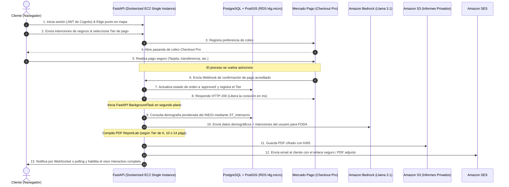

Author(s): Emmanuel Ramírez Romero & Antigravity AI
Status: Propuesta
Ultima actualización: 2026-05-21

---

# RFC: Arquitectura y Sistema de Tiers para GeoViabilidad Hook

Este documento de **Petición de Comentarios (RFC)** formaliza el diseño arquitectónico y de negocio para la plataforma de Geomarketing **GeoViabilidad Hook** enfocada en México, validando la consolidación técnica en AWS para minimizar costos de infraestructura y el motor de cobros basado en tiers de acceso (Básico, Pro y Premium).

---

## Links y Justificación del Stack Tecnológico en AWS

Para sustentar la viabilidad técnica y económica de la arquitectura de costo mínimo ($\approx \$21.50$ USD/mes), se listan a continuación los enlaces de documentación oficial junto con la justificación y ventajas de cada servicio y API:

### 🌐 Distribución y DNS de Alta Velocidad
*   **📋 [Amazon Route 53](https://aws.amazon.com/route53/)**: Servicio de DNS altamente disponible y escalable.
    *   *Ventaja*: Permite resolver peticiones a nivel global en milisegundos con failover integrado y mapeo simplificado de certificados SSL de AWS Certificate Manager (ACM) para asegurar conexiones seguras.
*   **⚡ [AWS CloudFront](https://aws.amazon.com/cloudfront/)**: Red de Entrega de Contenido (CDN) global.
    *   *Ventaja*: Almacena en caché el frontend en puntos de presencia locales en México. Su capa gratuita cubre hasta 1 TB de transferencia de salida mensual, reduciendo a cero el costo de distribución de la aplicación estática y protegiendo el origen.

### 📦 Almacenamiento y Cómputo Consolidado
*   **🗄️ [Amazon S3 (Simple Storage Service)](https://aws.amazon.com/s3/)**: Almacenamiento de objetos líder en la industria con una durabilidad del $99.999999999\%$.
    *   *Ventaja*: Aloja el frontend estático por menos de $0.50 USD/mes mediante *S3 Static Web Hosting* y almacena los reportes PDF privados cifrados con claves KMS, protegiendo los informes descargables de accesos no autorizados.
*   **⚙️ [Amazon EC2](https://aws.amazon.com/ec2/)**: Instancia de servidor virtual de cómputo en la nube de AWS.
    *   *Ventaja*: Aloja de forma directa y flexible el contenedor Docker de la API y las tareas asíncronas. Al consolidar la API y tareas en segundo plano en memoria con `FastAPI BackgroundTasks`, se erradican los costos fijos adicionales de colas de mensajería (SQS), balanceadores (ALB) y múltiples servicios de contenedores Fargate, garantizando un presupuesto mensual predecible e inalterable.

### 💾 Base de Datos y Seguridad
*   **🛢️ [Amazon RDS PostgreSQL + PostGIS](https://aws.amazon.com/rds/postgresql/)**: Motor de base de datos relacional totalmente gestionado.
    *   *Ventaja*: Habilita consultas espaciales nativas sumamente complejas mediante la extensión **PostGIS** sobre un esquema fijo (db.t4g.micro) por $\approx \$12.00$ USD/mes, evitando las fluctuaciones e inestabilidades de costos de Aurora Serverless.
*   **🔑 [Amazon Cognito](https://aws.amazon.com/cognito/)**: Servicio descentralizado de gestión de identidades y accesos (CIAM).
    *   *Ventaja*: Remueve la complejidad de almacenar contraseñas en la base de datos local y es gratuito hasta para los primeros 50,000 Usuarios Activos Mensuales (MAU), entregando tokens JWT seguros para validar sesiones al instante.
*   **🔒 [AWS SSM Parameter Store](https://aws.amazon.com/systems-manager/features#Parameter_Store)**: Almacén seguro para configuración y llaves criptográficas.
    *   *Ventaja*: Permite almacenar de forma encriptada y estándar (SecureString) los secretos de Mercado Pago y Google Places de forma **completamente gratuita**, evitando el cobro de AWS Secrets Manager. Para **Amazon Bedrock** y **Amazon S3 - Informes**, se asignará un **AWS IAM Role** de forma directa a la instancia EC2, eliminando por completo la necesidad de almacenar o inyectar llaves de acceso AWS, lo cual maximiza la ciberseguridad.

### 📧 Mensajería y APIs de Terceros
*   **✉️ [Amazon SES (Simple Email Service)](https://aws.amazon.com/ses/)**: Infraestructura de alta entregabilidad para correos electrónicos.
    *   *Ventaja*: Envía las confirmaciones e informes PDF generados directamente al buzón del cliente utilizando la capa de uso gratuito de AWS de forma sumamente robusta.
*   **🤖 [Amazon Bedrock (Meta Llama 3.1)](https://aws.amazon.com/bedrock/)**: Motor de inferencia de IA nativo de AWS.
    *   *Ventaja*: Proporciona análisis cualitativos en lenguaje natural de forma extremadamente segura (cumpliendo con HIPAA y RGPD) y veloz sin exponer datos fuera del entorno de red de tu AWS.
    *   *Ventaja*: Proporciona análisis cualitativos en lenguaje natural sobre las variables demográficas en milisegundos con un costo de API mínimo en comparación con GPT-4.
*   **🗺️ [Google Places API](https://developers.google.com/maps/documentation/places/web-service/overview)**: Base de datos comercial interactiva a nivel mundial.
    *   *Ventaja*: Permite obtener en tiempo real los competidores directos/indirectos y atractores de tráfico de la ubicación seleccionada.
*   **⏱️ [BestTime API](https://besttime.app/)**: Motor de predicción de afluencia peatonal.
    *   *Ventaja*: Brinda patrones dinámicos e históricos de saturación horaria por día para el análisis profundo en el Tier Premium.

---

## Objetivo

Facilitar a pymes, inversionistas y emprendedores mexicanos la toma de decisiones estratégicas de localización inteligente basadas en datos demográficos y de mercado objetivos, **mitigando de forma directa la tasa de fracaso del 70% de nuevos negocios en México** debido a una mala ubicación comercial. Esto se logra mediante una plataforma de geomarketing interactiva y económica basada en micropagos, complementada por un pipeline administrativo robusto que automatiza la ingesta de Shapefiles de INEGI para mantener los datos demográficos actualizados en base de datos PostgreSQL + PostGIS sin requerir expertos en Sistemas de Información Geográfica (SIG).

### Goals
1.  **Democratización del Geomarketing Corporativo**: Brindar a micro y pequeñas empresas análisis comerciales detallados y diagnósticos por IA, que tradicionalmente cuestan miles de dólares, a tarifas accesibles a partir de **$99 MXN** mediante un esquema de cobro transaccional por punto con **Mercado Pago Checkout Pro**.
2.  **Eliminación de Barreras Técnicas SIG (INEGI al Vuelo)**: Desarrollar algoritmos de intersección geoespacial (`ST_Intersects`) optimizados con índices GIST en PostGIS que digieran la compleja estructura demográfica de AGEBs de INEGI y la crucen dinámicamente con competencia local en menos de **800ms**.
3.  **Autosuficiencia en Ingesta de Datos (Cero Placeholders)**: Diseñar e implementar un pipeline administrativo asíncrono en `/admin` para que gestores no técnicos puedan subir, reproyectar geodésicamente al datum estándar `EPSG:4326` e insertar Shapefiles estatales de INEGI en hilos de fondo en menos de **15 segundos** por bloque.
4.  **IA Explicable para Emprendedores**: Integrar **Amazon Bedrock** para traducir variables cuantitativas y espaciales complejas (como densidad demográfica, saturación comercial Huff e índices de atracción) en reportes FODA intuitivos e interpretables en lenguaje natural.
5.  **Garantía de Operación a Costo Mínimo**: Estructurar un backend unificado en un contenedor Docker ejecutándose en una instancia de **Amazon EC2** con tareas en segundo plano en memoria (`BackgroundTasks`) que elimine por completo el cobro fijo de balanceadores (ALB) y colas de mensajería (SQS), manteniendo el costo de nube AWS en **menos de $22.00 USD mensuales**.

### Non-Goals
1.  **No proveer consultoría legal o de uso de suelo**: El sistema no valida licencias comerciales ni normativas jurídicas de zonificación y uso de suelo locales.
2.  **No sustituir la inspección física in situ**: La herramienta es un soporte cuantitativo y cualitativo de geomarketing, pero no reemplaza la validación de campo (ej. estado de la fachada, flujo peatonal visual específico, condiciones del local).
3.  **No automatizar facturas fiscales (SAT / CFDI)**: El alcance transaccional se limita a la acreditación del pago seguro con Mercado Pago y desbloqueo de funcionalidades; la facturación manual o automatizada queda fuera de esta fase.
4.  **No dar cobertura internacional**: El motor y las bases de datos cartográficas están calibrados exclusivamente para el territorio de la República Mexicana.

---

## Background

En México, más del 70% de las nuevas pymes cierran sus puertas antes de cumplir dos años de vida, principalmente por una mala selección del local comercial. La información geoespacial está disponible a través del Censo de Población y Vivienda del **INEGI** (a nivel AGEB y manzana), pero su acceso técnico requiere herramientas SIG muy complejas y bases de datos con soporte geoespacial costosas.

Adicionalmente, realizar un cruce demográfico con la oferta de competidores en tiempo real (Google Places) y flujos dinámicos de personas (BestTime API) es prohibitivo para un pequeño emprendedor. **GeoViabilidad Hook** democratiza esta información combinando el poder del visor interactivo web de Leaflet.js, PostgreSQL/PostGIS a bajo costo y un motor de razonamiento de IA (Amazon Bedrock) para guiar al usuario mediante un sistema comercial de micropagos adaptado a sus necesidades y presupuesto.

---

## Overview

El sistema opera bajo un modelo desacoplado y optimizado:
1.  **Frontend Estático**: Hospedado en un bucket de Amazon S3 y distribuido mediante **AWS CloudFront** para acelerar cargas y asegurar conexiones HTTPS de manera gratuita.
2.  **Backend Unificado**: Desarrollado en Python 3.12 (gestionado con `uv`) bajo **FastAPI**, empaquetado en un contenedor Docker en una instancia de **Amazon EC2**. Este único contenedor actúa tanto como API como motor asíncrono en memoria para tareas pesadas mediante hilos de fondo (`BackgroundTasks`), evitando el aprovisionamiento de colas SQS o workers redundantes.
3.  **Base de Datos Geoespacial Fija**: Una instancia única de **Amazon RDS PostgreSQL (db.t4g.micro)** con almacenamiento GP3 de 20GB y la extensión espacial **PostGIS** instalada. Se omiten RDS Proxy y Aurora Serverless por costes fijos elevados.
4.  **Capa de Gestión de Parámetros**: Inyección de variables de entorno y API Keys sin cargo mediante **AWS SSM Parameter Store**.
5.  **Identidad**: **Amazon Cognito** para registros y logins de clientes con validación JWT transparente.

---

## Detailed Design o solución

### Diagrama de Flujo del Sistema (Formato ASCII)

#### A. Flujo Transaccional y Analítico Asíncrono
Representa el camino desde que el cliente solicita el análisis, se procesa la transacción de cobro segura y se genera el informe analítico en segundo plano sin bloquear al usuario:

```
+---------------------------------------------------------------------------------------------------+
|                                  GeoViabilidad Hook - Flujo Asíncrono                             |
+---------------------------------------------------------------------------------------------------+

[ Cliente (Navegador) ]
          │
          │ 1. Solicita Análisis (JWT Cognito + Intenciones + Lat/Lng)
          ▼
   [ FastAPI Backend ] ─── 2. Genera Preferencia ───► [ Mercado Pago (Checkout Pro) ]
          │                                                         │
          │                                                         │ 3. Realiza Pago Seguro
          │                                                         ▼
          │                                                [ Transacción Aprobada ]
          │                                                         │
          │ 5. Procesa en Background (FastAPI BackgroundTask)       │ 4. Envía Webhook HTTP POST
          ├◄────────────────────────────────────────────────────────┘
          │
          ├───► [ PostGIS (RDS PostgreSQL) ] ───► Consulta Demografía Ponderada (ST_Intersects)
          │
          ├───► [ Google Places / BestTime ] ───► Recupera Competencia y Afluencia Peatonal
          │
          ├───► [ Amazon Bedrock (Meta Llama 3.1) ] ───► Genera FODA Contextualizado
          │
          ├───► [ ReportLab PDF Engine ] ────────► Compila PDF Ejecutivo (6, 10 o 14 páginas)
          │
          ├───► [ Amazon S3 KMS ] ──────────────► Persiste Reporte PDF Seguro y Cifrado
          │
          └───► [ Amazon SES ] ─────────────────► Envía Email con PDF / URL Firmada al Cliente
```

#### B. Pipeline de Ingesta Geoespacial Asíncrono (Administración)
Representa el flujo de descompresión, reproyección de datum de INEGI al CRS internacional e inserción optimizada a base de datos de forma no bloqueante:

```
+---------------------------------------------------------------------------------------------------+
|                              Pipeline de Ingesta Geoespacial Asíncrono                            |
+---------------------------------------------------------------------------------------------------+

[ Administrador (/admin) ]
          │
          │ 1. Carga Shapefiles (.zip multipart)
          ▼
   [ FastAPI Backend ] ─── 2. Retorna ID de Tarea & Estado 202 ───► [ Administrador (Polleo de Estado) ]
          │
          │ 3. Dispara Tarea Asíncrona (FastAPI BackgroundTask)
          ▼
 [ Contenedor Docker en EC2 ]
          │
          ├───► Descomprime temporalmente ZIP en memoria (/tmp)
          │
          ├───► Lee geometrías y censos de INEGI con GeoPandas y Fiona
          │
          ├───► Reproyecta geodésicamente al CRS estándar EPSG:4326 (WGS84)
          │
          ├───► Realiza inserción masiva en lotes de 1000 a la tabla 'agebs_demografia' (RDS PostGIS)
          │
          └───► Reconstruye índice espacial GIST (idx_agebs_geom) en RDS y elimina archivos temporales
```

---

### Diagrama de Secuencia de Operación

El flujo de procesamiento para la generación y entrega de informes transaccionales opera de la siguiente manera:



---

### Ingesta Geoespacial Asíncrona (Panel Administrativo `/admin`)

Para mantener actualizada la base de datos nacional con datos del Censo de Población de INEGI de forma autónoma:
1.  El administrador autenticado con rol `admin` en Cognito carga un archivo `.zip` que contiene los Shapefiles (`.shp`, `.dbf`, `.shx`, `.prj`) de AGEBs urbanas estatales.
2.  La API de FastAPI recibe el archivo multipart, genera un ID de seguimiento único y asigna una tarea asíncrona mediante `BackgroundTasks.add_task(procesar_ingesta_task, zip_file, ID)`.
3.  La API responde al instante al administrador con un estado HTTP 202 y el ID de tarea para su monitoreo.
4.  La tarea en segundo plano ejecuta:
    *   Descompresión de los Shapefiles en un directorio temporal en memoria (`/tmp` del contenedor Fargate).
    *   Lectura de la cartografía y variables mediante **GeoPandas** y **Fiona**.
    *   Reproyecta la cartografía del datum local de INEGI (ej. ITRF92) al estándar **EPSG:4326 (WGS84)** de forma nativa.
    *   Carga en bloque optimizada (inserciones masivas en batch de 1,000 registros) a la tabla `agebs_demografia` utilizando sentencias SQL preparadas sobre la conexión activa de RDS PostgreSQL.
    *   Elimina archivos temporales y reconstruye el índice espacial GIST (`idx_agebs_geom`) para mantener las búsquedas espaciales en milisegundos.
5.  El administrador monitorea el avance porcentual mediante un endpoint de polling `/api/admin/ingestar/estado/{id}` que consulta el estado almacenado en caché.

---

## Consideraciones

### 🔒 Seguridad en Producción
*   **Aislamiento de Datos**: La base de datos RDS PostgreSQL se configurará en una subred privada dentro de la VPC. Ningún puerto de base de datos (`5432`) será expuesto directamente a Internet. El acceso se limitará exclusivamente a la IP privada de la instancia de Amazon EC2.
*   **Protección de Secretos**: No se incluirán claves de API o credenciales en el repositorio de GitHub. Todos los secretos en producción se almacenarán en **AWS SSM Parameter Store** como parámetros cifrados del tipo `SecureString` y se inyectarán como variables de entorno al levantar el contenedor Docker en la EC2.
*   **Autenticación Robusta**: Todo acceso a los endpoints del visor y reportes se validará en el backend de FastAPI interceptando y decodificando los tokens JWT de Amazon Cognito.
*   **Acceso al VPS**: Los despliegues se automatizarán mediante flujos de **GitHub Actions** firmados. El acceso administrativo directo a servidores o contenedores se restringirá a llaves SSH autorizadas.

### 💳 Integración de Cobro con Mercado Pago
*   **Integridad de Webhooks**: El endpoint de webhook `/api/pagos/webhook` validará la firma de seguridad emitida por Mercado Pago en las cabeceras HTTP para impedir ataques de suplantación.
*   **Idempotencia**: Se implementará un mecanismo de control de estado en la tabla `ordenes_pagos` para asegurar que las notificaciones de webhooks duplicadas no generen reportes o llamadas al LLM de forma redundante.

---

## Métricas

### Métricas Técnicas (Validación de Rendimiento)
1.  **Latencia de Intersección Espacial**: Las consultas espaciales en RDS PostgreSQL (`ST_Intersects` y ponderación demográfica) deben resolverse en menos de **800 milisegundos** dentro del búfer de 5km gracias al índice GIST.
2.  **Tiempo de Procesamiento de Ingesta**: El pipeline administrativo debe reproyectar e insertar 1,000 polígonos de AGEBs en un tiempo menor a **15 segundos** en la base de datos RDS t4g.micro.
3.  **Tasa de Llamadas de API Optimizada**: Se medirá la tasa de aciertos de la caché de base de datos relacional para Google Places y Amazon Bedrock, con el objetivo de lograr un ahorro superior al **50% en llamadas redundantes** en un período de 30 días.
4.  **Consumo de Recursos EC2**: Monitorear a través de CloudWatch que el uso sostenido de CPU de la instancia permanezca por debajo del **75%** y la RAM por debajo del **85%** durante picos de solicitudes transaccionales simultáneas.
5.  **Costo de Infraestructura**: Validar a través de AWS Budgets que el gasto total de recursos se mantenga estrictamente por debajo de los **$22.00 USD mensuales** bajo una carga transaccional regular.

### Métricas de Negocio (Kpis Operacionales)
1.  **Conversión por Tier**: Medir el porcentaje de usuarios de Vista Previa Gratuita que realizan un upgrade a los planes Básico, Pro o Premium.
2.  **Rentabilidad por Consulta**: Calcular el costo computacional promedio de APIs externas (Google Places + BestTime + Bedrock) contra el ingreso por Tier para asegurar un margen operativo neto superior al **70%**.
3.  **Tasa de Éxito de Ingesta**: Porcentaje de archivos Shapefiles comprimidos cargados por administradores que concluyen su inserción a PostGIS exitosamente en el primer intento.
4.  **Descargas de Reportes**: Conteo dinámico de PDFs firmados generados y descargados por los usuarios según el Tier adquirido.
