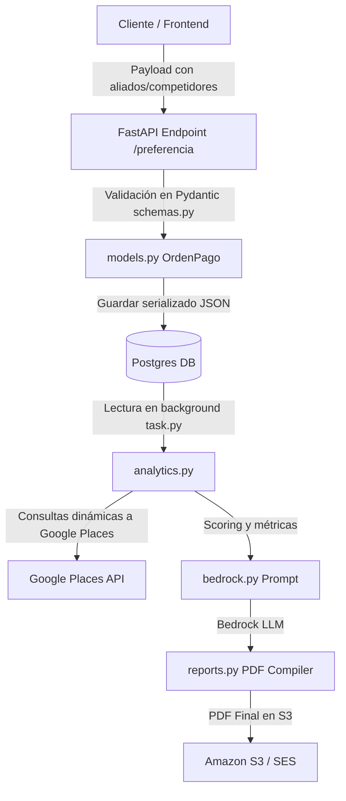

# Diseño Técnico: Personalización de Aliados y Competidores

## 1. Diseño del Modelo de Datos

### Cambios en Tabla `ordenes_pagos`
Se agregarán dos columnas a la tabla `ordenes_pagos` en PostgreSQL:
* `competidores_seleccionados` (`TEXT`): Almacenará la lista serializada en JSON de tipos seleccionados.
* `aliados_seleccionados` (`TEXT`): Almacenará la lista serializada en JSON de tipos seleccionados.

### Migración de Base de Datos
Se creará un script de migración en Python `scratch/add_custom_selection_columns.py` que aplicará:
```sql
ALTER TABLE ordenes_pagos 
ADD COLUMN IF NOT EXISTS competidores_seleccionados TEXT,
ADD COLUMN IF NOT EXISTS aliados_seleccionados TEXT;
```

---

## 2. Flujo y Validación de Datos



### Validación en `schemas.py`
Se validarán las listas en `PreferenciaCreate` utilizando decoradores de Pydantic:
* Si `tier_adquirido == 'basico'`: Tanto `competidores_seleccionados` como `aliados_seleccionados` deben ser nulos o estar vacíos.
* Si `tier_adquirido == 'pro'`: `competidores_seleccionados` puede tener un máximo de 3 elementos. `aliados_seleccionados` debe ser nulo o estar vacío.
* Si `tier_adquirido == 'premium'`: `competidores_seleccionados` y `aliados_seleccionados` pueden tener un máximo de 5 elementos cada uno.

---

## 3. Consultas Dinámicas en `analytics.py`

### Mapeo de Competidores
* Si no hay categorías personalizadas, se usa el resolvedor estándar `google_type`.
* Si están definidas, se ejecuta un loop que llama a `buscar_competidores` para cada categoría y se eliminan duplicados (en base a su identificador de lugar único o coordenadas exactas).

### Mapeo de Aliados
* En Tier Premium, si el usuario seleccionó aliados personalizados, se consultan en Google Places.
* Se unifican en `aliados_listado` con sus metadatos (nombre, tipo, rating, dirección).

---

## 4. Estructura de Prompts e Integración de IA
En `bedrock.py`, el `user_prompt` se expandirá para incluir de forma estructurada:
* Las categorías de competidores y el conteo de comercios detectados de cada tipo.
* Las categorías de aliados y el conteo de comercios detectados de cada tipo.
* Esto instruye al LLM a relacionar de forma cruzada por qué las sinergias o la saturación afectan la viabilidad del punto.

---

## 5. Diseño de Experiencia de Errores Orientada al Usuario
* Si la llamada a Google Places para alguna categoría personalizada falla por timeout o cuota, el motor de analítica continuará procesando las demás categorías de forma resiliente, registrando el error en los logs internos y mostrando lo que esté disponible en el PDF sin tracebacks para el usuario.
