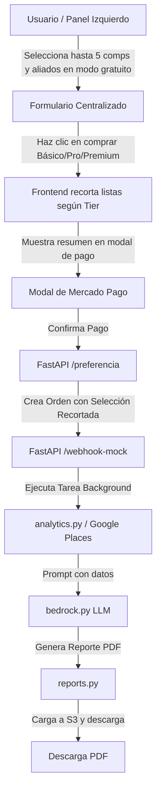
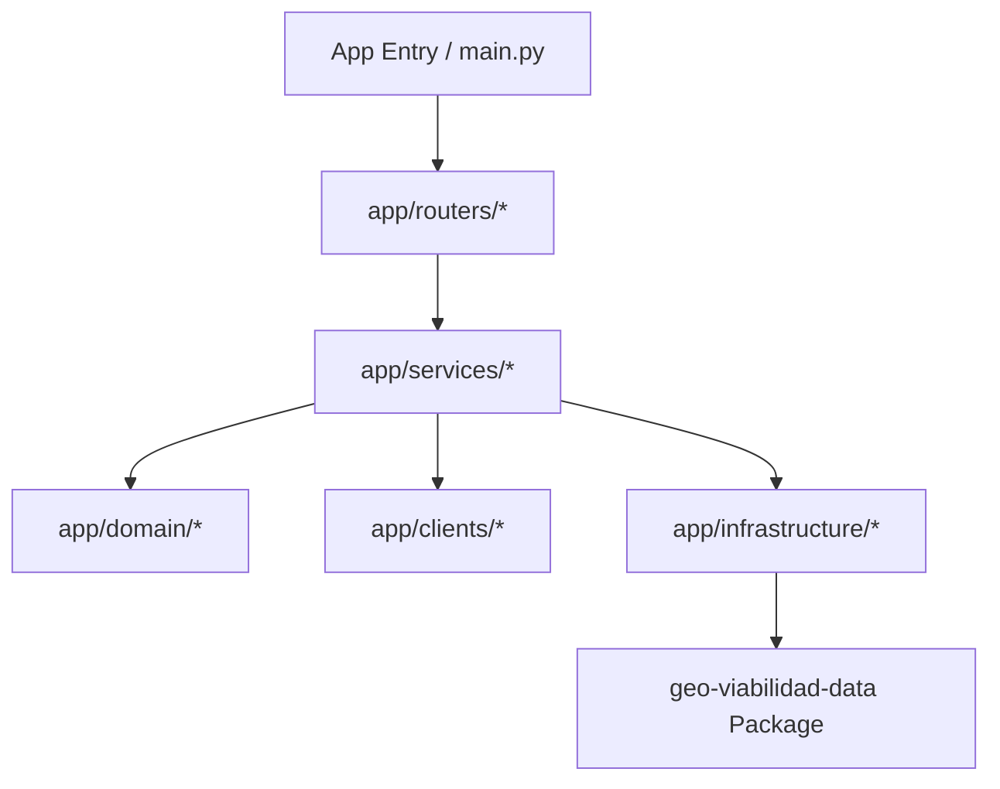

# Diseño Técnico: Personalización de Aliados y Competidores

## 1. Diseño del Modelo de Datos

### Cambios en Tabla `ordenes_pagos`
Se agregarán dos columnas a la tabla `ordenes_pagos` en PostgreSQL:
* `competidores_seleccionados` (`TEXT`): Almacenará la lista serializada en JSON de tipos seleccionados.
* `aliados_seleccionados` (`TEXT`): Almacenará la lista serializada en JSON de tipos seleccionados.

### Migración de Base de Datos
Se creará un script de migración en Python `scratch/add_custom_selection_columns.py` que aplicará:
```sql
ALTER TABLE ordenes_pagos 
ADD COLUMN IF NOT EXISTS competidores_seleccionados TEXT,
ADD COLUMN IF NOT EXISTS aliados_seleccionados TEXT;
```

---

## 2. Flujo y Validación de Datos



### Validación en `schemas.py`
Se validarán las listas en `PreferenciaCreate` utilizando decoradores de Pydantic:
* Si `tier_adquirido == 'basico'`: `competidores_seleccionados` puede tener un máximo de 1 elemento. `aliados_seleccionados` debe ser nulo o estar vacío.
* Si `tier_adquirido == 'pro'`: `competidores_seleccionados` puede tener un máximo de 3 elementos. `aliados_seleccionados` debe ser nulo o estar vacío.
* Si `tier_adquirido == 'premium'`: `competidores_seleccionados` y `aliados_seleccionados` pueden tener un máximo de 5 elementos cada uno.

---

## 3. Consultas Dinámicas en `analytics.py`

### Mapeo de Competidores
* Si no hay categorías personalizadas, se usa el resolvedor estándar `google_type`.
* Si están definidas, se ejecuta un loop que llama a `buscar_competidores` para cada categoría (soporta Básico, Pro y Premium) y se eliminan duplicados.

### Mapeo de Aliados
* En Tier Premium, si el usuario seleccionó aliados personalizados, se consultan en Google Places.
* Se unifican en `aliados_listado` con sus metadatos (nombre, tipo, rating, dirección).

---

## 4. Estructura de Prompts e Integración de IA
En `bedrock.py`, el `user_prompt` se expandirá para incluir de forma estructurada:
* Las categorías de competidores y el conteo de comercios detectados de cada tipo.
* Las categorías de aliados y el conteo de comercios detectados de cada tipo.
* Esto instruye al LLM a relacionar de forma cruzada por qué las sinergias o la saturación afectan la viabilidad del punto.

---

## 5. Diseño de Experiencia de Errores Orientada al Usuario
* Si la llamada a Google Places para alguna categoría personalizada falla por timeout o cuota, el motor de analítica continuará procesando las demás categorías de forma resiliente, registrando el error en los logs internos y mostrando lo que esté disponible en el PDF sin tracebacks para el usuario.

---

## 6. Diseño del Ajuste de Layout en Portada del PDF
Para evitar el desbordamiento de la primera página, reduciremos los espaciadores verticales (`Spacer`) en la portada:
* **Espaciador Superior**: Reducido de `150pt` a `80pt`.
* **Espaciador Central**: Reducido de `100pt` a `50pt`.
* **Espaciador Inferior**: Reducido de `60pt` a `40pt`.

### Mapeo Estético del Tier Adquirido
Para mejorar la presentación en el campo de metadatos de la portada del PDF, se implementará un mapeo explícito de los tiers:
```python
tier_map = {
    "basico": "BÁSICO",
    "pro": "PRO",
    "premium": "PREMIUM",
}
```
Esto asegura la acentuación correcta en español ("TIER BÁSICO" en lugar de "TIER BASICO" o "TIER PREMIUM" forzado).

---

## 7. Diseño de Remoción de Jergas y Proveedores Técnicos
Se implementarán modificaciones en cadenas de texto estáticas y dinámicas para ocultar la infraestructura tecnológica subyacente a los ojos del usuario:
* **En el PDF (`reports.py`)**:
  * Títulos de página simplificados (ej. "7. COMPETENCIA DETALLADA" en lugar de "7. COMPETENCIA DETALLADA (GOOGLE PLACES)").
  * Redefinición del anexo metodológico para eliminar referencias directas a APIs propietarias.
  * Cambios de cabeceras de tablas ("Valor Real PostGIS" -> "Valor Encontrado").
* **En el Frontend (`index.html` y `app.js`)**:
  * Ocultar menciones de AWS, S3, Cognito, FastAPI y ReportLab.
  * Reemplazo de los estados de la barra de progreso simulada para usar frases amigables como "Autenticando sesión..." y "Almacenando reporte..." en lugar de referencias a "Cognito User Pool" y "Amazon S3 (KMS)".
* **En variables del API (`routes_analytics.py`)**:
  * Modificación de `"mensaje_tier"` de salida para quitar la mención explicativa de "Bedrock" o "BestTime".

---

## 8. Diseño de Consistencia y Caché de Reportes en PostgreSQL

### Cambios en Tabla `ordenes_pagos`
Se agregarán dos columnas adicionales a la tabla `ordenes_pagos` en PostgreSQL:
* `resultado_json` (`TEXT`): Almacenará en formato JSON serializado el diccionario de resultados del motor de analítica (`resultado` / `analisis_cuant`).
* `foda_json` (`TEXT`): Almacenará en formato JSON serializado el diagnóstico estratégico devuelto por la IA.

### Migración de Base de Datos
Se creará un script de migración en Python `scratch/add_report_cache_columns.py` que aplicará:
```sql
ALTER TABLE ordenes_pagos 
ADD COLUMN IF NOT EXISTS resultado_json TEXT,
ADD COLUMN IF NOT EXISTS foda_json TEXT;
```

### Flujo de Datos Actualizado
1. **Webhook de Aprobación**: El pago se procesa, la orden pasa a `approved` y se encola `generar_informe_task`.
2. **Background Task (`tasks.py`)**:
   - Ejecuta `procesar_calculo_analitico` y obtiene `resultado` (incluyendo `sva`).
   - Ejecuta `generar_analisis_foda` y obtiene `analysis_result`.
   - **NUEVO**: Guarda `resultado_json = json.dumps(resultado)` y `foda_json = json.dumps(analysis_result)` en `OrdenPago` y hace `db.commit()`.
   - Genera el reporte PDF y lo sube a S3.
3. **Consulta de Resultados del Dashboard (`routes_analytics.py` - `/api/analizar/resultado/{orden_id}`)**:
   - Lee el registro de la orden.
   - **NUEVO**: Si `orden.resultado_json` y `orden.foda_json` existen, los 3. **Lectura Inmediata**: Modificar el endpoint del dashboard para retornar directamente este JSON si está disponible, sirviendo como caché definitivo y asegurando 100% de consistencia entre la vista digital y el reporte PDF.
   - **Fallback**: Si no existieran por algún motivo (ej. migración de registros antiguos), realiza los cálculos en caliente, guarda las respuestas en la base de datos para futuras peticiones, y retorna el resultado.

---

## 9. Diseño de Búsqueda de Direcciones y Geocodificación Directa

### Backend - Integración con Google Geocoding API (`google_places.py`)
Se agregará la función `buscar_coordenadas_por_direccion` que interactúa con la API de Google:
* **Endpoint de Google**: `https://maps.googleapis.com/maps/api/geocode/json`
* **Parámetros**:
  * `address`: Texto ingresado por el usuario.
  * `components`: Restringido a `country:MX` para acotar los resultados únicamente a México.
  * `language`: `es` para obtener direcciones en español.
  * `key`: `GOOGLE_MAPS_API_KEY`.
* **Retorno**: Una lista de hasta 5 candidatos con formato: `{"direccion": formatted_address, "latitud": lat, "longitud": lng}`.

### Backend - Endpoint de Consulta (`routes_analytics.py`)
Se expondrá un nuevo endpoint GET `/api/analizar/buscar-direccion`:
* **Parámetros**: `direccion` (string requerido).
* **Seguridad**: Requiere autenticación de usuario (Cognito Token en cabecera).
* **Comportamiento**: Retorna un JSON con estado de éxito y la lista de ubicaciones candidatas.

### Frontend - Buscador Flotante (HTML / CSS)
* Se añadirá el contenedor del buscador con estilo flotante (`position: absolute; top: 20px; left: 20px; z-index: 1000;`) sobre el div del mapa `#map`.
* Se aplicará la estética del sistema de diseño (glassmorphism con bordes curvos, fondos translúcidos y fuentes legibles).
* El dropdown de sugerencias `#map-search-results` aparecerá de forma dinámica al obtener resultados y se cerrará al hacer clic en uno de ellos o al hacer clic fuera del buscador.

### Frontend - Flujo de Control en JS (`app.js`)
* Se registrarán escuchadores de eventos para:
  * El botón de búsqueda `click` e input `keypress` (tecla Enter).
  * Consumo asíncrono del endpoint `/api/analizar/buscar-direccion?direccion=...`.
  * Renderizado interactivo de sugerencias en `#map-search-results`.
* Al hacer clic en un elemento de la lista:
  1. Se actualiza el valor del input con la dirección formateada.
  2. Se mueve la vista del mapa con `state.map.setView([lat, lng], 16)`.
  3. Se invoca a `handleMapClick(lat, lng)`, reutilizando toda la lógica del marcador, círculo e INEGI.
  4. Se oculta el dropdown.

---

## 10. Diseño de Consistencia y Calidad de Reportes (FODA, Competidores y Atractores)

### 10.1 Unificación de Criterios en el Diagnóstico
* En `bedrock.py`, el prompt de sistema y la simulación local (`DEV_MODE`) se modificarán para obligar al LLM a ajustar sus textos de salida (conclusión, recomendación de ROI, viabilidad financiera y dictamen final) en función de la escala del score `SVA` recibido:
  * `SVA < 50` (Bajo/Riesgoso): El tono debe ser de advertencia clara y diagnóstico desfavorable/reservado, estimando ROI de 24 a 36 meses y TIR anual baja (<12%).
  * `50 <= SVA <= 79` (Moderado): El tono debe ser equilibrado y prudente, destacando que es factible pero requiere estrategias fuertes de diferenciación comercial para mitigar el riesgo.
  * `SVA >= 80` (Alto/Excelente): El tono debe ser favorable y promotor, con estimación de ROI de 12 a 15 meses y TIR anual alta.

### 10.2 Ajuste del Pilar Atractores
* En `reports.py`, el texto dinámico de estatus en el Pilar de Atractores (Pág. 4) se construirá sumando y detallando los aliados personalizados del usuario si `aliados_seleccionados` o `aliados_adicionales` están definidos, en lugar de recurrir al conteo estático de bancos/escuelas/transporte por defecto.
* La conclusión del Forecast (Pág. 10) leerá la suma total de atractores reales detectados. Si es 0, en vez de imprimir el texto estático de "confluencia de atractores consolidados", inyectará un párrafo alternativo aclarando que la zona carece de atractores significativos y que el éxito dependerá enteramente de la captación autónoma de la demanda local.

### 10.3 Mapeo del Tipo "Fast Food"
* En `google_places.py`, la función `buscar_competidores` interceptará el tipo `fast_food` y lo transformará internamente a `restaurant` con la palabra clave `"fast food"`. Esto evitará que la API de Google ignore el parámetro de tipo y devuelva comercios de cualquier giro, resolviendo la inclusión de establecimientos no alimentarios en la lista.

### 10.4 Desglose Compacto de Competidores Adicionales
* En `reports.py`, al pie de la tabla de la Página 8 (Competidores Detallados), si el número de competidores directos en la lista devuelta es mayor a 4, se calculará y agregará un párrafo con tipografía compacta (`fontSize=7.5`, `leading=9.5`) listando de forma explícita los nombres de hasta 15 establecimientos adicionales, previniendo el overflow de la página y respetando la maquetación exacta.

### 10.5 Estimación e Integración de Nivel Socioeconómico (NSE)
* **Consulta Geoespacial en `analytics.py`**:
  * Se realizará una consulta a la tabla `ageb_demographics` cruzándola con el búfer geodésico de radio.
  * Se calcularán los promedios ponderados de población para las variables: `graproes`, `vivpar_hab`, `vph_autom`, `vph_inter` y `vph_pc`.
* **Cálculo Heurístico del Score de NSE**:
  * `nse_score = (escolaridad_promedio / 18.0 * 40.0) + (internet_pct * 0.3) + (autos_pct * 0.3)`
  * Mapeo de Niveles AMAI:
    * `nse_score >= 70` -> `"A/B (Alto / Alto Medio)"`
    * `55 <= nse_score < 70` -> `"C+ (Medio Alto)"`
    * `40 <= nse_score < 55` -> `"C / C- (Medio / Medio Bajo)"`
    * `25 <= nse_score < 40` -> `"D+ (Bajo Alto)"`
    * `nse_score < 25` -> `"D / E (Bajo / Muy Bajo)"`
* **Mecanismo de Fallback Determinista**:
  * Si la consulta retorna NULL (debido a falta de datos en la tabla para esa zona), se computa un valor determinista usando el hash: `hash_val = int(abs(lat * 1000 + lng * 1000)) % 100`.
  * Se asignará un nivel ficticio consistente (A/B para <10, C+ para <35, C para <70, D+ para <90, D/E para el resto) y porcentajes realistas proporcionales a dicho nivel.
* **Integración en PDF (`reports.py`)**:
  * **Página 2**: La tabla de KPIs sintéticos ahora tendrá 4 columnas (`colWidths=[126, 126, 126, 126]`), incorporando "NIVEL SOCIOECONÓMICO" con su respectivo valor y estilo.
  * **Página 3**: Se insertarán 4 filas nuevas en la tabla `demo_table_data` para desglosar el nivel socioeconómico y los porcentajes reales/fallbacks de equipamiento/escolaridad.
* **Integración en Frontend (`index.html` y `app.js`)**:
  * Se inyectará el elemento `#kpi-nse-card` en la rejilla de KPIs en `index.html`.
  * En `app.js`, `runPreviewAnalysis` bloqueará el valor como `"🔒 Bloqueado"`.
  * `unlockPaidReport` desbloqueará y renderizará el nivel devuelto por el API (ej. `"C+ (Medio Alto)"`).

---

## 11. Diseño de Experiencia de Usuario: Contexto y Ayudas Contextuales (Tooltips)

### 11.1 Tarjeta Introductoria de Contexto (HTML, CSS y JS)
* **HTML (`index.html`)**:
  * Se agregará un bloque `<div class="intro-card glass-card" id="app-intro-card">` en la parte superior del panel de configuración (`.control-panel`), antes de la sección `.panel-header`.
  * Contenido estructurado:
    * Un botón de cierre discreto `<button class="close-intro-btn" id="close-intro-btn" title="Ocultar descripción">&times;</button>`.
    * Un título de sección: `📍 ¿Qué es GeoViabilidad Hook?`.
    * Un párrafo explicativo premium de geointeligencia.
    * Un listado ordenado o estructurado en tres pasos con iconos para detallar el flujo de uso.
* **CSS (`index.css`)**:
  * Estilos premium glassmorphic para `.intro-card`: fondo translúcido con desenfoque de fondo, bordes suaves y sombra.
  * Transición suave para el colapsado (`max-height`, `opacity`, `margin-bottom` con transiciones de 0.4s).
  * Estilos del botón de cierre (`.close-intro-btn`): flotante a la derecha, sin bordes ni fondo, con efecto de rotación y opacidad en hover.
* **JavaScript (`app.js`)**:
  * Al iniciar la app: verificar si `localStorage.getItem("hide_intro_card") === "true"`. Si es así, ocultar la tarjeta añadiendo la clase `.hidden` o `.collapsed`.
  * Escuchador de clic en `#close-intro-btn`: añade la clase de colapsado a la tarjeta y registra `localStorage.setItem("hide_intro_card", "true")`.

### 11.2 Tooltips de Información (CSS Puro y HTML)
* **CSS (`index.css`)**:
  * Se usará una solución robusta basada en CSS para evitar scripts innecesarios y optimizar el rendimiento.
  * Clase del contenedor del tooltip: `.info-tooltip-wrapper` con posición relativa.
  * Clase del icono: `.info-icon` (diseñado como un círculo discreto con fondo translúcido, borde suave, color del texto secundario, centrado, tamaño de 14px, que muestra el símbolo `i` o `ℹ️` y cursor `pointer` / `help`).
  * Clase del tooltip: `.tooltip-text` posicionado de manera absoluta (`position: absolute;`).
    * **Alineación por defecto**: Arriba del icono, centrado horizontalmente (`bottom: 125%; left: 50%; transform: translateX(-50%);`).
    * **Estética**: `background: rgba(15, 23, 42, 0.9); backdrop-filter: blur(12px); border: 1px solid var(--glass-border); border-radius: 8px; color: var(--text-primary); font-size: 11px; padding: 10px 12px; width: 220px; box-shadow: var(--shadow-premium); opacity: 0; pointer-events: none; transition: opacity 0.3s cubic-bezier(0.4, 0, 0.2, 1), transform 0.3s cubic-bezier(0.4, 0, 0.2, 1); z-index: 1010; transform: translateX(-50%) translateY(5px);`.
    * **Flecha del Tooltip**: Pseudo-elemento `::after` para dibujar un pequeño triángulo indicador en la base.
    * **Hover**: `.info-tooltip-wrapper:hover .tooltip-text` cambia a `opacity: 1; pointer-events: auto; transform: translateX(-50%) translateY(0);`.
    * **Temas**: Adaptación dinámica para `body.light-theme .tooltip-text` para usar fondo claro (`rgba(255, 255, 255, 0.95)`) y borde oscuro suave, garantizando un contraste del 100%.
    * **Excepciones de posicionamiento**: Para tooltips situados cerca de los bordes (ej: KPIs del panel de control o extremos del mapa/dashboard), se definirán modificadores `.tooltip-right`, `.tooltip-left` o `.tooltip-bottom` para reposicionar el globo y su flecha de forma segura.
* **HTML (`index.html`)**:
  * Se inyectarán los wrappers de tooltip `.info-tooltip-wrapper` junto a los textos de etiqueta y encabezados correspondientes.
  * **Textos Explicativos (Sin Jergas Técnicas)**:
    * *Giro*: "Determina el tipo de competidores comerciales y clientes objetivos que analizaremos en la zona."
    * *Radio*: "Define el alcance en metros del círculo de estudio para consultar la demografía y los comercios locales."
    * *Intenciones*: "Describe tus metas y el perfil de tu local para que nuestra Inteligencia Artificial personalice el diagnóstico estratégico."
    * *Competidores*: "Elige marcas o giros que compiten por los mismos clientes. El reporte los evaluará en detalle."
    * *Aliados*: "Elige giros complementarios que atraen público a la zona, generando sinergia para tu local."
    * *Score SVA*: "Evaluación matemática de idoneidad del punto (0 a 100). Integra concentración de personas, competencia y confluencia."
    * *Población*: "Cantidad estimada de habitantes residentes dentro de la zona de estudio (Censo de Población oficial)."
    * *Competidores*: "Número total de establecimientos del mismo giro detectados dentro de tu radio de influencia."
    * *NSE*: "Nivel socioeconómico promedio de la zona (AMAI). Mide el poder adquisitivo familiar y equipamiento del hogar."

---

## 12. Diseño Técnico de Autodetección por IA

### 12.1 Diseño del Formulario Interactivo (Frontend)
* Se añadirán dos checkboxes con estilo distintivo (clase `.checkbox-ia-auto` y bordes de acento):
  - `#competidores-ia-auto` (dentro de `#competidores-checkboxes`, valor `"ia_auto"`).
  - `#aliados-ia-auto` (dentro de `#aliados-checkboxes`, valor `"ia_auto"`).
* Lógica JS de exclusión mutua en `setupLeftPanelCheckboxLimits()`:
  - Cuando se hace check en `#competidores-ia-auto`:
    1. Se recorren los demás checkboxes en `#competidores-checkboxes`, se desmarcan y se les añade la propiedad `disabled = true`.
    2. Se añade la clase `.disabled-by-ia` a sus contenedores `label` para atenuar su opacidad al 40% y quitar los eventos del puntero (`pointer-events: none`).
    3. Se deshabilita `#competidores-adicionales-input` aplicando la clase `.disabled-by-ia`.
  - Si se desmarca, se habilita todo de nuevo y se recalcula el límite tradicional de selección.
  - Comportamiento idéntico para aliados estratégicos usando `#aliados-ia-auto` y `#aliados-adicionales-input`.

### 12.2 Intercepción y Adaptación en el Backend (`analytics.py`)
* En `procesar_calculo_analitico()`, antes de ejecutar la llamada a Google Places:
  - Si `competidores_seleccionados` contiene `"ia_auto"`:
    - Se establece internamente una variable de contexto `ia_autodetect_competidores = True`.
    - Se limpia la lista de `competidores_seleccionados` (dejándola en `None` o eliminando `"ia_auto"`) para que el buscador geográfico de Places realice la consulta estándar basándose en el rubro/giro resuelto.
  - Si `aliados_seleccionados` contiene `"ia_auto"`:
    - Se establece `ia_autodetect_aliados = True`.
    - Se limpia la lista de `aliados_seleccionados` para que el buscador geográfico realice la consulta estándar (bancos, escuelas, transporte).

### 12.3 Modificación del Prompt LLM (`bedrock.py`)
* Si `ia_autodetect_competidores` o `ia_autodetect_aliados` son verdaderas, se añade una directiva al `user_prompt` de Groq/Bedrock:
  - `"CRITICAL: El usuario ha delegado la determinación de competidores y aliados estratégicos a la Inteligencia Artificial de forma automática. En tus respuestas JSON ('conclusion', 'dictamen_final' y el FODA), debes identificar de manera proactiva qué comercios, marcas o tipos de negocios del entorno actúan como competidores o aliados clave para el éxito del local y justificar por qué."`
    * *Distribución Competidores*: "Muestra la calidad percibida de tus competidores directos en la zona basada en las valoraciones de los clientes."
    * *Atractores*: "Lista de magnetos comerciales principales (transporte, bancos, escuelas) y su grado de atracción de flujo peatonal."
    * *IA (FODA)*: "Diagnóstico FODA cruzado situacional y cuantitativo elaborado a la medida por nuestro motor de Inteligencia Artificial."

---

## 13. Diseño Técnico de KPIs Reales y Blur de Marketing (Dashboard)

### 13.1 Habilitación del Cálculo Completo en Backend
* **`analytics.py`:** Se eliminó la restricción `if tier == "premium"` para la búsqueda de atractores/aliados y la obtención de afluencia peatonal (`obtener_afluencia()`), haciendo que el motor analítico calcule toda la información avanzada para todos los tiers.
* **`routes_analytics.py`:**
  - El endpoint `/api/analizar/previa` ahora ejecuta `procesar_calculo_analitico` con `tier="premium"` y devuelve las listas completas de competidores, aliados y afluencia.
  - El endpoint `/api/analizar/resultado/{orden_id}` ya no vacía ni limpia `"competidores_listado"` ni `"afluencia_peatonal"`.

### 13.2 Visualización Nítida de KPIs e Interacción
* **`app.js`:** `runPreviewAnalysis()` realiza un POST asíncrono a `/previa` y puebla los 3 KPIs tradicionales (`kpi-sva`, `kpi-poblacion`, `kpi-competidores`) con los datos reales del INEGI, en lugar de bloquearlos con `"🔒 Bloqueado"`.

### 13.3 Aplicación de Blur en Frontend
* **`index.css`:** Definición de la clase `.blurred-premium` que aplica:
  ```css
  .blurred-premium {
      filter: blur(8px) grayscale(20%);
      pointer-events: none !important;
      user-select: none !important;
      opacity: 0.7;
  }
  ```
* **`app.js`:** Implementación de `applyBlurRules(tier)`. Esta función localiza `.canvas-wrapper` (Competidores) y `.table-wrapper` (Atractores) y les aplica o remueve la clase `.blurred-premium`, así como oculta o muestra los carteles `#comp-chart-locked-msg` y `#poi-chart-locked-msg` correspondientes en base a las reglas de negocio de los planes:
  - `gratuito` / `basico`: Ambos blurreados y con carteles visibles.
  - `pro`: Competidores nítido (sin cartel), atractores blurreado (con cartel).
  - `premium`: Ambos nítidos y sin carteles.

---

## 14. Diseño Técnico de la Arquitectura por Capas en la API

### 14.1 Distribución y Mapa de Componentes
Para lograr un acoplamiento débil y alta cohesión, el código de la API FastAPI se reestructura bajo los siguientes paquetes de `geo-viabilidad-api/app`:

1. **`infrastructure/` (Infraestructura)**:
   - Contiene los adaptadores de base de datos.
   - `database.py` y `models.py` actúan como re-exports de `geo_viabilidad_data` de forma limpia.
2. **`clients/` (Clientes Externos)**:
   - Wrappers puros para APIs de red externas.
   - `google_places.py` (Places, Geocoding), `besttime.py` (matriz peatonal) y `bedrock.py` (LLM de Amazon Bedrock).
3. **`domain/` (Dominio)**:
   - Algoritmos puros de cálculo geométrico y de negocio, sin librerías de FastAPI ni SQLAlchemy.
   - Contiene `sva_calculo.py`, `nse.py`, `seleccion_atractores.py`, `vigencia_comercio.py`, `demografia_segmentos.py`, `competencia_busqueda.py`, `aliados_deterministico.py` y `aliados_guiados.py`.
4. **`services/` (Servicios)**:
   - Capa intermedia que interactúa con la infraestructura, clientes y dominio para resolver casos de uso.
   - `analytics_service.py` (orquesta geocodificación, INEGI y Places), `report_pdf_service.py` (maqueta PDF ReportLab) y `aliados_guiados_service.py`.
5. **`routers/` (Enrutadores)**:
   - Capa HTTP FastAPI.
   - `analytics.py` (endpoints `/previa`, `/resultado`, `/pdf`, etc.), `auth.py`, `payments.py`.



### 14.2 Registro y Configuración Desacoplada de Tiers
* La configuración de tiers y reglas de negocio se almacena en `app/tiers/definitions.json`.
* El archivo `app/tiers/registry.py` lee y parsea el archivo JSON en el startup de la aplicación.
* Expone métodos como `get_tier_details(tier_id)` y `check_feature_access(tier_id, feature_name)` para evitar el acoplamiento de condicionales de tipo `if tier == "premium"` en múltiples módulos.

### 14.3 Migración Progresiva (Re-exports Temporales)
* Para evitar fallos masivos en importaciones del frontend o módulos no migrados en el monorepo durante el refactor, los archivos originales de la raíz de `app/` (como `analytics.py`, `reports.py`, `sva_calculo.py`, `nse.py`, `google_places.py`, `besttime.py`, `bedrock.py` y `routes_analytics.py`) se mantendrán temporalmente con una única directiva de importación y re-exportación (ej: `from app.services.analytics_service import *`), marcados como obsoletos.
