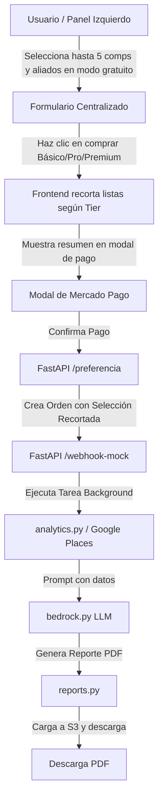

# Diseño Técnico: Personalización de Aliados y Competidores

## 1. Diseño del Modelo de Datos

### Cambios en Tabla `ordenes_pagos`
Se agregarán dos columnas a la tabla `ordenes_pagos` en PostgreSQL:
* `competidores_seleccionados` (`TEXT`): Almacenará la lista serializada en JSON de tipos seleccionados.
* `aliados_seleccionados` (`TEXT`): Almacenará la lista serializada en JSON de tipos seleccionados.

### Migración de Base de Datos
Se creará un script de migración en Python `scratch/add_custom_selection_columns.py` que aplicará:
```sql
ALTER TABLE ordenes_pagos 
ADD COLUMN IF NOT EXISTS competidores_seleccionados TEXT,
ADD COLUMN IF NOT EXISTS aliados_seleccionados TEXT;
```

---

## 2. Flujo y Validación de Datos



### Validación en `schemas.py`
Se validarán las listas en `PreferenciaCreate` utilizando decoradores de Pydantic:
* Si `tier_adquirido == 'basico'`: `competidores_seleccionados` puede tener un máximo de 1 elemento. `aliados_seleccionados` debe ser nulo o estar vacío.
* Si `tier_adquirido == 'pro'`: `competidores_seleccionados` puede tener un máximo de 3 elementos. `aliados_seleccionados` debe ser nulo o estar vacío.
* Si `tier_adquirido == 'premium'`: `competidores_seleccionados` y `aliados_seleccionados` pueden tener un máximo de 5 elementos cada uno.

---

## 3. Consultas Dinámicas en `analytics.py`

### Mapeo de Competidores
* Si no hay categorías personalizadas, se usa el resolvedor estándar `google_type`.
* Si están definidas, se ejecuta un loop que llama a `buscar_competidores` para cada categoría (soporta Básico, Pro y Premium) y se eliminan duplicados.

### Mapeo de Aliados
* En Tier Premium, si el usuario seleccionó aliados personalizados, se consultan en Google Places.
* Se unifican en `aliados_listado` con sus metadatos (nombre, tipo, rating, dirección).

---

## 4. Estructura de Prompts e Integración de IA
En `bedrock.py`, el `user_prompt` se expandirá para incluir de forma estructurada:
* Las categorías de competidores y el conteo de comercios detectados de cada tipo.
* Las categorías de aliados y el conteo de comercios detectados de cada tipo.
* Esto instruye al LLM a relacionar de forma cruzada por qué las sinergias o la saturación afectan la viabilidad del punto.

---

## 5. Diseño de Experiencia de Errores Orientada al Usuario
* Si la llamada a Google Places para alguna categoría personalizada falla por timeout o cuota, el motor de analítica continuará procesando las demás categorías de forma resiliente, registrando el error en los logs internos y mostrando lo que esté disponible en el PDF sin tracebacks para el usuario.

---

## 6. Diseño del Ajuste de Layout en Portada del PDF
Para evitar el desbordamiento de la primera página, reduciremos los espaciadores verticales (`Spacer`) en la portada:
* **Espaciador Superior**: Reducido de `150pt` a `80pt`.
* **Espaciador Central**: Reducido de `100pt` a `50pt`.
* **Espaciador Inferior**: Reducido de `60pt` a `40pt`.

### Mapeo Estético del Tier Adquirido
Para mejorar la presentación en el campo de metadatos de la portada del PDF, se implementará un mapeo explícito de los tiers:
```python
tier_map = {
    "basico": "BÁSICO",
    "pro": "PRO",
    "premium": "PREMIUM",
}
```
Esto asegura la acentuación correcta en español ("TIER BÁSICO" en lugar de "TIER BASICO" o "TIER PREMIUM" forzado).

---

## 7. Diseño de Remoción de Jergas y Proveedores Técnicos
Se implementarán modificaciones en cadenas de texto estáticas y dinámicas para ocultar la infraestructura tecnológica subyacente a los ojos del usuario:
* **En el PDF (`reports.py`)**:
  * Títulos de página simplificados (ej. "7. COMPETENCIA DETALLADA" en lugar de "7. COMPETENCIA DETALLADA (GOOGLE PLACES)").
  * Redefinición del anexo metodológico para eliminar referencias directas a APIs propietarias.
  * Cambios de cabeceras de tablas ("Valor Real PostGIS" -> "Valor Encontrado").
* **En el Frontend (`index.html` y `app.js`)**:
  * Ocultar menciones de AWS, S3, Cognito, FastAPI y ReportLab.
  * Reemplazo de los estados de la barra de progreso simulada para usar frases amigables como "Autenticando sesión..." y "Almacenando reporte..." en lugar de referencias a "Cognito User Pool" y "Amazon S3 (KMS)".
* **En variables del API (`routes_analytics.py`)**:
  * Modificación de `"mensaje_tier"` de salida para quitar la mención explicativa de "Bedrock" o "BestTime".

---

## 8. Diseño de Consistencia y Caché de Reportes en PostgreSQL

### Cambios en Tabla `ordenes_pagos`
Se agregarán dos columnas adicionales a la tabla `ordenes_pagos` en PostgreSQL:
* `resultado_json` (`TEXT`): Almacenará en formato JSON serializado el diccionario de resultados del motor de analítica (`resultado` / `analisis_cuant`).
* `foda_json` (`TEXT`): Almacenará en formato JSON serializado el diagnóstico estratégico devuelto por la IA.

### Migración de Base de Datos
Se creará un script de migración en Python `scratch/add_report_cache_columns.py` que aplicará:
```sql
ALTER TABLE ordenes_pagos 
ADD COLUMN IF NOT EXISTS resultado_json TEXT,
ADD COLUMN IF NOT EXISTS foda_json TEXT;
```

### Flujo de Datos Actualizado
1. **Webhook de Aprobación**: El pago se procesa, la orden pasa a `approved` y se encola `generar_informe_task`.
2. **Background Task (`tasks.py`)**:
   - Ejecuta `procesar_calculo_analitico` y obtiene `resultado` (incluyendo `sva`).
   - Ejecuta `generar_analisis_foda` y obtiene `analysis_result`.
   - **NUEVO**: Guarda `resultado_json = json.dumps(resultado)` y `foda_json = json.dumps(analysis_result)` en `OrdenPago` y hace `db.commit()`.
   - Genera el reporte PDF y lo sube a S3.
3. **Consulta de Resultados del Dashboard (`routes_analytics.py` - `/api/analizar/resultado/{orden_id}`)**:
   - Lee el registro de la orden.
   - **NUEVO**: Si `orden.resultado_json` y `orden.foda_json` existen, los 3. **Lectura Inmediata**: Modificar el endpoint del dashboard para retornar directamente este JSON si está disponible, sirviendo como caché definitivo y asegurando 100% de consistencia entre la vista digital y el reporte PDF.
   - **Fallback**: Si no existieran por algún motivo (ej. migración de registros antiguos), realiza los cálculos en caliente, guarda las respuestas en la base de datos para futuras peticiones, y retorna el resultado.

---

## 9. Diseño de Búsqueda de Direcciones y Geocodificación Directa

### Backend - Integración con Google Geocoding API (`google_places.py`)
Se agregará la función `buscar_coordenadas_por_direccion` que interactúa con la API de Google:
* **Endpoint de Google**: `https://maps.googleapis.com/maps/api/geocode/json`
* **Parámetros**:
  * `address`: Texto ingresado por el usuario.
  * `components`: Restringido a `country:MX` para acotar los resultados únicamente a México.
  * `language`: `es` para obtener direcciones en español.
  * `key`: `GOOGLE_MAPS_API_KEY`.
* **Retorno**: Una lista de hasta 5 candidatos con formato: `{"direccion": formatted_address, "latitud": lat, "longitud": lng}`.

### Backend - Endpoint de Consulta (`routes_analytics.py`)
Se expondrá un nuevo endpoint GET `/api/analizar/buscar-direccion`:
* **Parámetros**: `direccion` (string requerido).
* **Seguridad**: Requiere autenticación de usuario (Cognito Token en cabecera).
* **Comportamiento**: Retorna un JSON con estado de éxito y la lista de ubicaciones candidatas.

### Frontend - Buscador Flotante (HTML / CSS)
* Se añadirá el contenedor del buscador con estilo flotante (`position: absolute; top: 20px; left: 20px; z-index: 1000;`) sobre el div del mapa `#map`.
* Se aplicará la estética del sistema de diseño (glassmorphism con bordes curvos, fondos translúcidos y fuentes legibles).
* El dropdown de sugerencias `#map-search-results` aparecerá de forma dinámica al obtener resultados y se cerrará al hacer clic en uno de ellos o al hacer clic fuera del buscador.

### Frontend - Flujo de Control en JS (`app.js`)
* Se registrarán escuchadores de eventos para:
  * El botón de búsqueda `click` e input `keypress` (tecla Enter).
  * Consumo asíncrono del endpoint `/api/analizar/buscar-direccion?direccion=...`.
  * Renderizado interactivo de sugerencias en `#map-search-results`.
* Al hacer clic en un elemento de la lista:
  1. Se actualiza el valor del input con la dirección formateada.
  2. Se mueve la vista del mapa con `state.map.setView([lat, lng], 16)`.
  3. Se invoca a `handleMapClick(lat, lng)`, reutilizando toda la lógica del marcador, círculo e INEGI.
  4. Se oculta el dropdown.
