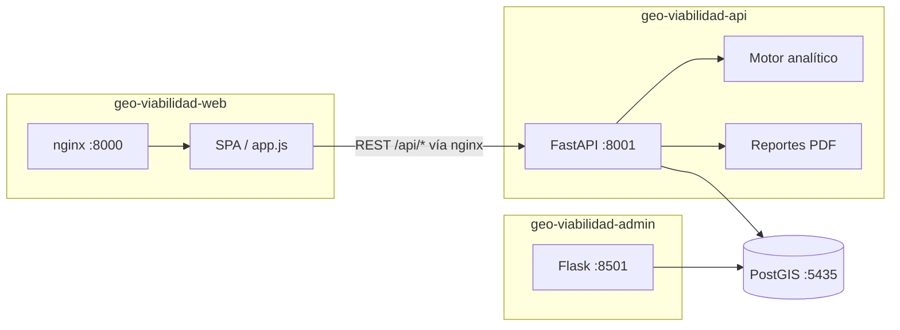

# Arquitectura Geo Viabilidad Negocios

Monorepo del producto **GeoViabilidad**: análisis de viabilidad comercial geoespacial para México.

La separación por responsabilidades existe a nivel **proyecto** (tres directorios principales). Dentro de `geo-viabilidad-api`, el código vive hoy en módulos planos bajo `app/`. La evolución hacia **multi-repo** y **capas** está en [`REPO_SPLIT_AND_LAYERS.md`](./REPO_SPLIT_AND_LAYERS.md).

## Proyectos principales

| Directorio | Responsabilidad | Stack | Puerto local |
|------------|-----------------|-------|--------------|
| `geo-viabilidad-api/` | Backend REST, motor analítico, pagos, PDFs, PostGIS | FastAPI + Python (`uv`, Ruff) | **8001** (directo) |
| `geo-viabilidad-web/` | SPA pública: mapa, vista previa, checkout, dashboard | HTML / CSS / JS vanilla + nginx (dev) | **8000** |
| `geo-viabilidad-admin/` | Panel interno: órdenes, leads, ingesta INEGI | Flask + Jinja | **8501** |

## Conexión entre servicios



**Docker Compose local** (`docker-compose.yml`):

| Servicio compose | Contenedor | Rol |
|------------------|------------|-----|
| `geo-db` | `geo-analisis-db` | PostgreSQL + PostGIS |
| `web-spa` | `geo-viabilidad-web` | nginx: SPA estática + proxy `/api/` → `web-api` |
| `web-api` | `geo-viabilidad-api` | API FastAPI (sin montaje de frontend) |
| `admin-app` | `geo-viabilidad-admin` | Panel Flask |

### Acoplamientos restantes (próximas fases)

- ~~**API → Web:** sirve la SPA con `FRONTEND_DIR`~~ → resuelto con `web-spa` (nginx).
- ~~**Admin → API:** importaba `app.*`~~ → resuelto con `geo-viabilidad-data`.

---

## Árbol de directorios (estado actual — jul 2026)

```
geo-viabilidad-negocios/
│
├── geo-viabilidad-api/              ← BACKEND
│   ├── app/
│   │   ├── main.py                  ← único entrypoint en raíz
│   │   ├── core/                    ← config, middleware, security
│   │   ├── exceptions/              ← UserFacingError + subtipos (404/402/403/502/400)
│   │   ├── routers/                 ← HTTP delgado (+ v0/)
│   │   ├── services/                ← orquestación (+ report_job_service, foda_service)
│   │   │   ├── presentation/        ← PDF narrative: afluencia, charts, maps, narrative
│   │   │   ├── tiers/               ← estrategias de tier (basico, pro, premium)
│   │   │   ├── v0/                  ← analytics, payments, reports
│   │   │   └── assets/              ← cover_bg.png, cover_logo.png, phiqus_logo
│   │   ├── domain/                  ← reglas puras (SVA, NSE, aliados…) — sin I/O
│   │   ├── clients/                 ← SDKs externos (+ v0/ raw/processed)
│   │   │   └── v0/
│   │   │       ├── bedrock/         ← raw (SDK Groq/AWS) + processed (FODA)
│   │   │       ├── besttime/        ← raw + processed (afluencia)
│   │   │       ├── database/        ← raw (SQL PostGIS) + processed (ORM tipado)
│   │   │       ├── google/          ← raw + processed (Places, Geocoding)
│   │   │       └── s3/              ← raw + processed (presigned URLs)
│   │   └── schemas/                 ← v0/ API + domain/ DTOs + auth_schemas
│   ├── tests/
│   ├── scripts/
│   ├── Dockerfile
│   └── pyproject.toml
│
├── geo-viabilidad-web/              ← FRONTEND
│   ├── index.html / index.css / app.js
│   ├── nginx.dev.conf               ← Proxy dev hacia web-api
│   └── README.md
│
├── geo-viabilidad-admin/            ← ADMIN
│   ├── admin/ (app, routes, services, templates, static)
│   ├── fuentes/
│   └── Dockerfile
│
├── geo-viabilidad-data/             ← PAQUETE COMPARTIDO (ORM + ingesta INEGI)
│   ├── geo_viabilidad_data/
│   │   ├── database.py / models.py
│   │   ├── ingest_nacional.py / ingest_censo_helpers.py / …
│   │   └── db_config.py
│   └── pyproject.toml
│
├── docs/
├── docker-compose.yml
└── README.md
```

---

## API HTTP (estado actual)

Prefijo `/api`. Routers en `main.py`:

```
GET  /api/health
GET  /api/auth/config
POST /api/analizar/previa
GET  /api/analizar/resultado/{orden_id}
GET  /api/reportes/{orden_id}
GET  /api/pagos/config
POST /api/pagos/preferencia
GET  /api/pagos/orden/{orden_id}/estado
POST /api/pagos/confirmar-retorno
GET  /api/pagos/mi-ultima-aprobada
POST /api/pagos/webhook
```

---

## Arquitectura por capas (en vigor — Fase 1.5)

```
routers  →  services  →  domain (puro, sin I/O)
                ↓
            clients (v0 raw/processed)
                ↓
            schemas (DTOs Pydantic entre capas)
```

**Reglas de frontera:**
- `routers` NO importan `app.domain` ni `app.clients` (excepto `get_db` para DI).
- `clients` NO importan `app.services` (ciclo prohibido).
- `domain` NO contiene SQL, HTTP ni Session; recibe datos pre-cargados.
- Excepciones tipadas (`app/exceptions/`) propagadas por handler, no `detail=str(exc)`.

Detalle del mapa módulo-a-capa, fases de migración y split a tres repos: **[`REPO_SPLIT_AND_LAYERS.md`](./REPO_SPLIT_AND_LAYERS.md)**.

---

Última actualización: julio 2026 (Fase 1.5 — enforce-layer-boundaries).
