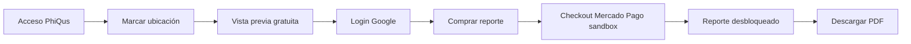

# Guía de uso local — GeoViabilidad Hook (equipo técnico)

> **¿Vas a probar solo el mapa y el flujo de compra?** Usa la guía para usuarios no técnicos: [`GUIA_PRUEBAS_USUARIO.md`](GUIA_PRUEBAS_USUARIO.md).

> **Entorno de desarrollo y pruebas.** Esta aplicación está en fase de desarrollo. Los pagos están en modo **simulado** (`PAYMENTS_MOCK=true`): no contactan Mercado Pago. Los precios mostrados ($299 / $649 / $799 MXN) son referencia del producto; en local solo simulan el flujo comercial.

---

## Antes de empezar

### Levantar el stack

Desde la raíz del monorepo:

```bash
./run_local.sh
```

> **Windows nativo:** `./run_local.ps1`. **Scripts de demografía / INEGI:** solo `.sh` (Linux/macOS/WSL) — ver `geo-viabilidad-api/scripts/README.md`.

### URLs del entorno local

| Servicio | URL | Para qué sirve |
|----------|-----|----------------|
| **App pública (SPA)** | http://localhost:8000 | Análisis de viabilidad, compra y descarga de reportes |
| **API (Swagger)** | http://localhost:8001/docs | Referencia técnica de endpoints |
| **API (health)** | http://localhost:8001/health | Smoke check del backend |
| **Panel Admin** | http://localhost:8501/admin/login | Órdenes, leads e ingesta de datos INEGI (equipo interno) |

> Arranque y variables: ver el **README.md de la raíz** del monorepo (runbook del equipo).

---

## Resumen del flujo completo



---

## 1. Acceso inicial a la plataforma (usuario y contraseña PhiQus)

Al abrir http://localhost:8000 verás una pantalla de acceso antes del mapa. Es una **puerta de desarrollo** para limitar quién entra mientras la app no está en producción.

| Campo | Valor |
|-------|-------|
| **Usuario** | `PhiQus` |
| **Contraseña** | `viabilidad-negocios` |

1. Escribe usuario y contraseña.
2. Pulsa **Entrar a la plataforma**.
3. Si las credenciales son correctas, desaparece la pantalla y aparece el analizador con el mapa.

> **Nota:** Estas mismas credenciales sirven para el **Panel Admin** (sección 8). Son distintas del login de Google y del login de Mercado Pago.

---

## 2. Configurar la ubicación a analizar

### Paso A — Buscar dirección (recomendado)

1. En el panel derecho del mapa, usa el buscador **“Paso 1 — Busca la dirección de tu local”**.
2. Escribe una dirección en México (ej.: `Av. Insurgentes 123, Roma, CDMX`).
3. Selecciona una sugerencia o confirma la búsqueda; el mapa centrará el punto.

### Paso B — Marcar en el mapa

1. Haz **clic** en el mapa donde quieras ubicar tu negocio.
2. Aparecerá un marcador y un círculo con el **radio de análisis** (por defecto 1 km).
3. En el panel izquierdo verás las **coordenadas seleccionadas**.

### Paso C — Elegir giro y radio

1. **Giro del negocio:** selecciona en el desplegable (Cafetería, Restaurante, Gimnasio, etc.) o elige **Otro** y escribe uno personalizado.
2. **Radio de cobertura:** ajusta entre 100 m y 5 km según el área que quieras estudiar.

Opcionalmente puedes:

- Marcar **competidores** y **aliados** en los checkboxes (Premium usa más opciones).
- Escribir **intenciones** del negocio en el cuadro de texto libre.
- En Premium, usar **“Descubrir mis aliados paso a paso”** (cuestionario guiado).

---

## 3. Vista previa gratuita (sin pagar)

1. Con giro y coordenadas listos, pulsa **⚡ ANALIZAR UBICACIÓN**.
2. Si aún no has iniciado sesión con Google, la app te pedirá autenticarte (paso 4).
3. Tras unos segundos verás indicadores resumidos: población estimada, competidores, score SVA, etc.
4. Esta vista previa **no requiere pago**; sirve para explorar la zona antes de comprar el reporte completo.

---

## 4. Inicio de sesión con Google

Google vincula tu compra y tu reporte a tu cuenta. **Usa siempre la misma cuenta** desde el análisis hasta la descarga del PDF.

1. Al analizar o al pulsar **COMPRAR BÁSICO / PRO / PREMIUM**, aparece el modal **Iniciar sesión con Google**.
2. Pulsa el botón de Google (**Continuar con Google**).
3. Elige tu cuenta de Google y acepta los permisos.
4. Tras el login verás tu nombre en la esquina superior y un mensaje de bienvenida.

> **Importante:** El login de Google **no cobra nada**. Solo identifica quién compró el reporte para desbloquearlo después del pago de prueba.

---

## 5. Comprar un reporte (Checkout Pro — sandbox)

### Planes disponibles

| Plan | Precio referencia | Contenido principal |
|------|-------------------|---------------------|
| **Básico** | $299 MXN | Reporte de 6 páginas, 1 competidor |
| **Pro** | $649 MXN | 10 páginas, mapas, hasta 3 competidores |
| **Premium** | $799 MXN | 14 páginas, afluencia, hasta 5 competidores y aliados |

Los montos son los del producto; en sandbox **no se debitan fondos reales**.

### Pasos en la app

1. Completa la vista previa (pasos 2 y 3).
2. Pulsa el botón del plan deseado: **🔒 COMPRAR BÁSICO**, **COMPRAR PRO** o **COMPRAR PREMIUM**.
3. Si no has iniciado sesión con Google, la app te pedirá login primero.
4. Se abrirá un **modal de pago simulado** dentro de la app (no sales a Mercado Pago).
5. Elige **«Aprobado al instante»** y pulsa **CONFIRMAR PAGO SIMULADO**.

---

## 6. Confirmar pago simulado

Con `PAYMENTS_MOCK=true` el flujo completo ocurre en la app:

1. En el modal, selecciona el estado **Aprobado** (opción por defecto).
2. Pulsa **CONFIRMAR PAGO SIMULADO**.
3. La app acredita la orden vía `/api/pagos/webhook-mock` y lanza la generación del reporte.
4. Verás un banner del tipo *“Pago acreditado. Generando tu reporte…”*.

> **Sin cobro real:** no se contacta Mercado Pago ni se debita ninguna tarjeta.

### Reactivar Mercado Pago (cuando toque)

En `.env`:

```env
PAYMENTS_MOCK=false
MERCADOPAGO_ACCESS_TOKEN=...
MERCADOPAGO_PUBLIC_KEY=...
MERCADOPAGO_SANDBOX=true   # sandbox; false + credenciales live para producción
PUBLIC_APP_URL=https://tu-dominio.ngrok-free.dev   # HTTPS obligatorio para Checkout Pro
```

Luego: `docker compose up -d --force-recreate web-api`

El código de Checkout Pro, webhooks y retorno automático (`auto_return`) permanece intacto; solo cambia el flag.

---

## 6b. Pagar en Mercado Pago — referencia (solo con PAYMENTS_MOCK=false)

*Sección de referencia cuando reactives el sandbox o producción.*

Mercado Pago sandbox simula pagos. Puedes pagar como **invitado** (sin iniciar sesión en MP) con tarjeta de prueba.

### Credenciales del comprador de prueba

| Campo | Valor |
|-------|-------|
| **Usuario / email** | `TESTUSER5240552677377634959` |
| **Contraseña** | `KsDnd3vYKX` |

*(También puede aparecer como `test_user_5240552677377634959@testuser.com` en algunos campos de MP.)*

### Recomendaciones antes de pagar

1. Usa una **ventana de incógnito** o cierra sesión en [mercadopago.com](https://www.mercadopago.com).
2. En la pantalla de Mercado Pago, inicia sesión **solo** con el usuario comprador de prueba de la tabla anterior.
3. **No** uses la cuenta vendedor ni tu cuenta real de Mercado Pago.

### Tarjeta de prueba (pago aprobado)

Si Mercado Pago pide datos de tarjeta, usa estos valores de prueba para simular un **pago aprobado**:

| Campo | Valor |
|-------|-------|
| **Número** | `5474 9254 3267 0366` |
| **CVV** | `123` |
| **Vencimiento** | `11/30` |
| **Titular** | `APRO` |
| **CURP** (si lo pide) | `12345678901` |

El titular **APRO** indica a Mercado Pago que debe **aprobar** la transacción en sandbox.

### Qué esperar después del pago

- En **localhost**, Mercado Pago puede **no redirigirte automáticamente** de vuelta a la app (limitación de URLs locales).
- **Vuelve manualmente** a la pestaña http://localhost:8000.
- La app detectará el pago (mediante confirmación en servidor) y comenzará a **generar tu reporte completo**.
- Verás un banner del tipo *“Pago acreditado. Generando tu reporte…”*.

> **Sin cobro real:** todo ocurre en el entorno sandbox. No se transferirá dinero a PhiQus ni a tu tarjeta.

---

## 7. Ver el reporte completo en pantalla

Tras confirmarse el pago (puede tardar entre **30 segundos y 2 minutos**):

1. El panel de resultados se **desbloquea** con secciones adicionales según tu plan:
   - Mapas y gráficas (Pro/Premium).
   - Afluencia peatonal (Premium).
   - Lectura estratégica del punto (Fortalezas, Oportunidades, Consideraciones).
2. Mantén la **misma sesión de Google** con la que compraste.
3. Si cerraste el navegador, vuelve a http://localhost:8000, entra con PhiQus, inicia sesión con Google y la app intentará **recuperar tu orden pagada**.

---

## 8. Descargar el reporte en PDF

1. Desplázate hasta la sección **“Tu reporte ejecutivo está listo para descarga”**.
2. Pulsa **⬇️ DESCARGAR REPORTE EN PDF**.
3. La app verificará tu acceso, esperará a que el PDF termine de generarse (barra de progreso) y descargará el archivo.
4. El nombre del archivo será similar a: `Reporte_Viabilidad_<número_de_orden>.pdf`.

Si el botón aparece antes de que el PDF esté listo, espera unos segundos y vuelve a intentar. La generación incluye mapas, gráficas y narrativa según el tier comprado.

---

## 9. Panel Admin (equipo interno — opcional)

El admin no es necesario para probar la compra como usuario final, pero comparte las credenciales de acceso PhiQus.

| Campo | Valor |
|-------|-------|
| **URL** | http://localhost:8501/admin/login |
| **Usuario** | `PhiQus` |
| **Contraseña** | `viabilidad-negocios` |

Desde ahí puedes consultar órdenes de pago, leads y estado de ingesta de datos demográficos INEGI.

---

## 10. Problemas frecuentes y soluciones

| Síntoma | Qué hacer |
|---------|-----------|
| No aparece el mapa | Verifica que Docker esté corriendo (`docker ps`) y recarga http://localhost:8000 |
| “Usuario o contraseña incorrectos” (PhiQus) | Usuario exacto `PhiQus` (P mayúscula) y contraseña `viabilidad-negocios` |
| Google no deja iniciar sesión | En Google Cloud Console, agrega `http://localhost:8000` a **Orígenes JavaScript autorizados** |
| No redirige a Mercado Pago | Recarga con Ctrl+F5; revisa que la API esté arriba en http://localhost:8001/health |
| MP rechaza el pago | Usa ventana incógnito, cuenta comprador de prueba y tarjeta con titular **APRO** |
| Pagaste pero no se desbloquea el reporte | Vuelve manualmente a http://localhost:8000 e inicia sesión con la **misma cuenta Google** |
| El PDF no descarga | Espera 1–2 minutos tras el pago y pulsa de nuevo **DESCARGAR REPORTE EN PDF** |
| Error 502 al comprar | Reinicia la API: `docker compose restart web-api` |

---

## 11. Recordatorio de seguridad y alcance

- **Desarrollo activo:** funcionalidades, textos y precios pueden cambiar sin aviso.
- **Pagos:** solo sandbox de Mercado Pago; **ningún cobro real**.
- **Datos:** demografía basada en INEGI; competencia y afluencia dependen de APIs externas (Google Places, BestTime) con límites de prueba.
- **No es asesoría financiera:** los reportes orientan decisiones comerciales; no sustituyen un estudio de mercado formal ni proyecciones contables.

---

## Referencia rápida de credenciales

| Sistema | Usuario | Contraseña / notas |
|---------|---------|-------------------|
| **App web (puerta PhiQus)** | `PhiQus` | `viabilidad-negocios` |
| **Panel Admin** | `PhiQus` | `viabilidad-negocios` |
| **Google** | Tu cuenta Gmail | Login OAuth estándar |
| **Mercado Pago sandbox (comprador)** | `TESTUSER5240552677377634959` | `KsDnd3vYKX` |
| **Tarjeta de prueba MP** | Titular: `APRO` | Número: `5474 9254 3267 0366`, CVV `123`, vence `11/30` |

---

*Última actualización: julio 2026 — entorno local Docker (`./run_local.sh` / `./run_local.ps1`).*
