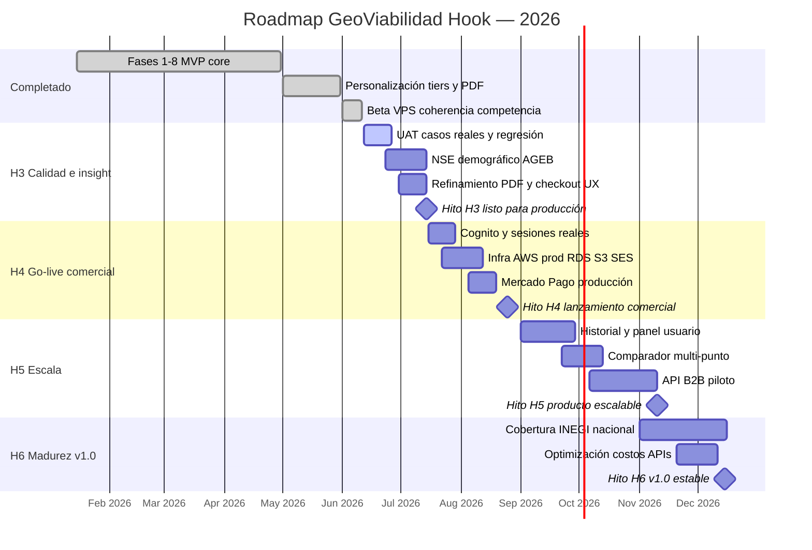
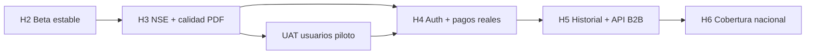

# Roadmap de Desarrollo — GeoViabilidad Hook

**Versión:** 1.0  
**Fecha:** 11 de junio de 2026  
**Rama activa:** `update-user-x`  
**Entorno beta:** VPS `135.181.30.179` · `/opt/viabilidad-negocios`  
**Último deploy:** `2e9792f` — filtro por giro, coherencia destacados y ajuste de prompt IA

---

## 1. Visión del producto

GeoViabilidad Hook es una plataforma de **geomarketing y viabilidad comercial** para México. Combina demografía INEGI (Censo 2020), competencia y aliados (Google Places), afluencia peatonal (BestTime) y lectura estratégica con LLM para entregar dictámenes y reportes PDF por niveles (Básico $99 · Pro $499 · Premium $999 MXN).

**Objetivo 2026:** pasar de beta operativa a **producto comercial estable (v1.0)** con monetización real, reportes confiables y cobertura demográfica nacional.

---

## 2. Estado actual (junio 2026)

| Área | Estado | Notas |
|------|--------|-------|
| Motor analítico (INEGI + Places + BestTime + SVA) | ✅ Operativo | PostGIS, ISC, heatmap |
| PDF ejecutivo por tier | ✅ Operativo | 6 / 10 / 13 páginas |
| Dashboard SPA + mapa Leaflet | ✅ Operativo | Búsqueda por dirección, tooltips |
| Personalización competidores/aliados + IA auto | ✅ Operativo | Límites por tier |
| Lectura estratégica 3+3+3 | ✅ Operativo | Reemplaza FODA clásico |
| Reseñas Google + filtro por giro | ✅ Desplegado | Mín. 5 reseñas, coherencia tabla/comentarios |
| Auth Cognito + Mercado Pago | ⚠️ Simulado | `DEV_MODE=True` en VPS |
| NSE (nivel socioeconómico) | ❌ Pendiente | Ver `SPEC_DRIVEN_CONTRACT_NSE.md` |
| Producción AWS end-to-end | ⚠️ Parcial | Docker en VPS, sin Cognito/MP live |

---

## 3. Hitos principales

| Hito | Nombre | Objetivo | Criterio de éxito | Estado | Fecha objetivo |
|------|--------|----------|-------------------|--------|----------------|
| **H0** | MVP técnico | Plataforma funcional E2E | Análisis → pago → PDF descargable | ✅ Completado | Abr 2026 |
| **H1** | Producto configurable | Tiers y personalización | Competidores/aliados por plan + caché BD | ✅ Completado | May 2026 |
| **H2** | Beta operativa | Validación con usuarios | VPS estable, datos coherentes dashboard/PDF | ✅ En curso | Jun 2026 |
| **H3** | Calidad de insight | Reportes confiables y completos | NSE + PDF sin incoherencias + UAT 10 rubros | 🔜 | 14 Jul 2026 |
| **H4** | Go-live comercial | Monetización real | Cognito + MP producción + SLA 99% | 🔜 | 25 Ago 2026 |
| **H5** | Escala de producto | Retención y upsell | Historial, comparador, API B2B piloto | 🔜 | 10 Nov 2026 |
| **H6** | v1.0 estable | Producto maduro | Cobertura INEGI nacional + costos optimizados | 🔜 | 15 Dic 2026 |

---

## 4. Fases de desarrollo

### Fase A — Consolidación beta (2–3 semanas) · H2 → H3

**Entregables:**
- UAT con 10 rubros reales (cafetería, farmacia, mascotas, restaurante, etc.)
- Cierre de incoherencias residuales (gráfica vs tabla, textos IA)
- Modal de resumen en checkout (selección recortada por tier)
- Smoke test automatizado post-deploy en VPS

**Definición de terminado:** 0 bugs críticos en dashboard/PDF; suite `pytest` en verde.

---

### Fase B — Inteligencia demográfica avanzada (3–4 semanas) · H3

**Entregables:**
- NSE desde AGEBs (escolaridad, internet, automóvil, PC)
- KPI NSE en dashboard (4ª tarjeta) + PDF páginas 2–3
- Prompt IA adaptado a poder adquisitivo local
- Desglose compacto de competidores adicionales en PDF (RF-20)

**Contrato técnico:** `docs/SPEC_DRIVEN_CONTRACT_NSE.md`

**Definición de terminado:** NSE visible en dashboard (post-pago) y PDF; coherente con demografía del radio.

---

### Fase C — Producción comercial (4–5 semanas) · H4

**Entregables:**
- Amazon Cognito real (registro, login, JWT)
- RDS/Aurora PostGIS + S3 + SES en producción
- Mercado Pago Checkout Pro modo **live**
- Monitoreo (logs, alertas, backups)
- Hardening seguridad LLM (guardrail + stress tests en CI)

**Definición de terminado:** ≥1 pago real end-to-end sin intervención manual.

---

### Fase D — Crecimiento (6–8 semanas) · H5

**Entregables:**
- Panel «Mis reportes» con historial de órdenes
- Comparador de 2–3 puntos en un mismo análisis
- Piloto API B2B (franquicias, inmobiliarias)
- Onboarding guiado y emails transaccionales (SES)

**Definición de terminado:** ≥30% usuarios repiten análisis en 30 días (métrica piloto).

---

### Fase E — Madurez v1.0 (6–8 semanas) · H6

**Entregables:**
- Cobertura INEGI nacional vía panel admin
- Caché agresivo Places/BestTime (reducción de costo por reporte)
- Métricas de negocio (conversión previa → pago)
- Documentación comercial y contrato técnico congelado

**Definición de terminado:** Costo por reporte Premium bajo umbral acordado; v1.0 tag en GitHub.

---

## 5. Diagrama de Gantt

---

## 6. Dependencias críticas

| Bloqueador | Impacto | Mitigación |
|------------|---------|------------|
| Columnas NSE ausentes en `agebs_demografia` | NSE no calculable | Migración + re-ingesta variables censales |
| Mercado Pago sin modo live | Sin ingresos reales | Cuenta MP verificada + webhook HTTPS |
| Costos Places/BestTime | Margen negativo | Caché + límites por tier |
| Cobertura INEGI parcial | SVA impreciso en zonas rurales | Priorizar estados con mayor demanda |

---

## 7. Métricas de éxito por hito

| Hito | KPI principal | Meta |
|------|---------------|------|
| H3 | Incoherencias dashboard/PDF | 0 en 10 rubros de prueba |
| H4 | Pagos reales completados | ≥1 E2E sin soporte manual |
| H5 | Retención | ≥30% repite análisis en 30 días |
| H6 | Costo operativo | Costo/reporte Premium < umbral definido |

---

## 8. Priorización inmediata (próximas 4 semanas)

| Semana | Foco | Entregable |
|--------|------|------------|
| 1–2 | UAT + checkout UX | Casos validados + modal resumen tier |
| 3–4 | NSE (Fase B) | Contrato aprobado → implementación → PDF/dashboard |
| Paralelo | Documentación | Este roadmap + contrato NSE sincronizados |

---

## 9. Stack y referencias

- **Backend:** FastAPI, SQLAlchemy, PostGIS, ReportLab, Groq/Bedrock
- **Frontend:** SPA Vanilla JS, Leaflet, Chart.js
- **Infra:** Docker, VPS Hetzner, GitHub `EmmanuelRR-data-science/viabilidad-negocios`
- **Specs relacionados:** `.kiro/specs/viabilidad-comercial/`, `requirements.md`, `design.md`

---

*Documento generado bajo el protocolo PHIQUSINO (Spec-Driven Development). Actualizar al cerrar cada hito.*
