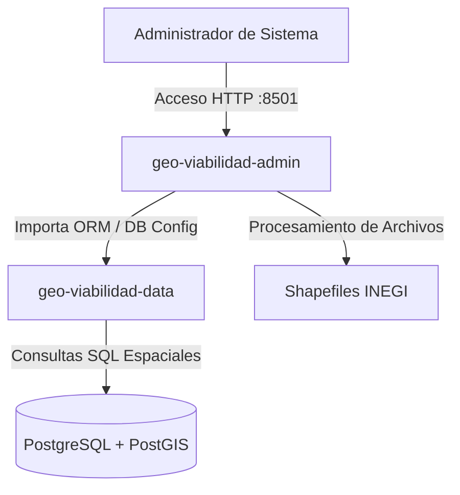

Author(s): Antigravity AI · Emmanuel Ramírez Romero
Status: Propuesta
Ultima actualización: 2026-07-03

---

# RFC: Módulo Administrativo (geo-viabilidad-admin)

## Objetivo

Definir la arquitectura y especificaciones del panel de administración interna de **GeoViabilidad Negocios**. Este componente proporciona una interfaz web exclusiva para operarios encargados de la ingesta y mantenimiento de bases cartográficas de población (INEGI), visualización de métricas de ventas y exportación de prospectos (leads) y órdenes de pago.

---

## Goals

* **Ingesta Simplificada de Datos Espaciales**: Automatizar el procesamiento, reproyección a sistema de coordenadas `EPSG:4326` y almacenamiento en base de datos de Shapefiles demográficos estatales del INEGI.
* **Consumo de persistencia desacoplado**: Operar directamente sobre la base de datos PostgreSQL/PostGIS utilizando el paquete compartido `geo-viabilidad-data`, eliminando importaciones de código fuente desde la API.
* **Control de Accesos Operativos**: Restringir las funciones administrativas mediante autenticación robusta y perfiles de usuario autorizados.
* **Exportación de Métricas y Prospectos**: Proveer herramientas para generar reportes en formato CSV con información de leads y órdenes para el área de marketing.

---

## Non-Goals

* **Atención al Cliente Final**: Este módulo no atiende peticiones de navegación de mapas, simulaciones de viabilidad ni descargas de reportes por parte del usuario final (delegado a los módulos API y Web).
* **Definición de Esquemas ORM**: El admin no gestiona las migraciones ni el código base del ORM de base de datos de manera primaria (delegado a `geo-viabilidad-data`).

---

## Background

Originalmente, las herramientas administrativas importaban módulos del backend de la API y corrían en el mismo contenedor Docker. Esto generaba acoplamiento, dependencias redundantes de librerías geoespaciales y de sistema, y un potencial vector de ataque si se vulneraba la API pública. Para mitigar estos riesgos, el panel de administración se separa en un servicio independiente en Flask con Jinja2 que se ejecuta en su propio puerto y comparte únicamente la capa de datos.

---

## Overview

El panel administrativo se implementa en **Python** utilizando **Flask** para el backend y **Jinja2** para la renderización de vistas del lado del servidor. Opera de la siguiente forma:

1. **Ingreso Protegido**: El usuario administrativo debe pasar por una pantalla de login local que verifica credenciales.
2. **Monitoreo de Operación**: Acceso a tableros simplificados de métricas comerciales (volumen de reportes por tier, compras recientes, órdenes pendientes).
3. **Ingesta de Cartografía**: Un flujo interactivo permite subir archivos comprimidos (Shapefiles de INEGI en ZIP), ejecuta un hilo asíncrono en segundo plano para leer, transformar y poblar las tablas de AGEBs y manzanas, reportando el progreso en el tablero.

---

## Detailed Design

### 1. Componentes del Módulo
El admin se estructura bajo el patrón de MVC clásico en Flask:
* **Entrypoint (`app.py`)**: Inicializa el servidor Flask, registra las rutas administrativas y configura las dependencias.
* **Servicio de Ingesta (`ingest_*.py`)**: Lógica encargada de leer archivos geoespaciales comprimidos, transformarlos al sistema geodésico común (`EPSG:4326`) utilizando dependencias GIS (como Shapely o Fiona, provistas de forma aislada), y guardar los polígonos demográficos en PostGIS.
* **Módulo de Autenticación (`auth.py`)**: Controla las sesiones activas, la validación de tokens y el hashing de contraseñas administrativas.
* **Vistas HTML (`templates/`)**: Páginas renderizadas del lado del servidor que estructuran las tablas de órdenes, pantallas de carga de Shapefiles y la sección de login.

### 2. Pipeline de Ingesta Demográfica
* **Procesamiento de Shapefiles**: Los archivos Shapefile del INEGI suelen contener datos espaciales y demográficos complejos. El servicio de ingesta procesa y mapea de forma asíncrona campos clave como la clave de AGEB, población total, y variables de Nivel Socioeconómico (NSE) para agregarse a nivel de censo.
* **Manejo de Transacciones**: Las cargas masivas de datos espaciales se dividen en transacciones acotadas por estado de la República para evitar el bloqueo del motor de base de datos principal.

### 3. Seguridad de Acceso Administrativo
* **Puerto de Servicio Aislado**: El puerto del panel administrativo (ej: 8501) no se expone a internet públicamente en el VPS. Se restringe a nivel de firewall para que solo sea accesible mediante conexiones localhost a través de túneles SSH de operarios autorizados.
* **Aislamiento de Entorno**: Las contraseñas del panel y credenciales de bases de datos se inyectan a través de variables de entorno configuradas localmente en el contenedor, sin estar guardadas en los archivos fuente.
