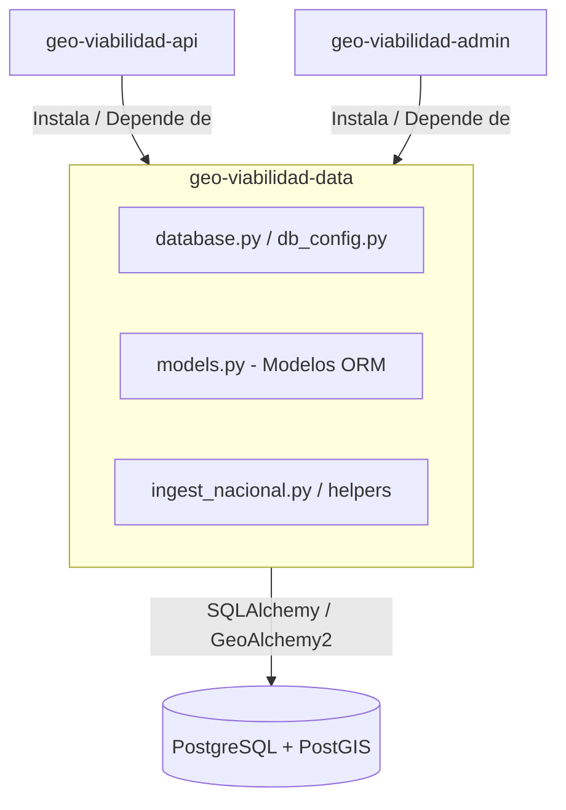

Author(s): Antigravity AI · Emmanuel Ramírez Romero
Status: Propuesta
Ultima actualización: 2026-07-03

---

# RFC: Módulo de Datos Compartidos (geo-viabilidad-data)

## Objetivo

Definir los requerimientos técnicos y el diseño del paquete compartido **`geo-viabilidad-data`**. Este componente centraliza la persistencia relacional y espacial (PostgreSQL + PostGIS), los modelos del ORM (SQLAlchemy), la configuración de la base de datos y los ayudantes de ingesta de cartografía de INEGI. Su propósito es actuar como una biblioteca común para los módulos `geo-viabilidad-api` y `geo-viabilidad-admin`.

---

## Goals

* **Única Fuente de Verdad del Esquema**: Unificar la declaración de tablas, modelos y tipos geoespaciales de base de datos, eliminando duplicidad y drifts de esquema.
* **Abstracción de Conexiones**: Proveer un pool de conexiones optimizado y seguro hacia la base de datos PostgreSQL, adaptable a diferentes ambientes (desarrollo, producción).
* **Utilerías de Ingesta Geoespacial**: Encapsular algoritmos comunes para la conversión, reproyección e inserción de geometrías y variables sociodemográficas a nivel AGEB.
* **Versionamiento y Reusabilidad**: Diseñar el paquete como una librería Python estándar instalable (vía `pip` editable o repositorio de paquetes privado), con control de versiones independiente.

---

## Non-Goals

* **Rutas e Interfaces HTTP**: Este módulo no expone controladores REST, endpoints HTTP ni lógica de rutas web.
* **Lógica de Negocio Transaccional**: No maneja la integración directa con Mercado Pago, Bedrock ni la compilación de PDFs (delegado estrictamente a la API).

---

## Background

En etapas previas, el módulo administrativo y la API importaban de forma cruzada archivos como `models.py` y `database.py` ubicados en el backend de la API. Esto impedía desplegar o testear el módulo administrativo sin copiar el código de la API, y generaba acoplamientos rígidos en el entorno Docker. La separación de la capa de datos en el subproyecto `geo-viabilidad-data` resuelve este acoplamiento y prepara el proyecto para un split de repositorios definitivo.

---

## Overview

El paquete compartido `geo-viabilidad-data` se diseña como una biblioteca Python empaquetada con **pyproject.toml**. Los módulos principales (API y Admin) la declaran como dependencia en sus respectivos archivos de requerimientos. El paquete provee los cimientos para la comunicación con la base de datos:

1. **Configuración de Conexión**: Resolución dinámica de la URL de conexión de base de datos basada en variables de entorno.
2. **Esquema ORM**: Clases SQLAlchemy que representan tanto tablas relacionales clásicas (usuarios, órdenes) como tablas con columnas espaciales (AGEBs y manzanas representadas mediante GeoAlchemy2).
3. **Ingesta y Helpers**: Algoritmos de lectura GIS que extraen la información de Shapefiles e insertan polígonos de forma eficiente.

---

## Detailed Design

### 1. Componentes del Módulo
* **Configuración del Motor (`database.py` y `db_config.py`)**: Centraliza la inicialización de la SessionFactory de SQLAlchemy, el Engine con pool de conexiones optimizado (configurando límites de timeout, reciclado y reintentos) y la base declarativa.
* **Definición de Modelos ORM (`models.py`)**: Contiene la definición de las entidades de base de datos:
  * `OrdenPago`: Representación de las cotizaciones con serialización JSON para selecciones personalizadas, resultados estructurados del motor analítico y estado del pago.
  * `AppUsuario`: Información de perfiles de usuario y credenciales.
  * `AGEB` / `Manzana`: Modelos con soporte espacial (usando `Geometry` de GeoAlchemy2) para almacenar las coordenadas vectoriales de los polígonos del censo e indicadores socioeconómicos del INEGI.
* **Procesamiento Espacial (`ingest_shapefile_utils.py` e `ingest_nacional.py`)**: Ayudantes técnicos que parsean metadatos geográficos y calculan proporciones demográficas ponderadas en polígonos interceptados.

### 2. Gestión de Base de Datos Geoespacial
* **PostGIS**: Toda consulta espacial de AGEBs o intersecciones por radio aprovecha las capacidades nativas de indexación GIST (`ST_Intersects`, `ST_Transform`) implementadas a nivel de base de datos, configurando y exponiendo los tipos espaciales a través de GeoAlchemy2 en el ORM.
* **Aislamiento de Entorno**: El paquete lee la variable `DATABASE_URL` (o credenciales por separado) desde el entorno en tiempo de ejecución, permitiendo cambiar dinámicamente entre la base de datos local en Docker (`geo-db`) y la base de datos de producción (Amazon RDS) sin modificar el código.

### 3. Empaquetamiento y Distribución
* **pyproject.toml**: Declaración de metadatos del paquete, dependencias de software críticas (SQLAlchemy, GeoAlchemy2, psycopg2-binary, Shapely) y especificación de compatibilidad con versiones de Python.
* **Integración Local**: En desarrollo, se instala en modo editable (`pip install -e ./geo-viabilidad-data`) para facilitar los cambios concurrentes en los modelos de base de datos.
