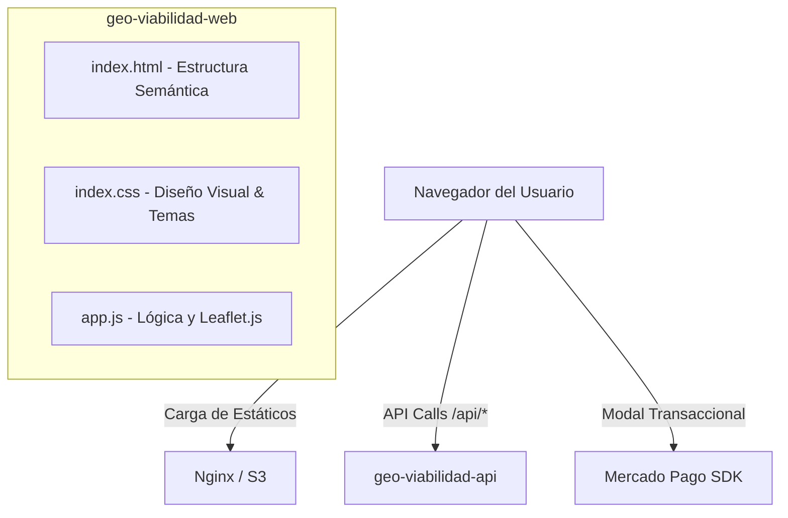

Author(s): Antigravity AI · Emmanuel Ramírez Romero
Status: Propuesta
Ultima actualización: 2026-07-03

---

# RFC: Módulo Frontend SPA (geo-viabilidad-web)

## Objetivo

Definir los requerimientos técnicos y la arquitectura de la interfaz de usuario interactiva (SPA) de **GeoViabilidad Negocios**. Este módulo proporciona la experiencia visual para que el usuario localice su negocio en un mapa, configure competidores y aliados, realice el pago y visualice los resultados analíticos a través de un dashboard web interactivo y responsivo.

---

## Goals

* **Visualización Cartográfica**: Integrar un visor de mapas interactivo basado en Leaflet.js para seleccionar coordenadas y visualizar radios de cobertura comercial.
* **Experiencia de Usuario Fluida (UX)**: Implementar una interfaz SPA responsiva utilizando exclusivamente HTML, CSS (Vanilla) y JavaScript puro (sin frameworks pesados).
* **Integración Transaccional**: Conectar la interfaz del usuario con el modal de pagos seguro de Mercado Pago Checkout Pro.
* **Dashboard Dinámico**: Renderizar indicadores cuantitativos (demografía, NSE, afluencia) y cualitativos (lectura de IA) obtenidos de la API REST posterior al pago de la orden.

---

## Non-Goals

* **Procesamiento Analítico**: El frontend no realiza cálculos de intersección espacial, normalización de datos censales, o inferencia con LLM. Toda la lógica pesada es consumida mediante APIs REST.
* **Persistencia de Estado del Lado del Servidor**: El frontend no almacena bases de datos locales; depende de la API para recuperar el estado de las órdenes.

---

## Background

El desarrollo original del frontend estaba empaquetado directamente en la estructura de FastAPI, lo que acoplaba el despliegue del código de la interfaz con los servicios del backend. Para optimizar tiempos de carga a través de redes de entrega de contenido (CDNs) y permitir la evolución independiente del diseño, el frontend se separa en una SPA estática autónoma servida por un servidor ligero (nginx en desarrollo / Amazon S3 en producción).

---

## Overview

La SPA opera bajo una arquitectura de página única basada en componentes HTML interactivos y manipulación dinámica del DOM mediante JavaScript. Su ciclo de interacción principal es:

1. **Ubicación e Input**: El usuario selecciona un punto geográfico en el mapa interactivo y selecciona su giro comercial.
2. **Vista Previa**: Envía una petición rápida a la API y renderiza métricas superficiales de población en un panel lateral.
3. **Flujo de Pago**: El usuario selecciona un tier de reporte (Básico, Pro, Premium) y el frontend renderiza el modal de pago integrado con Mercado Pago.
4. **Dashboard Activo**: Tras confirmarse la transacción, el frontend habilita el dashboard completo de análisis de viabilidad, incluyendo el heatmap horario de afluencia, los listados geocodificados de competencia/aliados y la opción de descarga del archivo PDF.

---

## Detailed Design

### 1. Componentes del Módulo
La SPA se compone de tres archivos fuente con responsabilidades aisladas:
* **Estructura (`index.html`)**: Define el maquetado semántico (HTML5) de la aplicación, incluyendo el contenedor del mapa, los formularios laterales de configuración, las secciones del dashboard y los modales informativos de pago y error.
* **Estilos (`index.css`)**: Define el sistema de diseño visual aplicando técnicas modernas como Glassmorphism, temas claro/oscuro integrados mediante variables CSS, transiciones suaves para micro-animaciones en botones y tarjetas, y tipografía optimizada.
* **Controlador de Lógica (`app.js`)**: Gestiona la inicialización de Leaflet.js, los escuchadores de eventos del DOM, el estado local de la sesión (ID de orden actual), y las peticiones `fetch` asíncronas hacia los endpoints de la API.

### 2. Integración Cartográfica
* **Leaflet.js**: Motor ligero utilizado para renderizar mapas interactivos sin requerir claves de pago de Google Maps en la UI.
* **Capas de Mapa**: Uso de teselas libres (como OpenStreetMap o CartoDB) configuradas en el visor.
* **Cálculo Visual de Radios**: Creación de geometrías visuales circulares (búfers de 500m o 1000m) dinámicas que se ajustan en pantalla al mover el marcador de ubicación.

### 3. Integración con Mercado Pago
* Implementación del SDK oficial de Mercado Pago en la interfaz del cliente.
* El flujo solicita a la API una preferencia de compra y renderiza el botón transaccional nativo, capturando el callback de retorno de Mercado Pago para desbloquear los datos de análisis sin recargar la aplicación completa.

### 4. Manejo de Errores e Interfaz Amigable
* **Aislamiento de Errores Técnicos**: La UI intercepta códigos HTTP de error (4xx y 5xx) y renderiza alertas en lenguaje natural comprensible (ej: "No pudimos conectar con el servidor, por favor verifica tu conexión" en vez de códigos de excepción de base de datos).
* **Estados de Carga**: Se definen loaders y skeletons dinámicos para áreas de procesamiento pesado (como el tiempo de espera mientras la IA analiza los resultados y el backend compila el reporte PDF).
